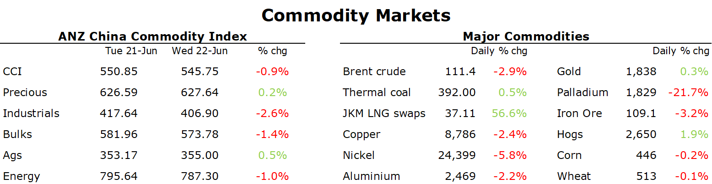

# Recessionary fears pushes commodity markets lower

**Date:** June 23, 2022  
**Publisher:** Breakwave Advisors | **Category:** Market Insights  
**Original URL:** [https://www.breakwaveadvisors.com/insights/2022/6/23/recessionary-fears-pushes-commodity-markets-lower](https://www.breakwaveadvisors.com/insights/2022/6/23/recessionary-fears-pushes-commodity-markets-lower)  

---

*By*[*Daniel Hynes*](https://www.linkedin.com/in/dahynes/)

Recessionary fears rattled commodity markets, with metals and oil falling sharply. Conversely, precious metals found support on strong haven demand.

> **Figure 1: 1655934490793**  
> **Interactive Data & Source:** [Linkedin](https://www.linkedin.com/newsletters/commodities-wrap-6692196755876012032/?fbclid=IwAR3kiXJqZdxmp9ZcRwBNI7FsBySI-XSC0pfPur1qzjt7OZp7PTE59Tsl1QI) | [Local Asset](file:///C:/Users/Dell/Github/Shipping/corpus/03-breakwave/insights/2022/assets/2022-06-23_recessionary-fears-pushes-commodity-markets-lower_img_1655934490793_d4d86b9bc3d6.png)

**Copper**led the base metals sector lower as concerns of an economic slowdown intensified. Central bankers continue to warn that more aggressive rate hikes are required to bring down inflation. Fed Chair Jerome Powell told US lawmakers that a recession is a possibility. This comes as China struggles to put the coronavirus behind it. Economic activity is stabilising, however consumer sentiment remains weak. The market shrugged off building supply side risks. Tin smelters in China are increasingly halting production amid falling profits. Fifteen plants that account for almost 90% of Chinese output have announced maintenance for 30-50 days. Workers at Chile’s Codelco copper mine will proceed with a strike to protest a decision to close a smelter due to environmental concerns. There is very little buffer in base metal markets, with inventories near record lows across most metals.

Weak sentiment in the iron ore market saw futures in Singapore fall sharply during the main session. The lack of growth in economic activity has seen steel demand suffer. This has led to a build-up in inventories, which is finally leading to a slowdown in steel production. The market has lost confidence that Beijing will be able to support the economy. China’s Finance Minister, Liu Kan, confirmed on Tuesday that the government will accelerate fiscal spending.

**Crude oil**fell to its lowest level in over a month amid concerns that a global economic slowdown will ultimately weigh on demand. WTI crude traded as low as USD102/bbl after starting the week around USD110/bbl amid a wave of selling from investors. Additional headwinds for crude oil came from a stronger USD. Renewed lockdowns in China have also raised concerns about oil demand's recovery in the world’s second largest consumer. However, traffic data suggests demand is already experiencing a steady recovery. US President Joe Biden is asking Congress to suspend the federal gasoline tax. This could ultimately boost demand, encouraging consumers to travel more over the summer holiday period. This comes as the real impact of Europe’s ban on Russian crude is yet to fully kick in. Cargo is still getting through according to ship tracking data. However, the sheer volume at risk is likely to push the market into a significant deficit.

**European gas**extended gains, as the threat of supply disruptions lingers. Gas flows from Russia via the Nord Stream pipeline remain at 40% of capacity, and European countries fear gas could be completely cut off in the near term. Germany has begun preparations to trigger the next stage of its emergency gas plan, which would mean more efforts to reduce gas use, including allowing companies to pass on cost increases to businesses and consumers. German Economy Minister Robert Habeck said the reduction is making it more challenging to reach its storage target of 90% by the start of winter. North Asian LNG futures were steady, as traders contemplate the increasing competition from Europe against weaker demand in Asia. Flooding in China’s manufacturing hub of Guangdong could see a reduction in power consumption, thus reducing gas demand. Inventories at Japanese power companies have also ticked above the four-year average amid milder weather which has crimped demand.

**Gold edge**higher as safe haven buying increased amid recessionary fears. The threat of an economic downturn is likely to provide a floor to gold prices, despite central banks aggressively hiking rates to tame inflation.

Data source:[Commodities Wrap](https://www.linkedin.com/newsletters/commodities-wrap-6692196755876012032/?fbclid=IwAR3kiXJqZdxmp9ZcRwBNI7FsBySI-XSC0pfPur1qzjt7OZp7PTE59Tsl1QI)

---

**Tags:** Commodities, Gas, Oil  
