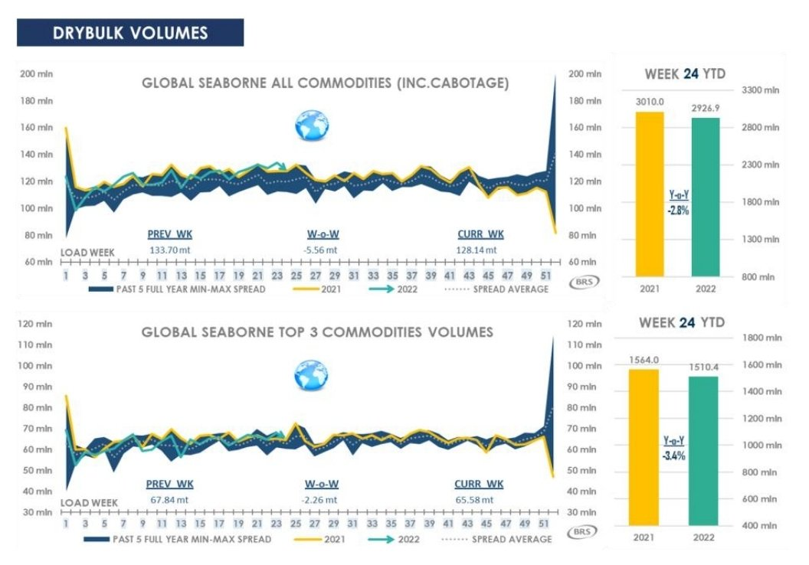
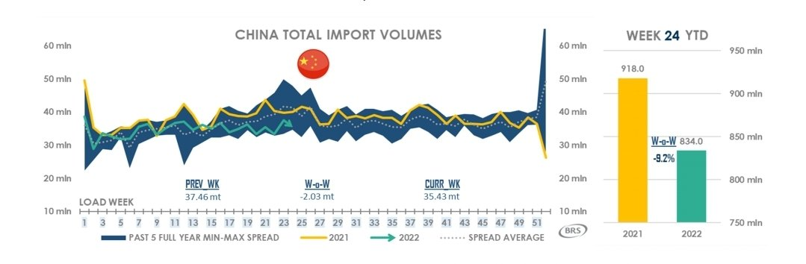
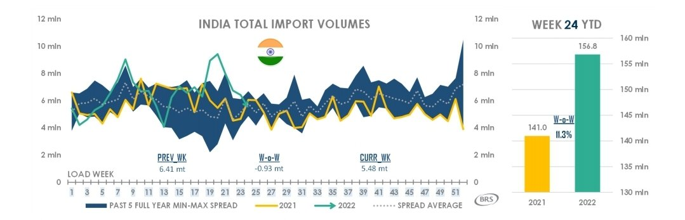
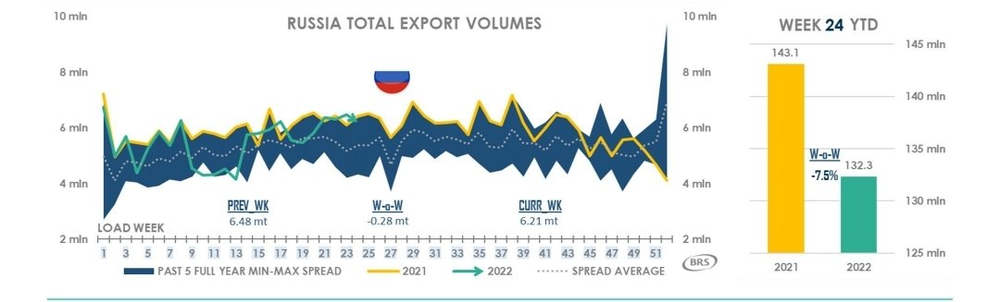
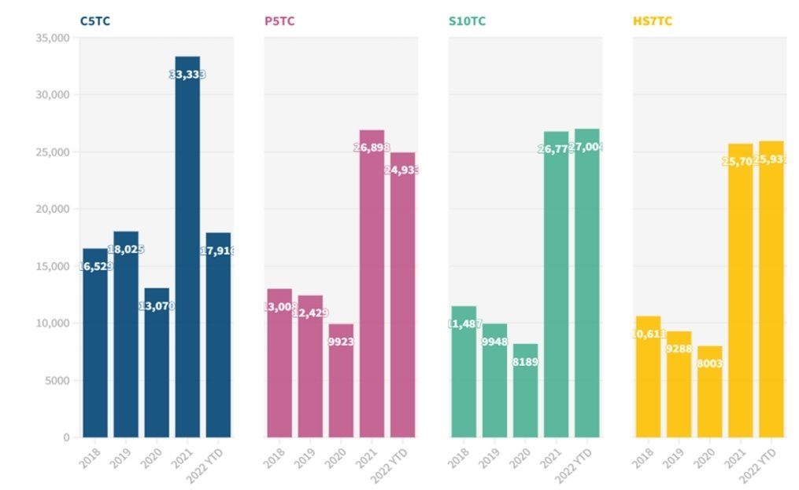
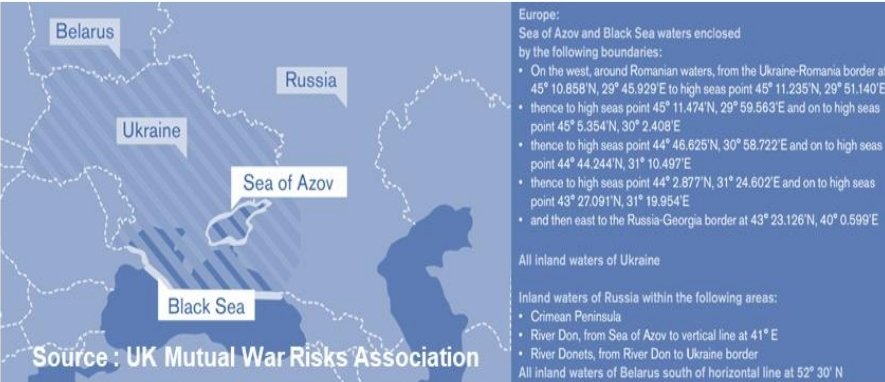
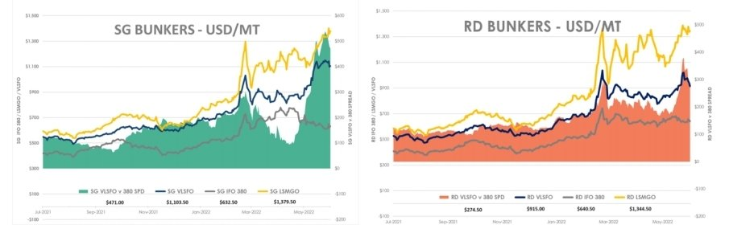

# BRS Dry Bulk Weekly Newsletter

**Date:** June 24, 2022  
**Publisher:** Breakwave Advisors | **Category:** Market Insights  
**Original URL:** [https://www.breakwaveadvisors.com/insights/2022/6/24/brs-dry-bulk-weekly-newsletter](https://www.breakwaveadvisors.com/insights/2022/6/24/brs-dry-bulk-weekly-newsletter)  

---

## 1h 2022 Recap and 2h Outlook

In a blink of the eye, we are near the mid-way mark of 2022. Concurrent and/or sequential events (Ukrainian war’s impact on crude oil and inflation, Indonesia & India imposing abrupt changes to their exports policies for various commodities etc) had massive repercussions on the shipping markets down the road. Yet, these events tend to have time-lagged effects which made mapping out the mid-term outlook for dry freight a rather hazardous exercise. It is with this understanding that market have a penchant for not following the script , we will attempt to layout the most likely scenario(s) in a methodological fashion.

> **Figure 1: Screenshot 20220624 123725 Samsung Notes**  
> [Local Asset](file:///C:/Users/Dell/Github/Shipping/corpus/03-breakwave/insights/2022/assets/2022-06-24_brs-dry-bulk-weekly-newsletter_img_screenshot-20220624-123725-samsungno_21fc149d0625.jpg)

For all commodities (including cabotage) transported on drybulk vessels, the year-to-date (YTD) volumes experienced a 2.8% loss, y.o.y basis. In comparison, when it comes to the top 3 commodities (Iron ore, Coal, Grains) shipped, YTD volumes’ losses widen to 3.4%, y.o.y basis. In a nutshell, demand from an ‘absolute volume’ perspective had notbeen particularly rosy in 2022. Yet, freight rates for sub-capes vessels had thrived in such turbulent times (to be discussed later on). This decline in global volumes was, no surprise, led by a 9.2% y.o.y decline in YTD volumes by the largest drybulk importer. China, while pursing its ‘COVID-Zero’ policy shut down several cities, including a 2 months-long lock down on its commercial and transportation hub, Shanghai. The supposedly ‘return’ of some key industrial regions of China in early Jun-22 has yet to translate into a surge in imports as business/retail confidence remained in the doldrums.

> **Figure 2: Screenshot 20220624 123751 Samsung Notes (1)**  
> [Local Asset](file:///C:/Users/Dell/Github/Shipping/corpus/03-breakwave/insights/2022/assets/2022-06-24_brs-dry-bulk-weekly-newsletter_img_screenshot-20220624-123751-samsungno_0615a893f44e.jpg)

Fortunately, loss in China’s import volumes had been partially cushioned by Indian’s demand for steam coal, driven by the lowest Indian utilities’ stockpiles in recent memory. As such, Indonesian coal trades to India involving bulker sizes from Supramaxes to Capes had been a boon to dry freight in May-22. However, the approaching monsoon season (Jun to Sep) had put a strong dampener on import levels since Jun-22.

> **Figure 3: Screenshot 20220624 123808 Samsung Notes**  
> [Local Asset](file:///C:/Users/Dell/Github/Shipping/corpus/03-breakwave/insights/2022/assets/2022-06-24_brs-dry-bulk-weekly-newsletter_img_screenshot-20220624-123808-samsungno_b12e1bbd1866.jpg)

Russian export volumes suffered a momentary hit following the start of the war but made a swift recovery as highly-discounted commodities enticed willing buyers such as India (which increase its Russian coal imports by c.45%). In addition, with the EU’s ban on Russian coal taking effect from 10-Aug, coal stockpiles in the Amsterdam-Rotterdam-Antwerp (ARA) region reached a two-year high as major developed European countries (Netherlands, Germany, Italy and Spain) collectively increased their Russian coal imports by c.24%.

> **Figure 4: Screenshot 20220624 123827 Samsung Notes**  
> [Local Asset](file:///C:/Users/Dell/Github/Shipping/corpus/03-breakwave/insights/2022/assets/2022-06-24_brs-dry-bulk-weekly-newsletter_img_screenshot-20220624-123827-samsungno_91a8c0865482.jpg)

## Freight Rates

As mentioned above, despite the few % drop in YTD drybulk volumes, the drybulk market had managed to keep a relatively firm footing in the 1H-22. That said, there’s still a distinction between Cape and sub-capes segments performance. Cape had been an underperformer (on par with FY-2019 though) on the back of easing congestion, slowing Chinese’s appetite for iron ore & coal and weather & covid-related supply disruptions to Brazil and Australia respectively. In contrast, sub-cape vessels in 1H-2022 had either outperformed/on par with their FY-2021’s rates (even after accounting for Jun-22’s decline). Several specific reasons can be attributed as follows:

> **Figure 5: Screenshot 20220624 123855 Samsung Notes**  
> [Local Asset](file:///C:/Users/Dell/Github/Shipping/corpus/03-breakwave/insights/2022/assets/2022-06-24_brs-dry-bulk-weekly-newsletter_img_screenshot-20220624-123855-samsungno_d580af558b06.jpg)

> **Figure 6: Screenshot 20220624 123911 Samsung Notes**  
> [Local Asset](file:///C:/Users/Dell/Github/Shipping/corpus/03-breakwave/insights/2022/assets/2022-06-24_brs-dry-bulk-weekly-newsletter_img_screenshot-20220624-123911-samsungno_5c407729deb7.jpg)

1) High risk premium for loading/discharging at/near Russian ports. Risk comes in the form of entering ‘High Risk Areas’ as defined by the Joint War Committee.

2) Increase in backhaul rate (more backhaul steel volumes + high container rates in 1H-22).

3) Greater fleet utilization (as a result of more back-haul trips which reduce ballast legs). When it comes to Ultramax-Handy (25-68,000 dwt) segment, the laden to ballast ship ratio had expanded to a 2-year high.

4) Longer ton-miles for Panamaxes and Supramaxes as Indonesian/Australian coal pivot to India/Atlantic basin.

## Bunkers

> **Figure 7: Screenshot 20220624 123933 Samsung Notes**  
> [Local Asset](file:///C:/Users/Dell/Github/Shipping/corpus/03-breakwave/insights/2022/assets/2022-06-24_brs-dry-bulk-weekly-newsletter_img_screenshot-20220624-123933-samsungno_fffec058f16a.jpg)

As Russian crude oil shipments divert toward Asia instead of USA & Europe, this flooded the region with copious volumes of IFO380 just as supply for distillates was unable to meet end-consumer demands, widening the Singapore scrubber spread (VLSFO– IFO 380) which hit north of $500/mt by early Jun-22. Even the Rotterdam scrubber spread had risen in tandem to a peak $380/mt. This placed a huge economical incentive on non-scrubber fitted vessels to slow steam for their ballast legs, providing an additional buffer to potential rates decline as the potential for increased tonnage capacity had a lid placed above it.
