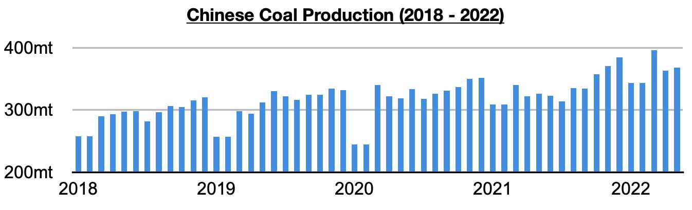
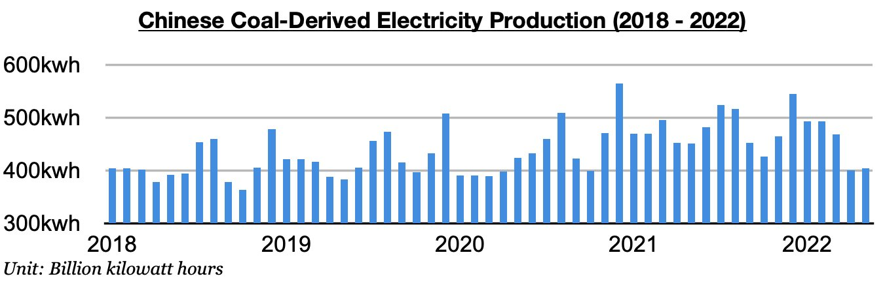
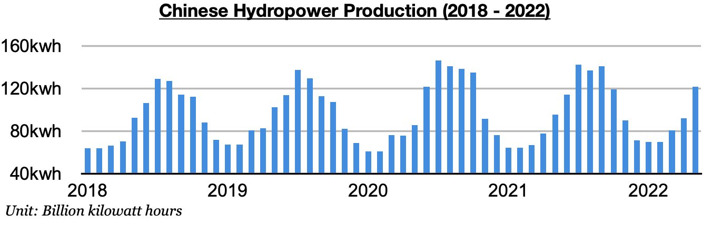

# China's Coal Output Remains Very Strong

**Date:** June 28, 2022  
**Publisher:** Breakwave Advisors | **Category:** Market Insights  
**Original URL:** [https://www.breakwaveadvisors.com/insights/2022/6/28/chinas-coal-output-remains-very-strong](https://www.breakwaveadvisors.com/insights/2022/6/28/chinas-coal-output-remains-very-strong)  

---

*By*[*Jeffrey Landsberg*](https://www.linkedin.com/in/jeffrey-landsberg-70ab957/)

As we have discussed in Commodore's recent Weekly Dry Bulk Reports and Weekly China Reports, China's coal production in May totaled 367.8 million tons. This has marked a month-on-month increase of 5 million tons (1%) and is up year-on-year by 41.5 million tons (13%). While again not setting a record (as was previously seen in March, December, November, and October), China’s coal production has remained quite strong. Remaining very significant to us is that prior to October, China had never even produced 352 million tons of coal in a single month.

> **Figure 1: Chart 1 (35)**  
> [Local Asset](file:///C:/Users/Dell/Github/Shipping/corpus/03-breakwave/insights/2022/assets/2022-06-28_chinas-coal-output-remains-very-strong_img_chart1283529_e8fdeed3ca86.jpg)

Overall, it remains concerning for China’s coal import prospects that coal production has stayed so strong. Also remaining concerning is that coal production growth continues to fare much better than coal-derived electricity generation growth. Coal-derived electricity generation is still likely to start finding growth again whenever coronavirus restrictions do end, but we continue to expect that coal production growth will remain stronger. Coal-derived electricity generation last month totaled 404.5 billion kilowatt hours. This is 3.7 billion kilowatt hours (1%) more than was produced in April but is down year-on-year by 46.2 billion kilowatt hours (-10%). This 27% year-on-year growth has marked the largest year-on-year growth seen in any single month since 2014.

> **Figure 2: Chart 2 (32)**  
> [Local Asset](file:///C:/Users/Dell/Github/Shipping/corpus/03-breakwave/insights/2022/assets/2022-06-28_chinas-coal-output-remains-very-strong_img_chart2283229_d03258220445.jpg)

Also of note is that the production of hydropower and other renewable sources of electricity last month all experienced year-on-year growth again. Hydropower output totaled 121.7 billion kilowatt hours in May, which is up from April by 29.9 billion kilowatt hours (33%) and up year-on-year by 26.1 billion kilowatt hours (27%). The last time that any renewable other than hydropower production contracted on a year-on-year basis was nuclear back in November 2020 -- and hydropower production itself has recently remained quite strong.

> **Figure 3: Chart 3 (27)**  
> [Local Asset](file:///C:/Users/Dell/Github/Shipping/corpus/03-breakwave/insights/2022/assets/2022-06-28_chinas-coal-output-remains-very-strong_img_chart3282729_d222c26e3b84.jpg)
