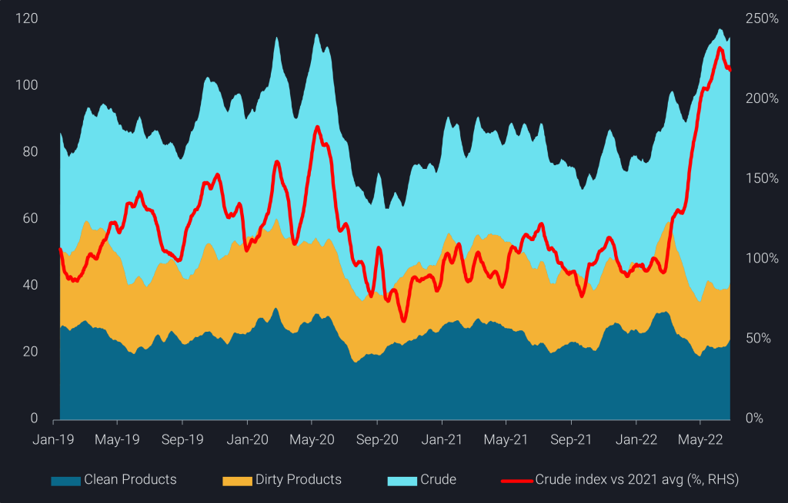
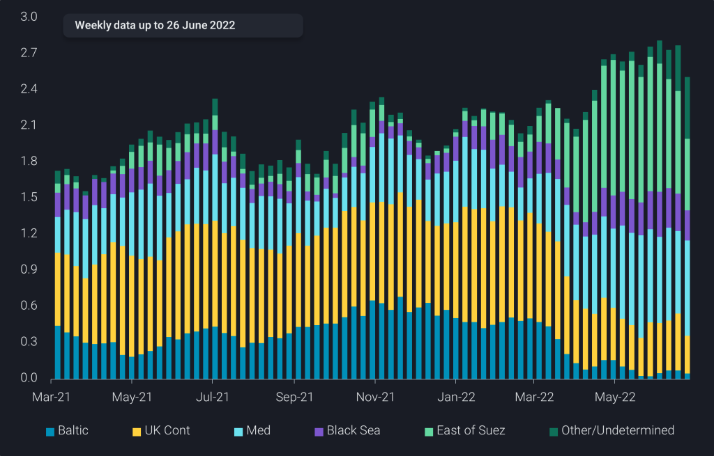
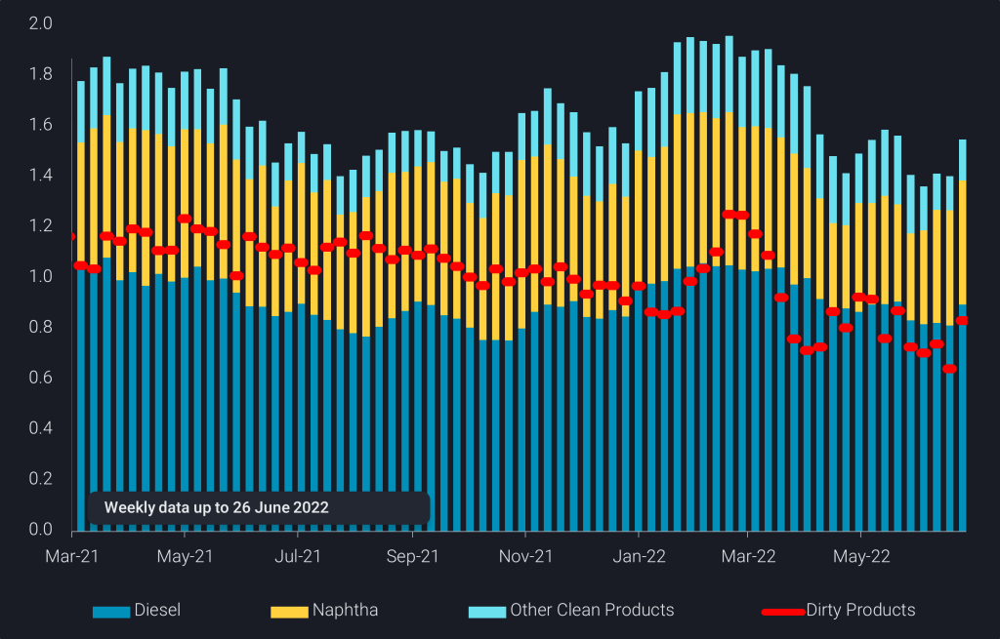
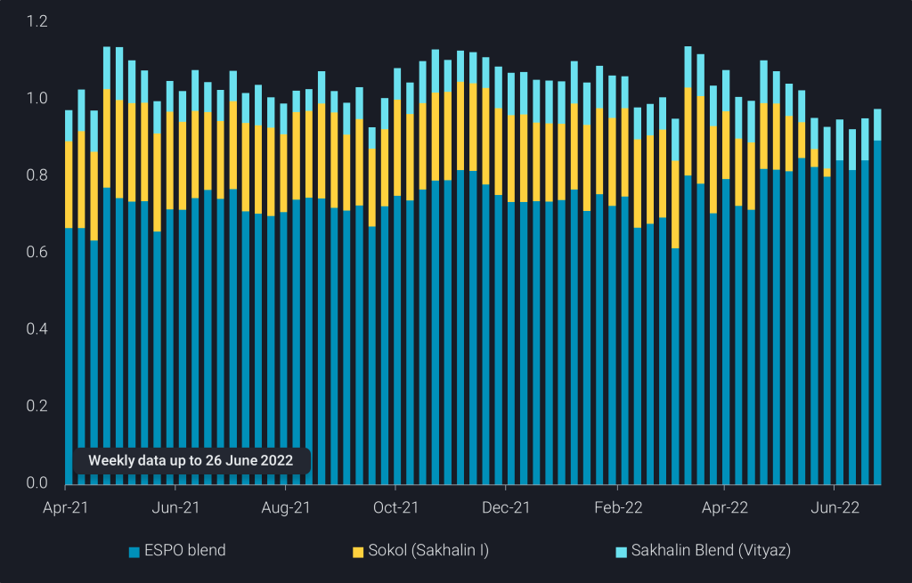

# Russian crude in transit at record highs

**Date:** June 29, 2022  
**Publisher:** Breakwave Advisors | **Category:** Market Insights  
**Original URL:** [https://www.breakwaveadvisors.com/insights/2022/6/29/russian-crude-in-transit-at-record-highs](https://www.breakwaveadvisors.com/insights/2022/6/29/russian-crude-in-transit-at-record-highs)  

---

*By*[*David Wech*](https://www.linkedin.com/in/david-wech-83a163165/)

Russia’s oil exports over Q2 have been pretty stable, a contrast to Russian natural gas flows into Europe. But there are a couple of interesting nuances in the latest data that could indicate new trends.

Overall, seaborne Russian oil in-transit is likely at all-time record highs, driven by crude. Due to high Russian crude export levels and the approximately 1mbd going from the Baltic and Black Seas to Asia, crude in-transit has recently been more than twice as high as on average last year. Clean and dirty products in-transit are also relatively resilient, given that exports are generally lower relative to pre-war levels, especially for residues.

> **Figure 1: 220628 1 1 1024x655**  
> **Interactive Data & Source:** [Analytics Vortexa](https://analytics.vortexa.com/?dateRange=2019-01-01T00%3A00%3A00.000Z__2022-06-26T23%3A59%3A59.999Z&filtersEnabled=%5B%22p%22%2C%22o%22%2C%22d%22%2C%22d_r%22%2C%22v%22%2C%22intra%22%2C%22sts_o%22%2C%22c_o%22%2C%22w%22%5D&frequency=day&from=%5B%22b996521be9c996db3560ca234a56286ac38f798d34be229437555fab4f12a6a5%22%5D&geoBreakdownDestinationGlobal=region&geoBreakdownOriginGlobal=trading_region&metric=bpd&movementEvent=transiting_state&page=Flows&productsExcluded=%5B%229b0f7f5de0b111910f9f8a71b4008d4e0fd7542c55750f21dc905cda5f76bc08%22%2C%22bb70cf56200f5b72ba69a90bda2c6b47ba29da23945c6f1994cfd4c2ef2fe0ff%22%5D&sortDirection=asc&sortField=destination&tabId=c6f9e5c5-5194-4257-8a66-ff4ad1067951&timeSeriesProperty=product_group&vesselClassChartView=count) | [Local Asset](file:///C:/Users/Dell/Github/Shipping/corpus/03-breakwave/insights/2022/assets/2022-06-29_russian-crude-in-transit-at-record-highs_img_220628-1-1-1024x655_8bffbbd0e725.png)

[**Russian seaborne oil in-transit by product group**](https://analytics.vortexa.com/?dateRange=2019-01-01T00%3A00%3A00.000Z__2022-06-26T23%3A59%3A59.999Z&filtersEnabled=%5B%22p%22%2C%22o%22%2C%22d%22%2C%22d_r%22%2C%22v%22%2C%22intra%22%2C%22sts_o%22%2C%22c_o%22%2C%22w%22%5D&frequency=day&from=%5B%22b996521be9c996db3560ca234a56286ac38f798d34be229437555fab4f12a6a5%22%5D&geoBreakdownDestinationGlobal=region&geoBreakdownOriginGlobal=trading_region&metric=bpd&movementEvent=transiting_state&page=Flows&productsExcluded=%5B%229b0f7f5de0b111910f9f8a71b4008d4e0fd7542c55750f21dc905cda5f76bc08%22%2C%22bb70cf56200f5b72ba69a90bda2c6b47ba29da23945c6f1994cfd4c2ef2fe0ff%22%5D&sortDirection=asc&sortField=destination&tabId=c6f9e5c5-5194-4257-8a66-ff4ad1067951&timeSeriesProperty=product_group&vesselClassChartView=count)**(mb, 14-day MA) & Russian crude in-transit vs 2021 average (%, RHS)**

Russian crude exports (excl. CPC Blend) from the European side have been significantly lower in the week to 26 June, also dragging down the 4-week average. There may be multiple reasons at play, including higher domestic refinery runs, a rerouting of crude to the East via pipelines, and renewed difficulties to place barrels as hinted at by new efforts to disguise exports.

## Baltic Exports Trend Lower

> **Figure 2: 220628 2 1024x655**  
> **Interactive Data & Source:** [Analytics Vortexa](https://analytics.vortexa.com/?dateRange=2021-01-01T00%3A00%3A00.000Z__2022-06-26T23%3A59%3A59.999Z&filtersEnabled=%5B%22p%22%2C%22o%22%2C%22d%22%2C%22d_r%22%2C%22v%22%2C%22intra%22%2C%22sts_o%22%2C%22c_o%22%2C%22w%22%5D&frequency=week&from=%5B%22c48ec599431027d68fbdc85031399ba463394e0e7dbec392ba3ce6979ee01c15%22%2C%2244a1b0bb0e2afdb98d07b20184550b77449745bb650cb31628fb4c6ceeb64603%22%2C%22488300bb8d94adfdd2e29bea7f692c69133b016810805dd012245882e2f2f6f7%22%5D&geoBreakdownOriginGlobal=trading_region&metric=bpd&page=Flows&products=%5B%2254af755a090118dcf9b0724c9a4e9f14745c26165385ffa7f1445bc768f06f11%22%5D&productsExcluded=%5B%22bb70cf56200f5b72ba69a90bda2c6b47ba29da23945c6f1994cfd4c2ef2fe0ff%22%5D&sortDirection=asc&sortField=destination&tabId=c6f9e5c5-5194-4257-8a66-ff4ad1067951&timeSeriesProperty=destination_shipping_region&vesselClassChartView=count&vesselClassesExcluded=%5B%22tiny_tanker%22%5D) | [Local Asset](file:///C:/Users/Dell/Github/Shipping/corpus/03-breakwave/insights/2022/assets/2022-06-29_russian-crude-in-transit-at-record-highs_img_220628-2-1024x655_9ed86a492bab.png)

[**Russian crude exports from the Arctic, Baltic and Black Sea**](https://analytics.vortexa.com/?dateRange=2021-01-01T00%3A00%3A00.000Z__2022-06-26T23%3A59%3A59.999Z&filtersEnabled=%5B%22p%22%2C%22o%22%2C%22d%22%2C%22d_r%22%2C%22v%22%2C%22intra%22%2C%22sts_o%22%2C%22c_o%22%2C%22w%22%5D&frequency=week&from=%5B%22c48ec599431027d68fbdc85031399ba463394e0e7dbec392ba3ce6979ee01c15%22%2C%2244a1b0bb0e2afdb98d07b20184550b77449745bb650cb31628fb4c6ceeb64603%22%2C%22488300bb8d94adfdd2e29bea7f692c69133b016810805dd012245882e2f2f6f7%22%5D&geoBreakdownOriginGlobal=trading_region&metric=bpd&page=Flows&products=%5B%2254af755a090118dcf9b0724c9a4e9f14745c26165385ffa7f1445bc768f06f11%22%5D&productsExcluded=%5B%22bb70cf56200f5b72ba69a90bda2c6b47ba29da23945c6f1994cfd4c2ef2fe0ff%22%5D&sortDirection=asc&sortField=destination&tabId=c6f9e5c5-5194-4257-8a66-ff4ad1067951&timeSeriesProperty=destination_shipping_region&vesselClassChartView=count&vesselClassesExcluded=%5B%22tiny_tanker%22%5D)**(4-week average, mbd)**

The driver of lower crude exports is the Baltic region, which is also responsible for higher product exports in recent weeks. This would fit with reports of higher refinery runs out of Russia, keeping some marginal crude in the country and converting it into products. It is important to remember that the initial hike in Russian crude exports was to quite some extent a function of lower domestic refinery runs, as players struggled to place refined products in international markets.

> **Figure 3: 220628 3 1024x655**  
> **Interactive Data & Source:** [Analytics Vortexa](https://analytics.vortexa.com/?dateRange=2020-01-01T00%3A00%3A00.000Z__2022-06-26T23%3A59%3A59.999Z&filtersEnabled=%5B%22p%22%2C%22o%22%2C%22d%22%2C%22d_r%22%2C%22v%22%2C%22intra%22%2C%22sts_o%22%2C%22c_o%22%2C%22w%22%5D&frequency=week&from=%5B%22b996521be9c996db3560ca234a56286ac38f798d34be229437555fab4f12a6a5%22%5D&geoBreakdownDestinationGlobal=region&geoBreakdownOriginGlobal=trading_region&metric=bpd&page=Flows&productsExcluded=%5B%229b0f7f5de0b111910f9f8a71b4008d4e0fd7542c55750f21dc905cda5f76bc08%22%2C%22bb70cf56200f5b72ba69a90bda2c6b47ba29da23945c6f1994cfd4c2ef2fe0ff%22%5D&sortDirection=asc&sortField=destination&tabId=c6f9e5c5-5194-4257-8a66-ff4ad1067951&timeSeriesProperty=product_group_product&vesselClassChartView=count) | [Local Asset](file:///C:/Users/Dell/Github/Shipping/corpus/03-breakwave/insights/2022/assets/2022-06-29_russian-crude-in-transit-at-record-highs_img_220628-3-1024x655_3e132dca3389.png)

[**Russian product exports**](https://analytics.vortexa.com/?dateRange=2020-01-01T00%3A00%3A00.000Z__2022-06-26T23%3A59%3A59.999Z&filtersEnabled=%5B%22p%22%2C%22o%22%2C%22d%22%2C%22d_r%22%2C%22v%22%2C%22intra%22%2C%22sts_o%22%2C%22c_o%22%2C%22w%22%5D&frequency=week&from=%5B%22b996521be9c996db3560ca234a56286ac38f798d34be229437555fab4f12a6a5%22%5D&geoBreakdownDestinationGlobal=region&geoBreakdownOriginGlobal=trading_region&metric=bpd&page=Flows&productsExcluded=%5B%229b0f7f5de0b111910f9f8a71b4008d4e0fd7542c55750f21dc905cda5f76bc08%22%2C%22bb70cf56200f5b72ba69a90bda2c6b47ba29da23945c6f1994cfd4c2ef2fe0ff%22%5D&sortDirection=asc&sortField=destination&tabId=c6f9e5c5-5194-4257-8a66-ff4ad1067951&timeSeriesProperty=product_group_product&vesselClassChartView=count)**(4-week average, mbd)**

## Diverging Trends in Russia Far East

To a some extent – somewhere in the range of 100-200kbd – Russia may also be rerouting crude towards the Asian market via its internal pipeline system. At any rate, seaborne crude exports via Kozmino have been on a steady increase over recent months, zooming in towards 900kbd over June, after having been below 700kbd in the period before the Ukraine war started. And overland pipeline exports to China are also likely to be maxed out.

Overall, Far Eastern Russian crude exports are lower despite higher Kozmino loadings, as Sokol exports from the De-Kastri port in Sakhalin have come to a complete halt ever since early May. That takes 230kbd of crude away, measured on the basis of the 2021 average. Sakhalin Blend exports from Prigorodnoye meanwhile are continuing at normal levels close to 100kbd.

> **Figure 4: 220628 4 1024x655 (1)**  
> **Interactive Data & Source:** [Analytics Vortexa](https://analytics.vortexa.com/?dateRange=2021-01-01T00%3A00%3A00.000Z__2022-06-26T23%3A59%3A59.999Z&filtersEnabled=%5B%22p%22%2C%22o%22%2C%22d%22%2C%22d_r%22%2C%22v%22%2C%22intra%22%2C%22sts_o%22%2C%22c_o%22%2C%22w%22%5D&frequency=week&from=%5B%22b996521be9c996db3560ca234a56286ac38f798d34be229437555fab4f12a6a5%22%5D&geoBreakdownOriginGlobal=trading_region&metric=bpd&originGlobalXFilter=%5B%224bd22474bec28e0d2576ff0ad204966df7f082d85af4f062763c49c4b1cac65d%22%5D&page=Flows&products=%5B%2254af755a090118dcf9b0724c9a4e9f14745c26165385ffa7f1445bc768f06f11%22%5D&productsExcluded=%5B%22bb70cf56200f5b72ba69a90bda2c6b47ba29da23945c6f1994cfd4c2ef2fe0ff%22%5D&sortDirection=asc&sortField=destination&tabId=c6f9e5c5-5194-4257-8a66-ff4ad1067951&timeSeriesProperty=product_grade&vesselClassChartView=count&vesselClassesExcluded=%5B%22tiny_tanker%22%5D) | [Local Asset](file:///C:/Users/Dell/Github/Shipping/corpus/03-breakwave/insights/2022/assets/2022-06-29_russian-crude-in-transit-at-record-highs_img_220628-4-1024x65528129_540c5dff9c31.png)

[**Russian crude exports from the Far East by grade**](https://analytics.vortexa.com/?dateRange=2021-01-01T00%3A00%3A00.000Z__2022-06-26T23%3A59%3A59.999Z&filtersEnabled=%5B%22p%22%2C%22o%22%2C%22d%22%2C%22d_r%22%2C%22v%22%2C%22intra%22%2C%22sts_o%22%2C%22c_o%22%2C%22w%22%5D&frequency=week&from=%5B%22b996521be9c996db3560ca234a56286ac38f798d34be229437555fab4f12a6a5%22%5D&geoBreakdownOriginGlobal=trading_region&metric=bpd&originGlobalXFilter=%5B%224bd22474bec28e0d2576ff0ad204966df7f082d85af4f062763c49c4b1cac65d%22%5D&page=Flows&products=%5B%2254af755a090118dcf9b0724c9a4e9f14745c26165385ffa7f1445bc768f06f11%22%5D&productsExcluded=%5B%22bb70cf56200f5b72ba69a90bda2c6b47ba29da23945c6f1994cfd4c2ef2fe0ff%22%5D&sortDirection=asc&sortField=destination&tabId=c6f9e5c5-5194-4257-8a66-ff4ad1067951&timeSeriesProperty=product_grade&vesselClassChartView=count&vesselClassesExcluded=%5B%22tiny_tanker%22%5D)**(4-week average, mbd)**

## Alternative Sts Activity

Russian players are increasing their efforts to work on alternative export logistics, partly likely keeping an eye to disguise actual movements. We have observed a number of dark STS transfers in the Atlantic Basin around the Azores, allowing the compilation of VLCC shipments to Asia as opposed to the direct movement of Aframaxes as observed in previous months post-conflict.

The unusual choice for the area around the Azores for STS activity, and significant costs to make the transfers possible (e.g. availability of fenders), may be driven by the wish to act in international waters subject to less observation and any national legislation, while weather patterns tend to be more benign than they are closer to the European continent.

The need to export crude and products in growing volumes to long-haul destinations East of Suez, ideally disguising also the origins to attract potential buyers beyond China and India, may be growing well ahead of the sixth EU sanction package coming into force around the turn of the year. While the sanctions legalise in principle continued European imports of Russian oil until that point, the recent escalation turns the conflict between Western allies and Russia into a straightforward economic war. This is illustrated by increased weapon deliveries, considerations on further sanctions including a price cap, and the Russian curtailment of natural gas supplies, amid others. Against this backdrop, opportunistic buying of Russian oil, as observed especially in the Mediterranean, is now more difficult than it looked just a couple of weeks ago.

Data Source:[Vortexa](https://www.vortexa.com//oil-gas-data-traders-analysts-data-scientists?gclid=Cj0KCQjw8_qRBhCXARIsAE2AtRZKOvMnbilZ_6_91d7huSFFy71pWLrnPwGwOHVzXsmsG-1a1mZnQw8aAt89EALw_wcB&hsa_acc=1782073842&hsa_ad=548425387665&hsa_cam=14746637662&hsa_grp=125038601902&hsa_kw=&hsa_mt=&hsa_net=adwords&hsa_src=g&hsa_tgt=dsa-1431852288425&hsa_ver=3&utm_campaign=%5BCD%5D%20-%20DSA%20-%20EMEA&utm_medium=cpc&utm_medium=ppc&utm_source=google&utm_source=adwords&utm_term=)
