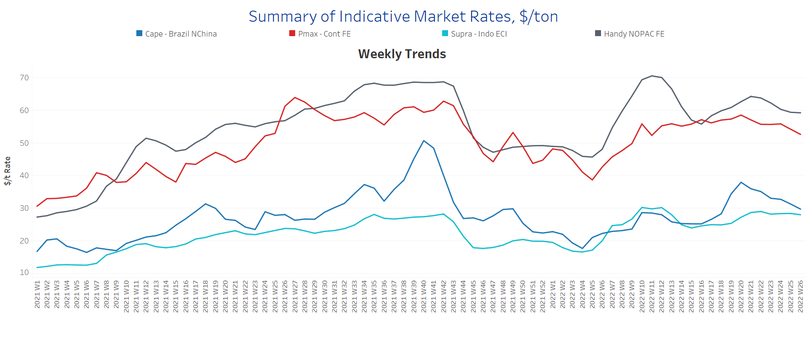
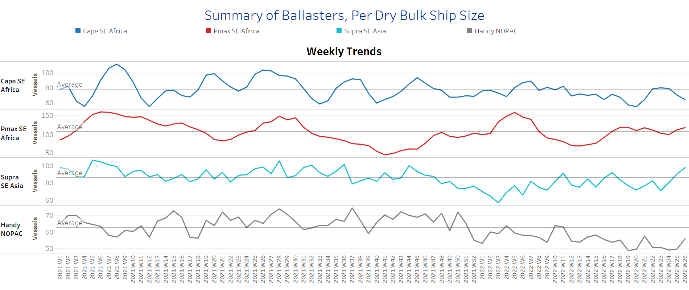
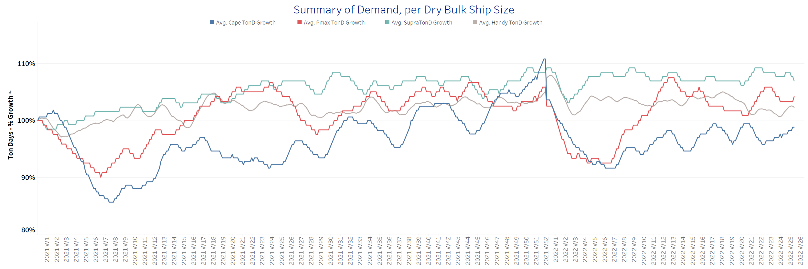
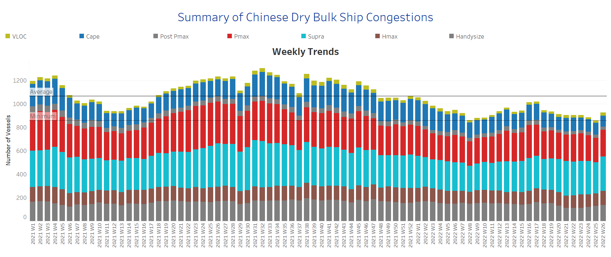

# Signal Dry Bulk Weekly Report

**Date:** June 29, 2022  
**Publisher:** Breakwave Advisors | **Category:** Market Insights  
**Original URL:** [https://www.breakwaveadvisors.com/insights/2022/6/29/signal-dry-bulk-weekly-report](https://www.breakwaveadvisors.com/insights/2022/6/29/signal-dry-bulk-weekly-report)  

---

Weaker sentiment in freight rates continued in the last week of June, however, iron ore price hit a one-week high on China's demand hopes amid easing Covid-19 curbs and President Xi Jinping’s pledge to take more effective measures to achieve the country’s economic and social development goals. The most-traded September iron ore price on China's Dalian Commodity Exchange rose 5% to 782.50 yuan ($117.02) per tonne, the highest since June 20. On the Singapore Exchange, the July front-month contract for the steelmaking material climbed 5.7% to $120.60 per tonne, its highest level since June 20.

However, the absence of additional and specific stimulus measures from Beijing could limit price increases for the time being. In China's steel production hub, the city of Tangshan, 56 of the 126 blast furnaces have been closed for maintenance, according to Sinosteel, as smelters struggle with falling margins in the face of weak demand and high inventories.

Overall, Covid 19 restrictions, which have put pressure on the real estate sector, and disruptions in construction activity caused by adverse weather conditions remain a headwind for China's huge steel sector.

In the coal segment, despite widespread commitments to phase out coal from the electricity sector, Poland and Ukraine are reported to be increasing production of thermal coal this year to prepare for the colder months, while Europe grapples with an energy security crisis. In addition, Germany, Austria, and the Netherlands are preparing to increase coal-fired power generation as an emergency measure.

In the grain segment, Chicago wheat futures were at the $9.3 level in late June, near prices not seen since geopolitical tensions began, as improved prospects pointed to a record-high production forecast for Russian wheat. This higher supply from Russia helped ease concerns about shortages during the harvest season in North America and Europe. Expectations for the resumption of exports from Ukraine remain muted, as it is questionable whether Russia will open safe trade corridors from Ukrainian ports.

## Section 1 - Freight -Market Rates ($/T) - Weaker

‘The Big Picture’ - Capesize and Panamax Bulkers and Smaller Ship Sizes

> **Figure 1: Market Chart 1**  
> **Interactive Data & Source:** [Signal Ocean Platform](https://www.thesignalgroup.com/signal-ocean-platform) | [Local Asset](file:///C:/Users/Dell/Github/Shipping/corpus/03-breakwave/insights/2022/assets/2022-06-29_signal-dry-bulk-weekly-report_img_unnamed282929_f40397616218.png)

In the last days of June, the weaker sentiment observed in the previous week was confirmed with a decline in all ship size categories.

- **Capesize**Brazil-to-North China freight rates fell below $31/tonne, down $7/tonne from the end of week 20.
- **Panamax**Continent-to-Far East freight rates fell to their lowest level since week 11, at $53/tonne, down $5/tonne from week 20.
- **Supramax**Indo-to-ECI freight rates seemed to hold resistance and not drop below $28/t over the last six consecutive weeks.
- **Handysize**NOPAC-to-Far East freight rates held at levels below $60/t since the end of the previous week.

## Section 2 - Supply - Ballasters View

## Number of Vessels -Increasing

> **Figure 2: Supply Trend Lines for Key Load Areas**  
> **Interactive Data & Source:** [Signal Ocean Platform](https://www.thesignalgroup.com/signal-ocean-platform) | [Local Asset](file:///C:/Users/Dell/Github/Shipping/corpus/03-breakwave/insights/2022/assets/2022-06-29_signal-dry-bulk-weekly-report_img_unnamed283029_d4037cf73a04.png)

In the Handysize, Supramax, and Panamax segments, the number of ballast tankers has increased significantly. However, Capesize SE Africa has seen a downward trend that has continued since the end of week 23.

- **Capesize**SE Africa: The number of vessels sailing in ballast dropped to 65, 12 less than the one-year average trend.
- **Panamax**SE Africa: The number of vessels has increased to 120, which is 20 more than at the end of week 24.
- **Supramax**SE Asia: The number of vessels increased to 103, 45% more than at the end of week 23 and 20% more than the annual average.
- **Handysize**NOPAC: The number of vessels has suddenly increased to 61, 20% above the low of week 25.

## Section 3 - Demand - In Ton Days

## Increasing

> **Figure 3: Increasing**  
> **Interactive Data & Source:** [Signal Ocean Platform](https://www.thesignalgroup.com/signal-ocean-platform) | [Local Asset](file:///C:/Users/Dell/Github/Shipping/corpus/03-breakwave/insights/2022/assets/2022-06-29_signal-dry-bulk-weekly-report_img_unnamed283129_7f35ac09e604.png)

June seems to end with a recovery in the Capesize segment, and there are signs of an upswing in Panamax and Handysize.

- **Capesize**demand ton-days: The latest percentage increase is approaching the peak of week 20.
- **Panamax**demand ton-days: The downward trend has already weakened and there are first signs of an upswing in the coming days.
- **Supramax**demand ton-days: The decline observed last week continued in the last days of June, while the percentage increase now seems to be the lowest since the end of week 20.
- **Handysize**demand ton-days: Momentum changed to higher percentage growth, surpassing the low of week 23.

## Section 4 - Chinese Port Congestions -

## Number of Vessels - Increasing

> **Figure 4: Dry Bulk Ships Congested at Chinese Ports**  
> **Interactive Data & Source:** [Signal Ocean Platform](https://www.thesignalgroup.com/signal-ocean-platform) | [Local Asset](file:///C:/Users/Dell/Github/Shipping/corpus/03-breakwave/insights/2022/assets/2022-06-29_signal-dry-bulk-weekly-report_img_unnamed283229_30e1819d010e.png)

The number of congested vessels emerged with an increasing trend through the end of June, driven by upward movements in the Handysize, Supramax, and Panamax segments.

- **Capesize:**The number of congested vessels was 102, a similar level to previous weeks in June.
- **Panamax:**The number of vessels sustained increased to 225, which is 9% more than the previous week.
- **Supramax:**The number of congested vessels is still below the threshold of 300.
- **Handysize**: The number of congested vessels has been about 130 over the last two weeks, up 30% from the low in week 22.

Data Source:[Signal Ocean Platform](https://www.thesignalgroup.com/signal-ocean-platform)
