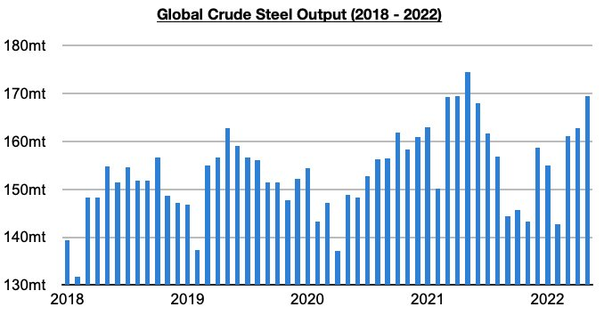
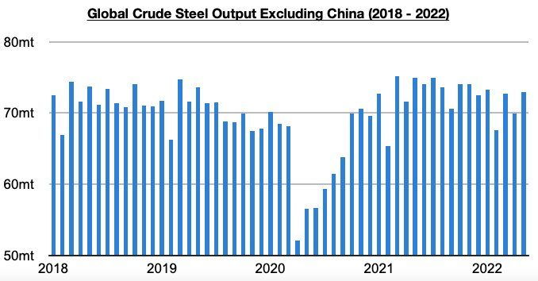

# Global Steel Contraction Continues

**Date:** June 30, 2022  
**Publisher:** Breakwave Advisors | **Category:** Market Insights  
**Original URL:** [https://www.breakwaveadvisors.com/insights/2022/6/30/global-steel-contraction-continues](https://www.breakwaveadvisors.com/insights/2022/6/30/global-steel-contraction-continues)  

---

*By*[*Jeffrey Landsberg*](https://www.linkedin.com/in/jeffrey-landsberg-70ab957/)

Global crude steel production totaled 169.5 million tons in May. This is up month-on-month by 6.8 million tons (4%) but is 4.9 million tons (-3%) less than was reported last year for May’s production. Global crude steel production has now contracted on a year-on-year basis for nine straight months. Last month marked the third straight month where production contracted on a year-on-year basis outside of China, and marked the eleventh straight month where it contracted on a year-on-year basis in China.

> **Figure 1: Chart 1 (36)**  
> [Local Asset](file:///C:/Users/Dell/Github/Shipping/corpus/03-breakwave/insights/2022/assets/2022-06-30_global-steel-contraction-continues_img_chart1283629_e50994eedeba.jpg)

Global crude steel production outside of China totaled 72.9 million tons. This is up month-on-month by 3 million tons (4%) but is 2 million tons (-2%) less than was reported last year for May 2021’s production. Concerning is that this has marked only the third time since February 2021 that steel production outside of China has contracted on a year-on-year basis. Prior to these last three months, global crude steel production outside of China had grown on a year-on-year basis for twelve consecutive months.

> **Figure 2: Chart 2 (33)**  
> [Local Asset](file:///C:/Users/Dell/Github/Shipping/corpus/03-breakwave/insights/2022/assets/2022-06-30_global-steel-contraction-continues_img_chart2283329_e39c9b573090.jpg)

Overall, it remains concerning to us that much of the world continues to tighten at the same time that economic weakness is already apparent. China and Russia, though, continue to stand out as each have recently cut interest rates. Going forward, we remain more bullish for China compared with the rest of the world. For the dry bulk market, we also continue to expect that an iron ore restock will be occurring in China at the same time that Brazilian and Australian iron ore output are undergoing their seasonal strength. At present, though, steel prices in China do remain under pressure as production has been exceeding demand. We expect that demand will ultimately improve whenever China does fully end its coronavirus restrictions. China’s housing market remains weak, but it has at least shown some improvement recently.
