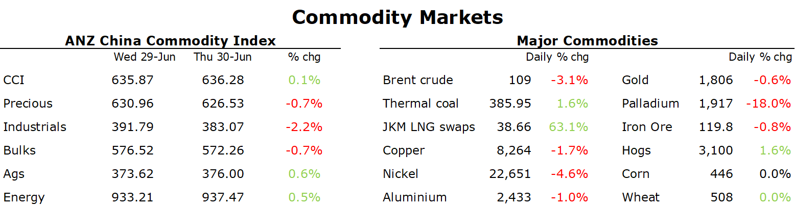

# Oil falls as focus returns to economic slowdown

**Date:** July 01, 2022  
**Publisher:** Breakwave Advisors | **Category:** Market Insights  
**Original URL:** [https://www.breakwaveadvisors.com/insights/2022/7/1/oil-falls-as-focus-returns-to-economic-slowdown](https://www.breakwaveadvisors.com/insights/2022/7/1/oil-falls-as-focus-returns-to-economic-slowdown)  

---

*By*[*Daniel Hynes*](https://www.linkedin.com/in/dahynes/)

Further weak economic data saw fears of an economic slowdown weighing on sentiment in commodity markets. A stronger USD also impacted investor appetite.

> **Figure 1: 1656625902140**  
> **Interactive Data & Source:** [Publications Anz](https://publications.anz.com/SingletrackCMS__DownloadDocument?docRef=df175f96-f9a0-4a87-b9d0-7c516d8df57b&uid=bd219b92-f5cc-400e-9646-4178791864b7&jobRef=8add11d5-57f1-4364-8b5d-57b0058ce655) | [Local Asset](file:///C:/Users/Dell/Github/Shipping/corpus/03-breakwave/insights/2022/assets/2022-07-01_oil-falls-as-focus-returns-to-economic-slowdown_img_1656625902140_434000793179.png)

**Crude oil**extended losses after US consumer spending fell in May for the first time this year. This raised concerns that high inflation is starting to weigh on the economic outlook. This comes following a report earlier this week that US motorists are planning fewer trips. The number of Americans planning on taking a vacation by car in the next six months dropped to 22.7% in June, according to data from the Conference Board’s index. This is the lowest level in four years, outside of pandemic induced lockdowns of 2020. US gasoline demand is also shown signs of softening. The four-week moving average of gasoline supplied, the best gauge on demand, fell below 9mb/d. This is about 600kb/d below typical season levels. Even so, we don’t see this[**derailing oil’s bullish run**](https://publications.anz.com/SingletrackCMS__DownloadDocument?docRef=df175f96-f9a0-4a87-b9d0-7c516d8df57b&uid=bd219b92-f5cc-400e-9646-4178791864b7&jobRef=8add11d5-57f1-4364-8b5d-57b0058ce655). Previous recessions have seen oil demand fall by 0-3% (peak to trough), but that would still not be enough to offset the supply side disruptions. As expected, the OPEC+ alliance rubber stamping an increase in supply for August. The rise in quotas brings the group back to pre-pandemic levels. The focus now shifts to whether producers such as Saudi Arabia will dig deep into its limited spare capacity to increase supplier further. The fact that the group continues to struggle to raise production suggests they won’t.

**European gas**prices continue to push higher as cuts to Russia gas flows haunts the market. Dutch front month futures closed the session up 3% to EUR144.51/MWh, bringing the monthly gain to 54%. After dropping to only 40% of capacity earlier this month, Gazprom has warned flows will halt in mid July for further maintenance of the Nord Stream pipeline. This has overshadowed reduced summer demand and strong imports of LNG. The supply shock is putting pressure on companies, with energy giant Uniper SE in bailout talks with the German government. Chancellor Olaf Scholz said they are ready to help companies in need.

**North Asian LNG**prices gained as strong demand boosted activity in the spot market. A heatwave in Japan has power demand surge so much that officials have asked businesses and homes to reduce electricity use as it faces power shortages. South Korea expects peak power demand to be above average this summer, according to the country’s Energy Ministry.

**Copper**, the economic bellwether, fell further amid concerns of an economic slowdown. Not even an increase in factory activity in China could improve the mood. China’s official manufacturing purchasing managers index rose above 50 for the first time since February. This comes as COVID-19 restrictions ease. This suggests the market views the improvement is not enough to offset the potential slowdown in developed economies. The market also quickly moved on from yesterday’s news that the UK had sanctioned Vladimir Potanin, the largest shareholder in Russian mining giant Norilsk Nickel.’

**Iron ore**sank for a second consecutive day amid signs of weak demand. The steel industry’s PMI in June plunged to its lowest level since the financial crisis of 2008. Steel inventories showed only a marginal decline during the month, despite output falling. Meanwhile, new steel orders sank in June.

The stronger USD weighed on investor demand in the**gold**market. Central bankers warned of even more aggressive policy tightening amid persistently high inflation. The steady selling was briefly interrupted after the release of US annual core PCE price index came in at 4.7% in May vs consensus of 4.8%.

Data source:[Commodities Wrap](https://www.linkedin.com/newsletters/commodities-wrap-6692196755876012032/?fbclid=IwAR3kiXJqZdxmp9ZcRwBNI7FsBySI-XSC0pfPur1qzjt7OZp7PTE59Tsl1QI)
