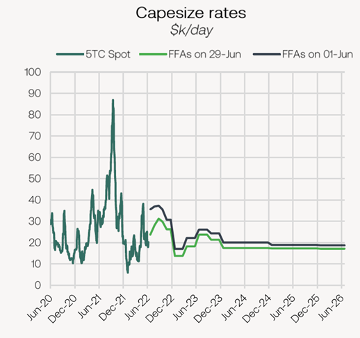
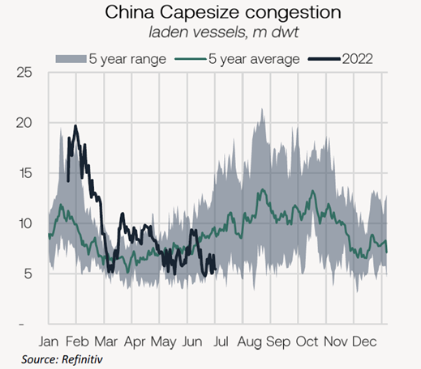
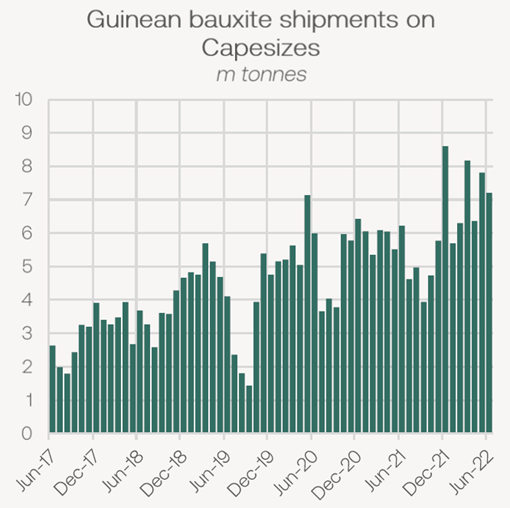
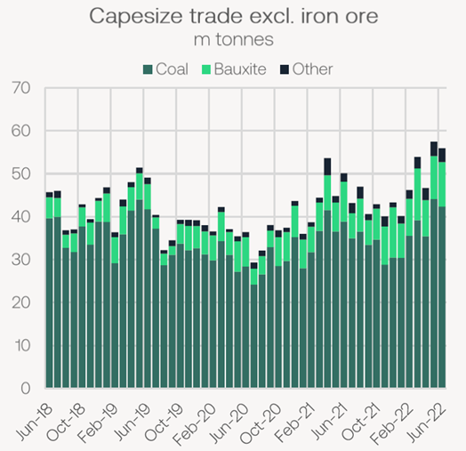

# The Big Picture: The Capesize market

**Date:** July 02, 2022  
**Publisher:** Breakwave Advisors | **Category:** Market Insights  
**Original URL:** [https://www.breakwaveadvisors.com/insights/2022/7/1/the-big-picture-the-capesize-market](https://www.breakwaveadvisors.com/insights/2022/7/1/the-big-picture-the-capesize-market)  

---

*By*[*Mark Nugent*](https://www.linkedin.com/in/mark-nugent-3724a3192/)

### Looking Forward to Q3

*Having reached the halfway point of the year, we look at what has been driving the recent drawdown in Capesize rates and what may be in store for the rest of the year.*

The BCI has sold off $4,084/day in June declining by 16.8% and FFA prices decreasing by 29.6% on the July contract and 22.6% on the Q3. However, at the mid-way point of the year, the index has printed a 3.6% gain YTD. The Capesize market is in the midst of adjusting to altering trade flows and positioning, now attempting to find a healthy balance that can be sustained.

> **Figure 1: Market Chart 1**  
> [Local Asset](file:///C:/Users/Dell/Github/Shipping/corpus/03-breakwave/insights/2022/assets/2022-07-02_the-big-picture-the-capesize-market_img_unnamed283329_1b92a1d03a02.png)

Naturally, Capesize trade volumes have come in lighter than expected due to relatively weak iron ore shipments. In June, the Capesizes shipped 173.8m tonnes of dry bulk commodities , declining by 3.4% YoY. Below we look into several factors influencing the Capesize market at present.

### Congestion Eases

What was a significant factor in supporting Capesize returns in 2021, congestion has come down on the Capes so far this year. The removal of quarantine requirements in West Australia has reduced total voyage lengths on the C5 route, with congestion now at 8.5m dwt, 13.3% lower WoW. In China, congestion was unaffected by lockdowns and thus currently lies at 5.5m dwt, declining by 15.9% WoW, nearing 5-year lows.

> **Figure 2: Market Chart 2**  
> [Local Asset](file:///C:/Users/Dell/Github/Shipping/corpus/03-breakwave/insights/2022/assets/2022-07-02_the-big-picture-the-capesize-market_img_unnamed283429_5eedc962fda5.png)

The quick turnaround times for Capes discharging in China leaves more vessels in search of a fresh cargo. However, according to AXS tracking data, there are currently 464 laden Capesize vessels destined for China, which is likely to drive queues higher. This is the highest level since mid January, with this metric rising by 102 ships from the start of the month. With bunker prices still very firm, it will be an expensive choice to reposition out of the Pacific, meaning steady supply for routes such as the C5, preventing any material increase in returns for the intra-Pacific routes. While a small number of ballasters past Singapore may typically reduce tonnage supply available to Brazil, the historically high openings in the North Atlantic have provided the miners with more-than-enough tonnage to cover. The short ballasting time also means these vessels are available for relatively prompt dates, giving the charterers plenty of vessels to choose from.

### Bauxite Shipments Hit New Highs

While iron ore liftings in the Atlantic have been relatively weak, shipments out of West Africa have continued strongly. In June, Guinean bauxite exports on Capesizes amounts to 7.2m tonnes (up to 28.06 inclusive), 15.7% higher YoY. Guinean bauxite has been one of the few dry bulk trades yet to slow so far this year despite weak global economic performance. Unlike steel, Chinese aluminium smelters achieved a record level of monthly production in May at 3.4m tonnes. With the country’s energy shortage now easing, largely due to a significant ramp up in coal production, the constraints producers faced last year have now passed.

> **Figure 3: Market Chart 3**  
> [Local Asset](file:///C:/Users/Dell/Github/Shipping/corpus/03-breakwave/insights/2022/assets/2022-07-02_the-big-picture-the-capesize-market_img_unnamed283529_725d0090249c.png)

This trend is likely set for a reversal in the short-term, however, as the seasonal Q3 rainy season in Guinea arrives, implying the strong liftings in Q2 are also a result of stockpiling. Over the past 5 years, Guinean bauxite shipments on the Capes have declined by 31.5% QoQ in Q3 on average. Based on shipments in Q2, this would imply a 6.7m decline in liftings in the upcoming quarter, or approximately 39 fewer liftings.

### Non-Iron Ore Shipments

Total Capesize trade volumes excluding iron ore, primarily coal and bauxite, have reached new highs during Q2. Capesize coal liftings reached 44.1m tonnes in May, rising by 20.6% YoY, whilst total bauxite shipments totalled 10m tonnes, a 49% increase. In Q2, these trades have helped keep rates supported amid weaker-than-expected iron ore liftings. Excluding these trades, flows on the Capes totalled 3.4m tonnes, the second highest monthly total on record, mostly consisting of other minor ores.

> **Figure 4: Market Chart 4**  
> [Local Asset](file:///C:/Users/Dell/Github/Shipping/corpus/03-breakwave/insights/2022/assets/2022-07-02_the-big-picture-the-capesize-market_img_unnamed283629_da24c0a82614.png)

While these volumes are still a minor share of total Capesize trade, this is positive when considering iron ore volumes are likely to improve as the year progresses. Although we see a softening in bauxite in Q3, we believe the added demand generated from these trades can be supportive in firming rates going forward, with Cape coal trade in particular likely to be sustained at these levels for the remainder of the year.

### Outlook

In China, the largest source of Capesize demand, economic sentiment has improved this week following several months of economic shocks due to lockdowns. The country posted a manufacturing PMI of 50.2 today, climbing back in expansionary territory following months of low readings. Further, the country has reduced quarantine requirements for international arrivals, sparking hopes of less Covid-induced economic turmoil in 2H22. Looking forward, the sole easing of mass-lockdowns sets a positive tone for Chinese economic activity and in turn, raw material demand. Finally, steel production returned to healthy levels in May, totalling 96.6m tonnes, the highest so far this year despite the Covid disruption. This gives us optimism the country’s iron ore demand will continue to rise in Q3 and provide a lift to Capesize demand.
