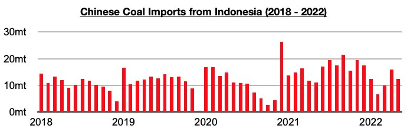
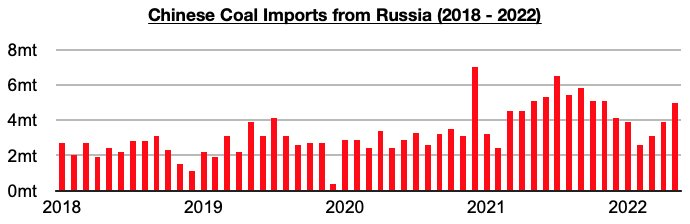

# China's Coal Imports From Russia Are Likely To Continue to Climb

**Date:** July 04, 2022  
**Publisher:** Breakwave Advisors | **Category:** Market Insights  
**Original URL:** [https://www.breakwaveadvisors.com/insights/2022/7/4/chinas-coal-imports-from-russia-are-likely-to-continue-to-climb](https://www.breakwaveadvisors.com/insights/2022/7/4/chinas-coal-imports-from-russia-are-likely-to-continue-to-climb)  

---

*By*[*Jeffrey Landsberg*](https://www.linkedin.com/in/jeffrey-landsberg-70ab957/)

China's coal import data for May by origin has been released and shows imports from Indonesia have remained the primary source of imports and Russia the second largest source of imports. China's coal imports from Indonesia totaled 12.4 million tons in May, which is down from April by 3.4 million tons (-23%) but up year-on-year by 1.2 million tons (11%).

> **Figure 1: Chart 1 (37)**  
> [Local Asset](file:///C:/Users/Dell/Github/Shipping/corpus/03-breakwave/insights/2022/assets/2022-07-04_chinas-coal-imports-from-russia-are-likely-to-continue-to-climb_img_chart1283729_42c1c02f21c5.jpg)

China's coal imports from Russia totaled 5 million tons in May, which is up from April by 1.1 million tons (28%) but down year-on-year by 100,000 tons (-2%). Imports from Russia last month rose to the highest level seen since November.

> **Figure 2: Chart 2 (34)**  
> [Local Asset](file:///C:/Users/Dell/Github/Shipping/corpus/03-breakwave/insights/2022/assets/2022-07-04_chinas-coal-imports-from-russia-are-likely-to-continue-to-climb_img_chart2283429_4dde6aeea6d1.jpg)

Going forward, China's coal imports from Russia are likely to continue to climb. As we discussed in Commodore's weekly Dry Bulk Reports and Weekly China Reports earlier this year, just as Russia’s tensions with Ukraine shifted into Russia launching its unjust war, Russia’s Ministry of Energy announced that it had signed an agreement to increase its coal exports to China to 100 million tons within three to five years. In comparison, last year saw China import 57 million tons of coal from Russia.
