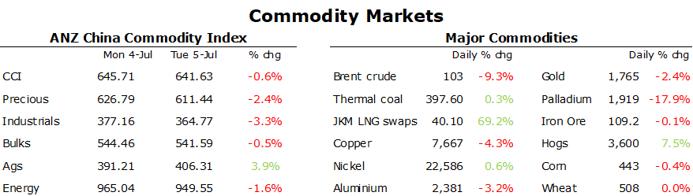

# Crude oil plunges amid rising recessionary fears

**Date:** July 06, 2022  
**Publisher:** Breakwave Advisors | **Category:** Market Insights  
**Original URL:** [https://www.breakwaveadvisors.com/insights/2022/7/6/crude-oil-plunges-amid-rising-recessionary-fears](https://www.breakwaveadvisors.com/insights/2022/7/6/crude-oil-plunges-amid-rising-recessionary-fears)  

---

*By*[*Daniel Hynes*](https://www.linkedin.com/in/dahynes/)

Recession fears gripped commodity markets, with crude oil and metals suffering sharp losses. A stronger USD also weighed on investor sentiment.

> **Figure 1: 1657058201360**  
> **Interactive Data & Source:** [Publications Anz](https://publications.anz.com/SingletrackCMS__DownloadDocument?docRef=df175f96-f9a0-4a87-b9d0-7c516d8df57b&uid=bd219b92-f5cc-400e-9646-4178791864b7&jobRef=86198754-9e51-4010-a7fe-f7f2c17cf1fe) | [Local Asset](file:///C:/Users/Dell/Github/Shipping/corpus/03-breakwave/insights/2022/assets/2022-07-06_crude-oil-plunges-amid-rising-recessionary-fears_img_1657058201360_2c999b3505ed.png)

**Crude oil**prices slumped as fears of weaker demand amid slowing economic growth outweighed a fundamentally tight market. The US market reopened after a long weekend in bearish mode, pushing WTI crude below USD100/bbl for the first time since March. Adding to the recessionary fears was the re-emergence of COVID-19 cases in Shanghai, calling into question the demand recovery of the world’s second largest consumer. Authorities launched mass testing, while outbreaks in other regions saw some limited restrictions enacted. This comes despite signs of stronger demand. China’s independent refiners in Shandong province increased their crude procession rates last week to their highest level since December, according to CITIC. Traffic numbers also remain strong despite high prices in Europe and the US. The market is already pricing in a mild recession, which should see[**support for Brent crude at USD100/bbl**](https://publications.anz.com/SingletrackCMS__DownloadDocument?docRef=df175f96-f9a0-4a87-b9d0-7c516d8df57b&uid=bd219b92-f5cc-400e-9646-4178791864b7&jobRef=86198754-9e51-4010-a7fe-f7f2c17cf1fe). That support level could fall to USD80/bbl in the unlikely event of global demand falling by 5%, an occurrence that has only happened in the most severe of global recessions.

Supply issues remained the focus in the**European gas**market. Dutch front month futures extended gains to end the session at EUR165.01/MWh. They have now gained more than 90% this month following the sharp fall in gas flows from Russia. Fears of a complete halt continue to rise. Authorities are concerned that following maintenance on Nord Stream pipeline next week, gas flows will remain curtailed. Germany’s cabinet has rushed through legislation to allow it to rescue struggling energy companies to prevent a supply crunch seeping into the broader economy.

The issues in Europe are permeating across the globe, with**North Asian LNG**prices jumping higher. Japan-Korea Market future for August ended the session above USD40/MMBtu for the first time since early March. This is roughly USD250/bbl on an oil-equivalent basis. The curbs to Russian gas is likely to see increasing competition for LNG cargoes in Asia as European consumers search for alternative sources. There are growing fears that Russia may ask for LNG to be paid in rubles, following a report by Interfax that Gazprom was raising the issues with buyers. This comes amid signs of stronger demand across the region.

Investors shrugged off higher gas and coal prices to push**base metals**lower as recessionary fears escalated.**Copper**led the sector lower, falling to a 19 month low of USD7,670/t. Sentiment was further hit following the new outbreak of COVID-19 cases in Shanghai. The selloff came despite better-than-expected economic data. US factory orders rose 1.6% in May, while durable goods orders climbed 0.8%. The processing of metals is highly energy intensive. This has already led to[**the closure of zinc smelters in Europe**](https://publications.anz.com/SingletrackCMS__DownloadDocument?docRef=f6f9e6c5-9b98-462c-a200-bc37216911ed&uid=bd219b92-f5cc-400e-9646-4178791864b7&jobRef=86198754-9e51-4010-a7fe-f7f2c17cf1fe). Earlier this week top US aluminium producer Alcoa Corp said it would immediately curtail one of its three smelting lines at a US facility.

**Iron ore**futures managed to buck the trend and rose following a report that Chinese steel mills are trying to stabilise the market. Steel producers in south western China held a meeting to discuss measures such as limiting output.

Fears of a recession failed to ignite any safe haven buying in**gold**, with the precious metal slumping to its lowest level in more than six months. Instead, investors flocked to the USD, which rallied strongly against most major currencies.

Data source:[Commodities Wrap](https://www.linkedin.com/newsletters/commodities-wrap-6692196755876012032/?fbclid=IwAR3kiXJqZdxmp9ZcRwBNI7FsBySI-XSC0pfPur1qzjt7OZp7PTE59Tsl1QI)
