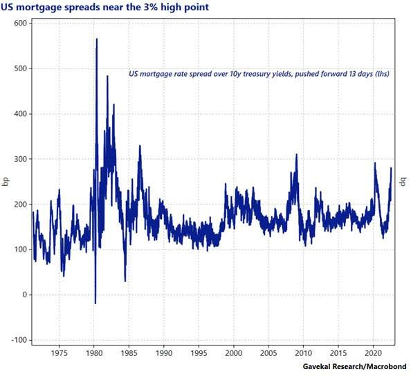
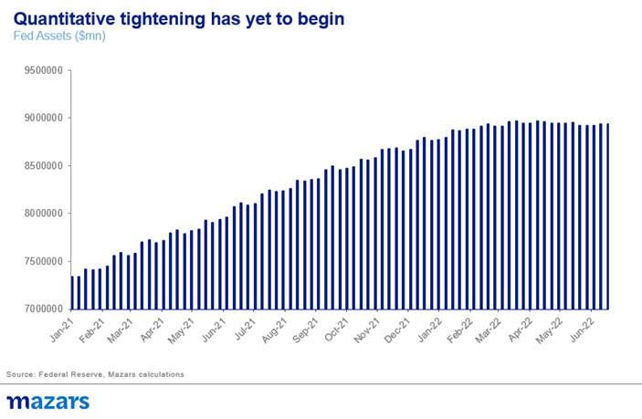
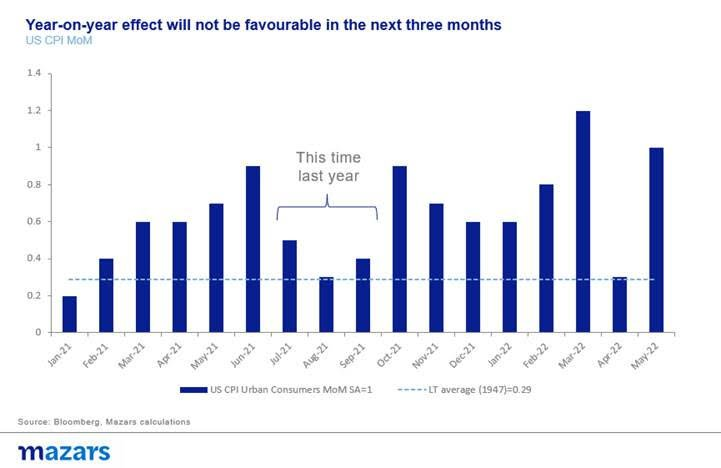
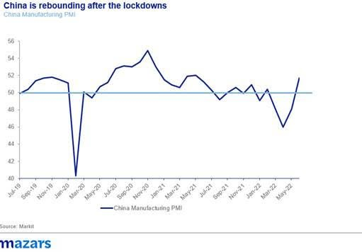

# Weekly comment: The Great Deflation of 2023

**Date:** July 06, 2022  
**Publisher:** Breakwave Advisors | **Category:** Market Insights  
**Original URL:** [https://www.breakwaveadvisors.com/insights/2022/7/6/weekly-comment-the-great-deflation-of-2023](https://www.breakwaveadvisors.com/insights/2022/7/6/weekly-comment-the-great-deflation-of-2023)  

---

*By*[*George Lagarias*](https://www.linkedin.com/in/george-lagarias-mba-3baa769/)

Last week featured more volatility, with the world’s leading indices anchoring at bear-market levels in anticipation of new sharp rate hikes by the Fed. Currently, investors anticipate three 0.25% rate hikes late in the month and another two in September, towards a grand total of seven until the end of the year.

**Yet, we feel that markets might once again be missing the forest for the trees.**The larger question is not how much will the Fed hike this year but rather how quickly it plans to remove liquidity from financial markets and how long before the liquidity tank fills up again.

Because the fact remains that while rates have gone up from zero to 1.75% in six months, this has not yet translated into a significant slowdown in economic activity. If anything, bank lending has fully rebounded after the pandemic. It is the present realities of high inflation that are driving the economy, which lend credibility to self-fulfilling predictions over a coming economic slowdown. At least half of consumers believe that high prices have eroded their living standards. Tech behemoth Tesla and Meta bosses freezing hires and laying off personnel in their usual blusterous way, is certainly making waves -although consumers and investors would do well to think that this may have more to do with competition and a sharp drop in their equity prices more than the general state of the economy.

At this point, only real estate markets have seen a direct effect from higher rates, with long mortgage yields at multi-year highs.

> **Figure 1: Market Chart 1**  
> **Interactive Data & Source:** [Gzeromedia](https://www.gzeromedia.com/viewpoint/does-the-world-really-need-more-oil-right-now) | [Local Asset](file:///C:/Users/Dell/Github/Shipping/corpus/03-breakwave/insights/2022/assets/2022-07-06_weekly-comment-the-great-deflation-of-2023_img_unnamed28429_113b70502166.jpg)

And, interesting enough, the Fed has not proceeded with any significant removal of liquidity, via Quantitative Tightening just yet. So while it tries to curb inflation, it’s movements (or lack thereof) in the asset market may be betraying its true nature: that of a market-friendly monetary dove.

> **Figure 2: Market Chart 2**  
> **Interactive Data & Source:** [Gzeromedia](https://www.gzeromedia.com/viewpoint/does-the-world-really-need-more-oil-right-now) | [Local Asset](file:///C:/Users/Dell/Github/Shipping/corpus/03-breakwave/insights/2022/assets/2022-07-06_weekly-comment-the-great-deflation-of-2023_img_unnamed28529_8717b8ed7f2c.jpg)

To be sure, we don’t anticipate that inflation will come down dramatically in the next three-four months. This is due to the year-on-year effect of inflation. Last summer, price rises were significantly moderated. This means that on a year-on-year basis, headline inflation pressures could persist for this summer. And the Fed is highly sensitive even to high-frequency monthly data, so we are fully ready for another triple rate hike in July.

> **Figure 3: Market Chart 3**  
> **Interactive Data & Source:** [Gzeromedia](https://www.gzeromedia.com/viewpoint/does-the-world-really-need-more-oil-right-now) | [Local Asset](file:///C:/Users/Dell/Github/Shipping/corpus/03-breakwave/insights/2022/assets/2022-07-06_weekly-comment-the-great-deflation-of-2023_img_unnamed28629_5a82233c3d5d.jpg)

The question is what happens thereafter. Following September, there’s a significant confluence of factors which could help reign in inflation, and with it constrictive policy:

1. **The year-on-year effect will once again begin to affect numbers**. From October onwards, 2021 prices had began to rise. This is a significant headwind for 2022 year-on-year figures to rise.
2. The drop in discretionary spending and the recent mega-restocking cycle could lead to a material slowdown in**inventory build-ups. This will impact demand**much more than higher interest rates and help bring inflation down.
3. **China is beginning to rebound post-lockdowns**. While the longer-term pressures on the economy are still very relevant, including clampdowns on major growth sectors, the immediate effect of major ports and cities coming back into production should be greatly beneficial for inflation.
4. **Fossil fuel prices could come down.**Oil demand and supply are coming back in equilibrium. By some[sources](https://www.gzeromedia.com/viewpoint/does-the-world-really-need-more-oil-right-now), supply may even exceed demand. This should put meaningful downside pressure in fossil fuels. Additionally, while quantitative tightening hasn’t started, we have seen evidence of market deleveraging. This should also reduce speculation on the futures markets.

> **Figure 4: Market Chart 4**  
> [Local Asset](file:///C:/Users/Dell/Github/Shipping/corpus/03-breakwave/insights/2022/assets/2022-07-06_weekly-comment-the-great-deflation-of-2023_img_unnamed28729_fdaac6284102.jpg)

What would follow this, incredible by globalisation standards, inflation bout? An above-trend inflation, or deflation?

On the one hand, tight labour markets give an incentive towards higher wages. However, as the tech sector sheds high-paid jobs, the equivalent of the Financial sector in 2009, the net effect on consumer wealth might not be significant.

Over the longer term,[Green](assets/2022-07-06_weekly-comment-the-great-deflation-of-2023_ecbsp220317-2dbb3582f0aen_ca6310961ebb.html)transition and China’s shift towards consumption should, all other things being equal, add to the pre-pandemic inflation trend of 1.5%. Brexit should also be a medium to long term additive for Britain.

However, in the immediate aftermath of this inflationary bout, as oil prices come down, we expect that consumption will remain moderate. For the past decade and a half, consumers have been hit with crisis after crisis. The GFC (2008), the Euro Crisis (2011-2012), the Pandemic (2020-2021) and the Great Inflation Crisis (2022) have all affected real disposable income. In Developed Markets, where demographics are less than favourable, deflationary pressures should be significant.

In search of a new economic and financial paradigm we see that the Great Moderation (a generation-long macroeconomic stability) has come to an end. Thus, macroeconomic conditions, and with them interest rates and policy decisions, are set to remain volatile.

So while over the short and very long term we believe that inflation and thus interest rates will remain higher than the pre-pandemic average, over the medium term we don’t rule out the possibility of experiencing a sharp deflationary episode, a sort of whiplash effect, which would force another about-turn for central banks.
