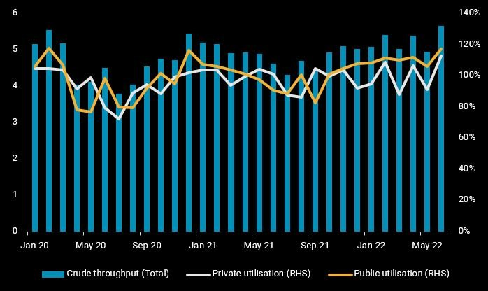
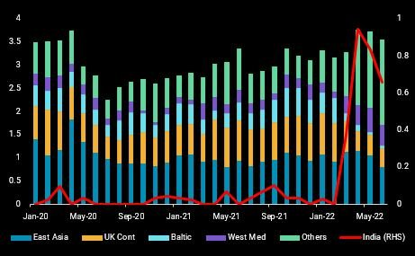
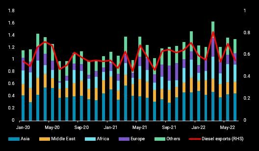

# India’s refiners face headwinds after months of windfall profits

**Date:** July 07, 2022  
**Publisher:** Breakwave Advisors | **Category:** Market Insights  
**Original URL:** [https://www.breakwaveadvisors.com/insights/2022/7/7/indias-refiners-face-headwinds-after-months-of-windfall-profits](https://www.breakwaveadvisors.com/insights/2022/7/7/indias-refiners-face-headwinds-after-months-of-windfall-profits)  

---

*By*[*Serena Huang*](https://www.linkedin.com/in/serena-huang-2466b489/)

Ιndia’s refiners have been enjoying windfall profits from sky-high domestic and export margins in recent months, further sweetened by access to discounted Russian crude. In the recent week however, the global oil market seems to be tethering on the edge of a turning point, with clean product cracks retreating consecutively for days, pointing to an unwinding of the product market tightness. Are the winds of fortune turning for India’s refiners?

## Indian Refiners Raise Runs Near Operating Limits in June, But Signs of Slowdown Emerging

Our assessment of Indian refiners’ implied refinery runs, calculated using crude imports net stock change, indicate that refiners have revved up crude throughputs to near operating limits last month. A seasonal uptick in domestic harvesting and road freight activities, coupled with a demand pull from the tight global clean products market have incentivised refiners to push runs to multi-year highs. Average utilisation of private refiners, Reliance and Nayara, was at 113% in June, up from 98% in the first five months of the year, whilst public sector refiners operated at utilisation near 117%, versus 110% in Jan-May.

But a slowdown in global crude loadings to India in June, with the cargoes expected to arrive in the next few weeks, is hinting at a possible cooling of refinery runs ahead. As seasonal demand strength fades and rising inflation dampens consumer demand, refiners are likely looking to scale back on their refinery runs, with some undergoing maintenance before demand picks up again during the year-end festive season.

> **Figure 1: India Refinery Runs**  
> **Interactive Data & Source:** [Analytics Vortexa](https://analytics.vortexa.com/?dateRange=2020-01-01T00%3A00%3A00.000Z__2022-06-30T23%3A59%3A59.999Z&from=%5B%22b996521be9c996db3560ca234a56286ac38f798d34be229437555fab4f12a6a5%22%5D&metric=bpd&page=Flows&products=%5B%2254af755a090118dcf9b0724c9a4e9f14745c26165385ffa7f1445bc768f06f11%22%5D&productsExcluded=%5B%22bb70cf56200f5b72ba69a90bda2c6b47ba29da23945c6f1994cfd4c2ef2fe0ff%22%5D&tabId=550a00b0-d1fa-4166-9940-ed0ba587b717&timeSeriesProperty=destination_shipping_region) | [Local Asset](file:///C:/Users/Dell/Github/Shipping/corpus/03-breakwave/insights/2022/assets/2022-07-07_indias-refiners-face-headwinds-after-months-of-windfall-profits_img_india-refinery-runs_6fabd644538f.jpg)

India’s implied crude throughput (LHS, mbd) and refinery utilisation (RHS, %)

## Diverging Trends of Russia Baltic/ Black Sea versus Far East Crude Loadings to India

Imports of discounted Russian crude have surged to over 1.1mbd in June, marking a historical high. But recent weeks have seen a slowdown in Russian Baltic and Black Sea crude cargoes heading to India, with loadings in June sliding to a three-month low of 450kbd. This is not surprising given Russia’s domestic refineries ramping up post maintenance, and higher exports to several European countries such as Turkey, Romania and the Netherlands. This slowdown in exports to India, and wider Asia, is likely to be transient, as more Russian crude cargoes would be expected to make their way East in the weeks leading up to the EU ban on Russian crude imports towards the end of the year.

In contrast to Russia’s Baltic/ Black Sea crude exports, more ESPO blend cargoes are heading to India, with three Aframax cargoes (or 75kbd) loaded from Russia’s Kozmino port in June compared to almost negligible volumes previously. While still early days, this could potentially evolve into a structural flow as Russia looks for alternative dispositions for its crude exports, amid limited upsides from its otherwise now exclusive outlet China.

> **Figure 2: Russia Crude Loadings**  
> **Interactive Data & Source:** [Analytics Vortexa](https://analytics.vortexa.com/?dateRange=2020-01-01T00%3A00%3A00.000Z__2022-06-30T23%3A59%3A59.999Z&from=%5B%22b996521be9c996db3560ca234a56286ac38f798d34be229437555fab4f12a6a5%22%5D&metric=bpd&page=Flows&products=%5B%2254af755a090118dcf9b0724c9a4e9f14745c26165385ffa7f1445bc768f06f11%22%5D&productsExcluded=%5B%22bb70cf56200f5b72ba69a90bda2c6b47ba29da23945c6f1994cfd4c2ef2fe0ff%22%5D&tabId=550a00b0-d1fa-4166-9940-ed0ba587b717&timeSeriesProperty=destination_shipping_region) | [Local Asset](file:///C:/Users/Dell/Github/Shipping/corpus/03-breakwave/insights/2022/assets/2022-07-07_indias-refiners-face-headwinds-after-months-of-windfall-profits_img_russia-crude-loadings_960a18da4590.jpg)

[Russia crude exports](https://analytics.vortexa.com/?dateRange=2020-01-01T00%3A00%3A00.000Z__2022-06-30T23%3A59%3A59.999Z&from=%5B%22b996521be9c996db3560ca234a56286ac38f798d34be229437555fab4f12a6a5%22%5D&metric=bpd&page=Flows&products=%5B%2254af755a090118dcf9b0724c9a4e9f14745c26165385ffa7f1445bc768f06f11%22%5D&productsExcluded=%5B%22bb70cf56200f5b72ba69a90bda2c6b47ba29da23945c6f1994cfd4c2ef2fe0ff%22%5D&tabId=550a00b0-d1fa-4166-9940-ed0ba587b717&timeSeriesProperty=destination_shipping_region)(LHS, mbd) and[loadings to India](https://analytics.vortexa.com/?dateRange=2020-01-01T00%3A00%3A00.000Z__2022-06-30T23%3A59%3A59.999Z&from=%5B%22b996521be9c996db3560ca234a56286ac38f798d34be229437555fab4f12a6a5%22%5D&metric=bpd&page=Flows&products=%5B%2254af755a090118dcf9b0724c9a4e9f14745c26165385ffa7f1445bc768f06f11%22%5D&productsExcluded=%5B%22bb70cf56200f5b72ba69a90bda2c6b47ba29da23945c6f1994cfd4c2ef2fe0ff%22%5D&tabId=550a00b0-d1fa-4166-9940-ed0ba587b717&to=%5B%2270425373a1836d6d0390dc6fef838a468717fba7776d66065a5043488f9f041b%22%5D)(RHS, kbd)

## Clean Product Export Hurdles Ahead

With export margins surpassing domestic profitability, some refiners have sought to increase exports to maximise profits while leaving their pumps dry in the domestic market. To ensure energy security, the Indian government has imposed regulations requiring exporters to sell a volume equivalent of 30% and 50% of their diesel and gasoline exports to the domestic market respectively for the fiscal year ending next March, while also implementing export taxes on the fuels to reign in exports. Gasoline and jet fuel exports will be taxed at 6 rupees/litre, while diesel exports will be taxed at 13 rupees/litre. Nonetheless, export-oriented refineries such as the 704kbd Reliance Jamnagar complex will be exempted from the export tax. In June, India’s clean product exports totalled 1.35mbd, flat versus last month, but could see downside risks from the above regulations and cooling global oil market ahead.

> **Figure 3: India Cpp Exports**  
> **Interactive Data & Source:** [Analytics Vortexa](https://analytics.vortexa.com/?dateRange=2020-01-01T00%3A00%3A00.000Z__2022-06-30T23%3A59%3A59.999Z&from=%5B%2270425373a1836d6d0390dc6fef838a468717fba7776d66065a5043488f9f041b%22%5D&metric=bpd&page=Flows&products=%5B%22deda35eb9ca56b54e74f0ff370423f9a8c61cf6a3796fcb18eaeeb32a8c290bb%22%2C%229256907ba7e4ed11ff03aa297a7e62e14484ce5a85c8118c7495b9120ad0e268%22%2C%22d72edbab2b5e2e249d8c216909945922a02eb017dd200f90876fee6fa180c743%22%2C%223e4db72ef7027de928ce55703a213a546fd86d2debe6f2e9c85f3a5f9d53e8dd%22%5D&tabId=550a00b0-d1fa-4166-9940-ed0ba587b717&timeSeriesProperty=destination_region) | [Local Asset](file:///C:/Users/Dell/Github/Shipping/corpus/03-breakwave/insights/2022/assets/2022-07-07_indias-refiners-face-headwinds-after-months-of-windfall-profits_img_india-cpp-exports_40df6eca5199.jpg)

[India clean product exports by destination region](https://analytics.vortexa.com/?dateRange=2020-01-01T00%3A00%3A00.000Z__2022-06-30T23%3A59%3A59.999Z&from=%5B%2270425373a1836d6d0390dc6fef838a468717fba7776d66065a5043488f9f041b%22%5D&metric=bpd&page=Flows&products=%5B%22deda35eb9ca56b54e74f0ff370423f9a8c61cf6a3796fcb18eaeeb32a8c290bb%22%2C%229256907ba7e4ed11ff03aa297a7e62e14484ce5a85c8118c7495b9120ad0e268%22%2C%22d72edbab2b5e2e249d8c216909945922a02eb017dd200f90876fee6fa180c743%22%2C%223e4db72ef7027de928ce55703a213a546fd86d2debe6f2e9c85f3a5f9d53e8dd%22%5D&tabId=550a00b0-d1fa-4166-9940-ed0ba587b717&timeSeriesProperty=destination_region)(LHS, mbd) and[its diesel exports](https://analytics.vortexa.com/?dateRange=2020-01-01T00%3A00%3A00.000Z__2022-06-30T23%3A59%3A59.999Z&from=%5B%2270425373a1836d6d0390dc6fef838a468717fba7776d66065a5043488f9f041b%22%5D&metric=bpd&page=Flows&products=%5B%22deda35eb9ca56b54e74f0ff370423f9a8c61cf6a3796fcb18eaeeb32a8c290bb%22%2C%229256907ba7e4ed11ff03aa297a7e62e14484ce5a85c8118c7495b9120ad0e268%22%2C%22d72edbab2b5e2e249d8c216909945922a02eb017dd200f90876fee6fa180c743%22%2C%223e4db72ef7027de928ce55703a213a546fd86d2debe6f2e9c85f3a5f9d53e8dd%22%5D&productsBreakdown=group_product&productsXFilter=%5B%22deda35eb9ca56b54e74f0ff370423f9a8c61cf6a3796fcb18eaeeb32a8c290bb%22%5D&tabId=550a00b0-d1fa-4166-9940-ed0ba587b717)(RHS, mbd)

## India a Crucial Diesel Supplier to Europe Next Year

India is the world’s third largest diesel exporter with 630kbd leaving the country so far this year, ranking behind the US (1mbd) and Russia (950kbd), but still slightly ahead of Saudi Arabia (610kbd). As such, the country is of crucial importance once Europe fully phases out diesel imports from Russia early next year. Together with the US, Saudi Arabia and a few other Middle Eastern countries, it will be up to India to supply European needs, probably at steep margins. Accordingly, domestic demand, refining operations and consequently the amount of surplus barrels will continue to be closely scrutinised by market players and observers.

Data Source:[Vortexa](https://www.vortexa.com//oil-gas-data-traders-analysts-data-scientists?gclid=Cj0KCQjw8_qRBhCXARIsAE2AtRZKOvMnbilZ_6_91d7huSFFy71pWLrnPwGwOHVzXsmsG-1a1mZnQw8aAt89EALw_wcB&hsa_acc=1782073842&hsa_ad=548425387665&hsa_cam=14746637662&hsa_grp=125038601902&hsa_kw=&hsa_mt=&hsa_net=adwords&hsa_src=g&hsa_tgt=dsa-1431852288425&hsa_ver=3&utm_campaign=%5BCD%5D%20-%20DSA%20-%20EMEA&utm_medium=cpc&utm_medium=ppc&utm_source=google&utm_source=adwords&utm_term=)
