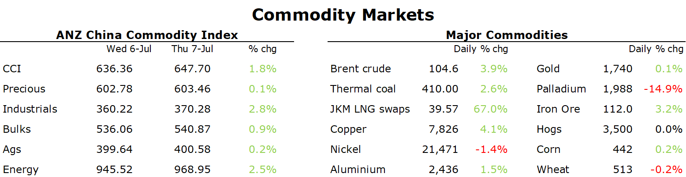

# Metals rebound as China plans further stimulus measures

**Date:** July 08, 2022  
**Publisher:** Breakwave Advisors | **Category:** Market Insights  
**Original URL:** [https://www.breakwaveadvisors.com/insights/2022/7/8/metals-rebound-as-china-plans-further-stimulus-measures](https://www.breakwaveadvisors.com/insights/2022/7/8/metals-rebound-as-china-plans-further-stimulus-measures)  

---

*By*[*Daniel Hynes*](https://www.linkedin.com/in/dahynes/)

Commodity markets rebounded as the focus returned to tightness in physical markets. Sentiment was also boosted by China’s move to support economic growth with fiscal stimulus measures.

> **Figure 1: 1657232098824**  
> **Interactive Data & Source:** [Publications Anz](https://publications.anz.com/SingletrackCMS__DownloadDocument?docRef=aa68aa62-c5ec-4772-9cb9-140de829d632&uid=bd219b92-f5cc-400e-9646-4178791864b7&jobRef=4d86c563-ac59-4e85-ba43-be6a405d63f8) | [Local Asset](file:///C:/Users/Dell/Github/Shipping/corpus/03-breakwave/insights/2022/assets/2022-07-08_metals-rebound-as-china-plans-further-stimulus-measures_img_1657232098824_12a3e56cace4.png)

**Base metals**rebounded sharply as China considered a massive USD224bn stimulus to boost growth. China’s Ministry of Finance is considering a plan to allow local governments to sell CNY1.5tn of special bonds in the second half of the year. Most of this would be spent on infrastructure, and be a big step up in spending as the country struggles to lift growth following recent COVID-19 lockdowns. Copper led the sector higher, jumping as much as 5.6% on the LME. The metal has been under pressure this month amid fears that an economic slowdown would weigh on demand. We expect these fiscal policies to[**support metals demand through to the end of 2022**](https://publications.anz.com/SingletrackCMS__DownloadDocument?docRef=aa68aa62-c5ec-4772-9cb9-140de829d632&uid=bd219b92-f5cc-400e-9646-4178791864b7&jobRef=4d86c563-ac59-4e85-ba43-be6a405d63f8). Supply side issues also can’t be ignored. Mining headwinds associated with environmental, social and governance (ESG) requirements are exacerbating labour shortages and high energy costs, stalling plans to boost the output of copper, aluminium and nickel. This is on top of the disruptions caused by Russia’s invasion of Ukraine. This should see metals recover in the second half of the year.

**Iron ore**gained following the spectre of increased infrastructure spending in China. Futures in Singapore ended 1.4% higher to USD112.80/t, while they gained 2.3% on the Dalian Exchange. Nevertheless, signs of weak demand continue to hang over the market. Chinese steel companies are looking to halt unprofitable mills amid weak margins and high inventories. The steel industry’s PMI for June recorded its worst reading in more than a decade last week.

**Crude oil**gained as investors attention switched to the physical market, where signs of tightness persist. The US crude prompt time spread (spot - 1m future) has surged to USD4/bbl, its highest level since March. The EIA weekly crude oil inventory report also showed further drawdowns. Gasoline inventories fell while refinery utilisation rates were lower. This was offset somewhat by a rise in total crude oil stockpiles of 8.23mbbls last week. This rise was largely driven by a fall in US exports. Traders are also fretting about a potential halt to Kazakh crude. The Caspian Pipeline Consortium, which exports Kazakh crude from a key terminal on the Black Seas, was ordered to halt loadings for 30 days due to violation of a spill-prevention plan.

The rally in**European gas**shows no signs of slowing amid fears of further supply shortages. Dutch front month futures rose for the seventh consecutive session and have now more than doubled over the past month. The continent is facing its biggest energy crisis as the threat of a complete halt to Russian gas supplies rises. The Nord Stream pipeline is currently operating at only 40% capacity and it is set to close for annual maintenance next week. A prolonged halt to gas flows would jeopardise plans to fill storage facilities in time for winter. Concerns are so great that Germany has urged Canada to release the turbine from the Nord Stream pipeline that has caused the issues. Canada says it would be breaking European sanctions if it allowed such a move.

**North Asian LNG**prices were dragged higher by the rising European market. However, higher tight supply of the super-cooled fuel also played their part. Pakistan failed to receive any offers from suppliers for 10 LNG cargoes for July. Gas outages in the UK and Norway are also causing concerns. Demand was also robust, with Japan buyers active in the market.

**Gold**held near a nine-month low as investors continues to slash their holding of the precious metal. Gold-backed ETFs have seen their holdings fall by 39t over the past week to their lowest level in almost four months.

Data source:[Commodities Wrap](https://www.linkedin.com/newsletters/commodities-wrap-6692196755876012032/?fbclid=IwAR3kiXJqZdxmp9ZcRwBNI7FsBySI-XSC0pfPur1qzjt7OZp7PTE59Tsl1QI)
