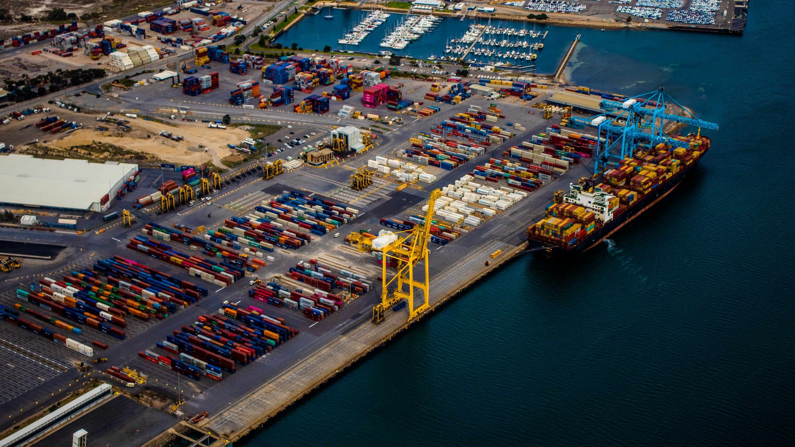

# War in Ukraine Continues to Divide the World

**Date:** July 08, 2022  
**Publisher:** Breakwave Advisors | **Category:** Market Insights  
**Original URL:** [https://www.breakwaveadvisors.com/insights/2022/7/8/war-in-ukraine-continues-to-divide-the-world](https://www.breakwaveadvisors.com/insights/2022/7/8/war-in-ukraine-continues-to-divide-the-world)  

---

*By*[*Jeffrey Landsberg*](https://www.linkedin.com/in/jeffrey-landsberg-70ab957/)

As we have been discussing in our Weekly China Reports and Weekly Dry Bulk Reports this year, both India and China have been standing out from many other nations in continuing to work with Russia. Each nation has continued to happily buy up Russian oil, and each also previously signed individual coal purchase agreements with Russia (India signed a coal deal with Russia back in October in which it will eventually be buying 40 million tons of Russian coking coal per year, and China signed a coal deal with Russia in February in which it eventually will be buying 100 million tons of coking and thermal coal per year from Russia). These two nations are ignoring any questions of ethics and are benefiting financially.

New last week is news broke showing that these three nations have further solidified cooperation in which India's biggest cement producer, UltraTech Cement, signed an agreement to import a cargo of Russian coal that it will be paying for in Chinese yuan. Reuters last week reported that UltraTech Cement is in the process of importing 157,000 tons of coal on a capesize vessel from Russian producer SUEK from Russia’s eastern port of Vanino. The cargo has been valued and priced at 172,652,900 yuan ($25.8 million). Several other Russian coal cargoes in recent months have reportedly been priced in yuan as well. Overall, Russia is continuing to work towards having its cargoes priced in currencies other than the US dollar in order to avoid any current and future sanctions from the West. China too has long been keen on having international transactions settled in yuan rather than dollars, and is using the current situation to further accomplish its long-standing goal of ending the US dollar hegemony and increasing the global use of the yuan.

> **Figure 1: Unsplash Image a E Y8y5wo**  
> [Local Asset](file:///C:/Users/Dell/Github/Shipping/corpus/03-breakwave/insights/2022/assets/2022-07-08_war-in-ukraine-continues-to-divide-the-world_img_unsplash-image-a-e-y8y5wo_7a1f9890cefa.jpg)

In another sign of China, India, Russia, and others gaining more prominence and collectively shifting away from the West, Iran last week submitted an application to become an official member of emerging economies group BRICS (BRICS includes Brazil, Russia, India, China and South Africa and first became an official collective back in 2009). Argentina is also expected to submit an application to join BRICS. Overall, 2022 is continuing to see China and others pull away from the West. The war in Ukraine has continued to serve as a divide of sorts, with many nations not actually shunning Russia. As we discussed in our April 17th Weekly Dry Bulk Report, an April motion in the UN General Assembly to remove Russia from the Human Rights Council passed but included governments representing over half of the world voting either no or abstaining. The no’s and abstentions included China (the world’s most populous country), India (the world’s second most populous country), Indonesia (the world’s fourth most populous country), Pakistan (the world’s fifth most populous country), Nigeria (the world’s sixth most populous country), Brazil (the world’s seventh most populous country), Bangladesh (the world’s eighth most populous country), Russia (the world’s ninth most populous country), and Mexico (the world’s tenth most populous country).
