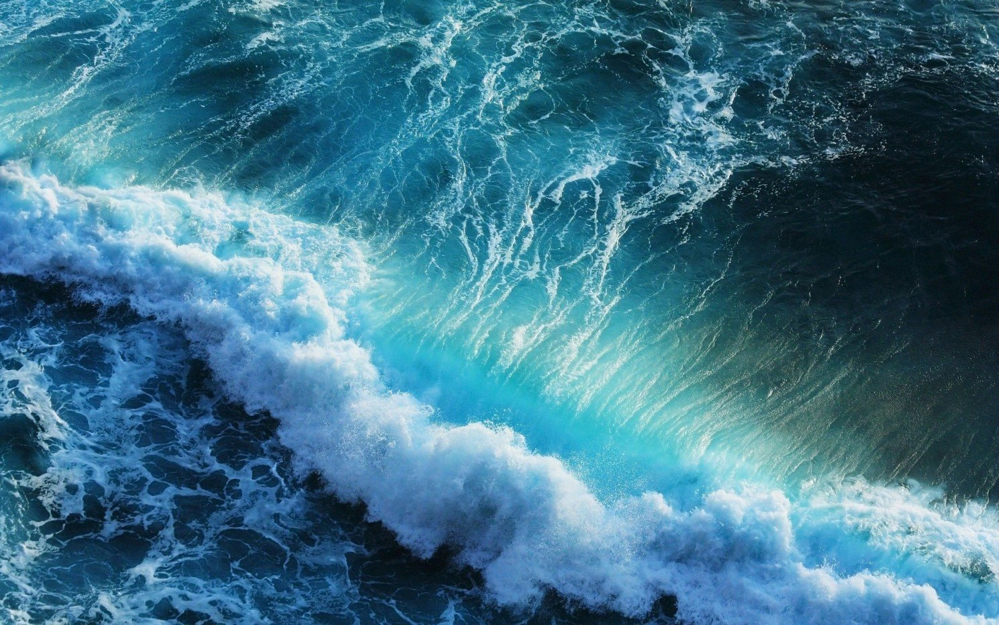
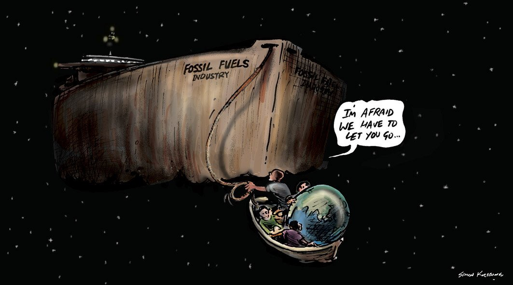
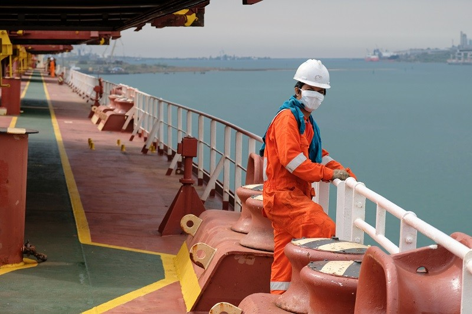

# Tanker Tailor Soldier Sailor

**Date:** July 09, 2022  
**Publisher:** Breakwave Advisors | **Category:** Market Insights  
**Original URL:** [https://www.breakwaveadvisors.com/insights/2022/7/8/tanker-tailor-soldier-sailor](https://www.breakwaveadvisors.com/insights/2022/7/8/tanker-tailor-soldier-sailor)  

---

*By*[*Arthur Richier*](https://www.linkedin.com/in/arthurrichier/)

## Tanker 🇬🇷

“This has been by far the most successful Posidonia in the history of the event” said[**Theodore Vokos**](https://www.linkedin.com/in/theodore-vokos-70951233/), managing director of[**Posidonia Events**](https://www.linkedin.com/company/posidonia-events/). The 27,000-strong crowd was the largest the exhibitors had ever seen and represented a close to 20% increase since 2018 numbers. Overall, the event was a tremendous success. After a 4-year hiatus for reasons all-too well known, I was overjoyed to step foot in Athens for what is arguably the most important date (bi-annually) in the shipping calendar. The organisers’ website describes the occasion as follows: “It is often said that Posidonia gatherings are “family”. That is how it feels, a global family of tens of thousands from over ninety countries coming together in Athens for an enjoyable week of lively discussion and productive business. Renewing and beginning friendships that are the foundation of long-term success.” More on that further down, first I’d like to talk about our oceans.

## Tailor 🌊

The bluefish is a marine pelagic fish (meaning it lives kind of in the middle of the ocean, neither close to the shore, nor close to the bottom). It can be found around the world and is known as “tailor” in Australia and New Zealand. It is a popular game fish and food fish. Why does what I just wrote matter? Because the bluefish is a fish that has suffered tremendously from overfishing and today’s assessment from the North American Fisheries Association describes its population as “significantly below target population levels”. Like many species of fish, the bluefish suffers from the current commercially-driven approach to fishing which has depleted stocks worldwide and is wreaking havoc on the health of our oceans, a critical part of our ecosystem. If you have watched Seaspiracy on Netflix you might remember some of the terrifying data points shared with us, amongst them that with 2.7 trillion fish each year claimed by fishing, our oceans will be “empty” by 2048. At the same time, the ocean is the largest carbon sink on the planet, storing up to 20 times more carbon than land-based forests. It deserves attention.

> **Figure 1: 241**  
> **Interactive Data & Source:** [Linkedin](https://www.linkedin.com/company/the-shift-project/) | [Local Asset](file:///C:/Users/Dell/Github/Shipping/corpus/03-breakwave/insights/2022/assets/2022-07-09_tanker-tailor-soldier-sailor_img_241_f7907183e48f.jpg)

Over the course of the last weekend of June, I flew to Lyon to take part in the Univershifté 2022, organised by[**The Shift Project**](https://www.linkedin.com/company/the-shift-project/), under the leadership of French climate expert[**Jean-Marc Jancovici**](https://www.linkedin.com/in/jean-marc-jancovici/). Amongst other insightful panels: how to build resilient cities, what is the role of finance, our ocean’s role in our ecosystem as well as whether we have enough metals for the energy transition (hint: we do if we prioritise building solar panels and not 300m new iPhones every year). Alongside the panels, workshops were organised to learn more about one particular aspect of climate change and/or impact of human behaviour. The Ocean Workshop was of course the one closest to my heart. Around a clever game, the instructor raised awareness of the issues related to the ocean and the impacts of our activities on this ecosystem. I came out of it invigorated by the beauty and complexity of the maritime ecosystem but also ever-more aware of the challenges we are facing, specifically around commercial shipping to decarbonise whilst preserving its health. The energy transition however has fallen by the wayside, as energy security took centre stage in the last couple of months.

## Soldier 🪖

With the Group of Seven nations coming together at the end of last month, the invasion of Ukraine by Russia and its repercussions were high on the agenda. The energy fallout from the conflict has fuelled rampant inflation globally and led Germany to lobby to turn the G7 back on a commitment to halt new investments in fossil fuels. The electrification of our energy systems and the localised nature of renewable energy provides safety against disruptions abroad when it comes to energy sources. It seems this point has been forgotten. Oil majors seem to forget their investments abroad will always face the risk of going against national interests, especially in the context of war. And yet money continues to be fuelled towards projects that might fall prey to the same consequences of past investments in Russia.

> **Figure 2: 242**  
> **Interactive Data & Source:** [Vortexa](https://www.vortexa.com//oil-gas-data-traders-analysts-data-scientists?gclid=Cj0KCQjw8_qRBhCXARIsAE2AtRZKOvMnbilZ_6_91d7huSFFy71pWLrnPwGwOHVzXsmsG-1a1mZnQw8aAt89EALw_wcB&hsa_acc=1782073842&hsa_ad=548425387665&hsa_cam=14746637662&hsa_grp=125038601902&hsa_kw=&hsa_mt=&hsa_net=adwords&hsa_src=g&hsa_tgt=dsa-1431852288425&hsa_ver=3&utm_campaign=%5BCD%5D%20-%20DSA%20-%20EMEA&utm_medium=cpc&utm_medium=ppc&utm_source=google&utm_source=adwords&utm_term=) | [Local Asset](file:///C:/Users/Dell/Github/Shipping/corpus/03-breakwave/insights/2022/assets/2022-07-09_tanker-tailor-soldier-sailor_img_242_d8448b03de4e.jpg)

### Are Renewables Really the Best Way to Achieve Energy Independence?

At the end of the summit, leaders claimed they would not compromise on climate goals. They vowed the establishment of a “climate club” whilst also admitting public financing for some fossil fuel projects might be required to counter the dependency on Russian energy. In the meantime, whilst the sanctioning of the main source of funding for Russia’s war machine continues to languish in the corridors of Brussels, our data shows Russian crude in transit is currently at record highs.

## Sailor ⚓

To claim that June 2022 has been a busy month for the industry is quite the understatement. To cap things off, on June 25th, we came together for the Day of the Seafarer. The focus of 2022’s theme for this day aligned with the focus of the UN Sustainable Development Goal number 14: Conserve and sustainably use the oceans, seas and marine resources for sustainable development. Even as vessels operate in a greener way, even as vessel operations digitalise, we are a long way away from autonomous shipping and it remains to be seen whether that is something that we would or should wish for the industry. Seafarers are the lifeblood of our industry and as we seek to make the profession safer, more diverse and more recognised, it is worth celebrating the seafarer as often as we can.

> **Figure 3: 1**  
> **Interactive Data & Source:** [Vortexa](https://www.vortexa.com//oil-gas-data-traders-analysts-data-scientists?gclid=Cj0KCQjw8_qRBhCXARIsAE2AtRZKOvMnbilZ_6_91d7huSFFy71pWLrnPwGwOHVzXsmsG-1a1mZnQw8aAt89EALw_wcB&hsa_acc=1782073842&hsa_ad=548425387665&hsa_cam=14746637662&hsa_grp=125038601902&hsa_kw=&hsa_mt=&hsa_net=adwords&hsa_src=g&hsa_tgt=dsa-1431852288425&hsa_ver=3&utm_campaign=%5BCD%5D%20-%20DSA%20-%20EMEA&utm_medium=cpc&utm_medium=ppc&utm_source=google&utm_source=adwords&utm_term=) | [Local Asset](file:///C:/Users/Dell/Github/Shipping/corpus/03-breakwave/insights/2022/assets/2022-07-09_tanker-tailor-soldier-sailor_img_1_bf5fbebdd960.png)

The dates for the next edition of Posidonia have already been confirmed for 2024. Two years seems like a long time away and yet it will feel like time went by in an instant once we get there. We can only wish that by then the world has become a safer place and that we are already seeing the progress made on the energy transition if the right & difficult decisions are taken today.

Data Source:[Vortexa](https://www.vortexa.com//oil-gas-data-traders-analysts-data-scientists?gclid=Cj0KCQjw8_qRBhCXARIsAE2AtRZKOvMnbilZ_6_91d7huSFFy71pWLrnPwGwOHVzXsmsG-1a1mZnQw8aAt89EALw_wcB&hsa_acc=1782073842&hsa_ad=548425387665&hsa_cam=14746637662&hsa_grp=125038601902&hsa_kw=&hsa_mt=&hsa_net=adwords&hsa_src=g&hsa_tgt=dsa-1431852288425&hsa_ver=3&utm_campaign=%5BCD%5D%20-%20DSA%20-%20EMEA&utm_medium=cpc&utm_medium=ppc&utm_source=google&utm_source=adwords&utm_term=)
