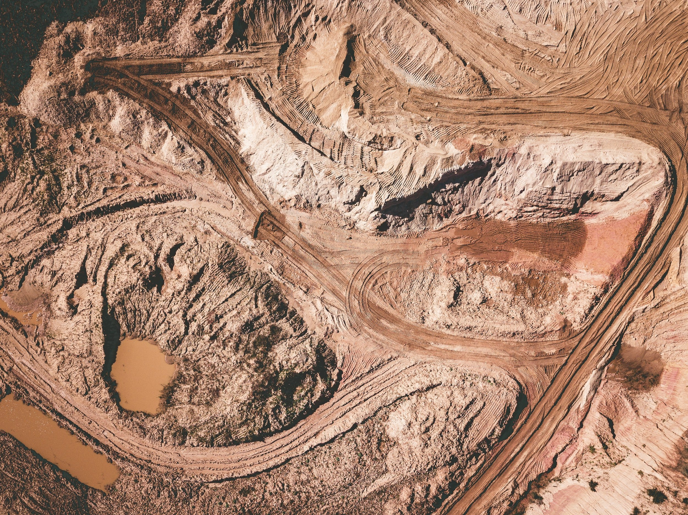
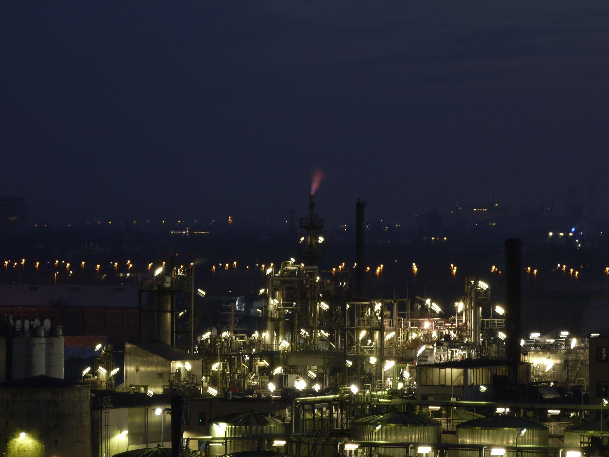
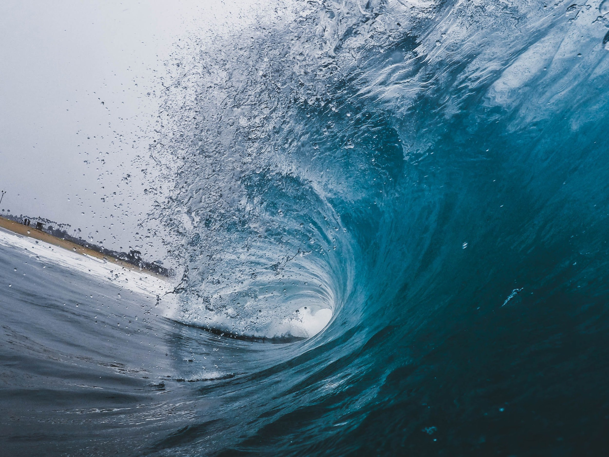

# Weekly Insights Review

**Date:** July 10, 2022  
**Publisher:** Breakwave Advisors | **Category:** Market Insights  
**Original URL:** [https://www.breakwaveadvisors.com/insights/2022/7/10/weekly-insights-review](https://www.breakwaveadvisors.com/insights/2022/7/10/weekly-insights-review)  

---

## Welcome to Our Weekly Insights Review

## Read Here Everything You Need to Know

> **Figure 1: Unsplash Image D5kmhgxgzmi**  
> **Interactive Data & Source:** [Breakwave Advisors Market Insights](https://www.breakwaveadvisors.com/insights/2022/7/4/chinas-coal-imports-from-russia-are-likely-to-continue-to-climb) | [Local Asset](file:///C:/Users/Dell/Github/Shipping/corpus/03-breakwave/insights/2022/assets/2022-07-10_weekly-insights-review_img_unsplash-image-d5kmhgxgzmi_d82e17a31b75.jpg)

## China's Coal Imports From Russia Are Likely to Continue to Climb

## Imports From Indonesia Have Remained the Primary Source of Imports and Russia the Second Largest Source

China's coal import data for May by origin has been released and shows imports from Indonesia have remained the primary source of imports and Russia the second largest source of imports.
[Read More](https://www.breakwaveadvisors.com/insights/2022/7/4/chinas-coal-imports-from-russia-are-likely-to-continue-to-climb)

## Weekly Comment: The Great Deflation of 2023

## Yet, We Feel That Markets Might Once Again Be Missing the Forest for the Trees

Last week featured more volatility, with the world’s leading indices anchoring at bear-market levels in anticipation of new sharp rate hikes by the Fed.
[Read More](https://www.breakwaveadvisors.com/insights/2022/7/6/weekly-comment-the-great-deflation-of-2023)

> **Figure 2: Unsplash Image Q8xsczyh6d8**  
> **Interactive Data & Source:** [Breakwave Advisors Market Insights](https://www.breakwaveadvisors.com/insights/2022/7/6/crude-oil-plunges-amid-rising-recessionary-fears) | [Local Asset](file:///C:/Users/Dell/Github/Shipping/corpus/03-breakwave/insights/2022/assets/2022-07-10_weekly-insights-review_img_unsplash-image-q8xsczyh6d8_674ff82df87b.jpg)

> **Figure 3: Unsplash Image J Lmptk8tmg**  
> **Interactive Data & Source:** [Breakwave Advisors Market Insights](https://www.breakwaveadvisors.com/insights/2022/7/6/crude-oil-plunges-amid-rising-recessionary-fears) | [Local Asset](file:///C:/Users/Dell/Github/Shipping/corpus/03-breakwave/insights/2022/assets/2022-07-10_weekly-insights-review_img_unsplash-image-j-lmptk8tmg_da944bc8805b.jpg)

## Crude Oil Plunges Amid Rising Recessionary Fears

## Recession Fears Gripped Commodity Markets, with Crude Oil and Metals Suffering Sharp Losses

A stronger USD also weighed on investor sentiment.
[Read More](https://www.breakwaveadvisors.com/insights/2022/7/6/crude-oil-plunges-amid-rising-recessionary-fears)

> **Figure 4: Unsplash Image Lfncq6eu1cm**  
> **Interactive Data & Source:** [Breakwave Advisors Market Insights](https://www.breakwaveadvisors.com/insights/2022/7/7/indias-refiners-face-headwinds-after-months-of-windfall-profits) | [Local Asset](file:///C:/Users/Dell/Github/Shipping/corpus/03-breakwave/insights/2022/assets/2022-07-10_weekly-insights-review_img_unsplash-image-lfncq6eu1cm_f9e997839de5.jpg)

## India’s Refiners Face Headwinds After Months of Windfall Profits

## India’s Refiners Have Been Riding the Waves of Soaring Refining Margins Over the Past Months But the Tides Could Be Turning Soon

Ιndia’s refiners have been enjoying windfall profits from sky-high domestic and export margins in recent months, further sweetened by access to discounted Russian crude.
[Read More](https://www.breakwaveadvisors.com/insights/2022/7/7/indias-refiners-face-headwinds-after-months-of-windfall-profits)

## Metals Rebound As China Plans Further Stimulus Measures

## Commodity Markets Rebounded

Commodity markets rebounded as the focus returned to tightness in physical markets
[Read More](https://www.breakwaveadvisors.com/insights/2022/7/8/metals-rebound-as-china-plans-further-stimulus-measures)

> **Figure 5: Unsplash Image P Qvsf7yodw**  
> **Interactive Data & Source:** [Breakwave Advisors Market Insights](https://www.breakwaveadvisors.com/insights/2022/6/24/the-big-picture-thermal-coal-outlook) | [Local Asset](file:///C:/Users/Dell/Github/Shipping/corpus/03-breakwave/insights/2022/assets/2022-07-10_weekly-insights-review_img_unsplash-image-p-qvsf7yodw_571ac05a8d82.jpg)

## War in Ukraine Continues to Divide the World

> **Figure 6: Unsplash Image Iwly Plic U**  
> **Interactive Data & Source:** [Breakwave Advisors Market Insights](https://www.breakwaveadvisors.com/insights/2022/6/24/the-big-picture-thermal-coal-outlook) | [Local Asset](file:///C:/Users/Dell/Github/Shipping/corpus/03-breakwave/insights/2022/assets/2022-07-10_weekly-insights-review_img_unsplash-image-iwly-plic-u_462bbc96a3d7.jpg)

## Βoth India and China Have Been Standing Out From Many Other Nations in Continuing to Work with Russia

India and China have been standing out from many other nations in continuing to work with Russia

## Tanker Tailor Soldier Sailor

> **Figure 7: Unsplash Image Iftbhuffece (1)**  
> **Interactive Data & Source:** [Breakwave Advisors Market Insights](https://www.breakwaveadvisors.com/insights/2022/7/8/tanker-tailor-soldier-sailor) | [Local Asset](file:///C:/Users/Dell/Github/Shipping/corpus/03-breakwave/insights/2022/assets/2022-07-10_weekly-insights-review_img_unsplash-image-iftbhuffece28129_979e4ffbb2aa.jpg)

## It Is Often Said That Posidonia Gatherings Are “Family”.

“This has been by far the most successful Posidonia in the history of the event”.
[Read More](https://www.breakwaveadvisors.com/insights/2022/7/8/tanker-tailor-soldier-sailor)
