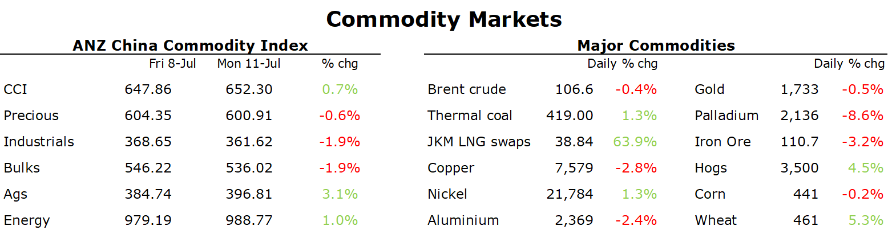

# Oil falls as supply issues ease

**Date:** July 12, 2022  
**Publisher:** Breakwave Advisors | **Category:** Market Insights  
**Original URL:** [https://www.breakwaveadvisors.com/insights/2022/7/12/oil-falls-as-supply-issues-ease](https://www.breakwaveadvisors.com/insights/2022/7/12/oil-falls-as-supply-issues-ease)  

---

*By*[*Daniel Hynes*](https://www.linkedin.com/in/dahynes/)

A risk-off tone across markets saw commodities start the week on the back foot. Renewed outbreaks of COVID-19 in China also weighed on sentiment, while a stronger USD dampened investor appetite.

> **Figure 1: 1657576954780**  
> **Interactive Data & Source:** [Publications Anz](https://publications.anz.com/SingletrackCMS__DownloadDocument?docRef=e34dd8db-4e31-4879-a29f-723162ed87f1&uid=bd219b92-f5cc-400e-9646-4178791864b7&jobRef=1b275f7f-a0aa-45b9-971d-3a8f6c28d31d) | [Local Asset](file:///C:/Users/Dell/Github/Shipping/corpus/03-breakwave/insights/2022/assets/2022-07-12_oil-falls-as-supply-issues-ease_img_1657576954780_e2ac4ffdd762.png)

**Crude oil**fell as supply disruptions eased and COVID in China fed into weakness across global markets. New virus cases in Shanghai hit 69 on Sunday, the most since late May, raising concerns that the recent spike in infections across the country has further to run. This could weigh on the economic recovery. Concerns of supply disruptions eased after a court allowed the crucial CPC terminal on Russia’s Black Sea to stay operational. The terminal had been under instructions from a lower authority to suspend shipments for 30-days due to alleged violations of an oil-spill prevention plan. The terminal handles about 1.2mb/d of Kazakh crude. The US government has also released more oil from its strategic reserve. Some 14 companies were awarded 38.9mbbl of oil for delivery in August and September.

**European gas**extended recent losses as the reopening of part of the Nord Stream pipeline eased concerns of further supply disruptions. Canada agreed to release the stranded turbine, which had left the pipeline operating at 40% capacity. The test will come next week when scheduled maintenance work on the pipeline is completed. Gas flows stopped as that work commenced today. Even with the turbine due back in Russia, Gazprom warned that six other turbines on the pipeline still require parts that are increasingly difficult to source in Russia. Dutch front month futures ended the session down 6.1% to EUR164.52/MWh.**North Asian LNG**prices were dragged lower on the move, despite supply side issues. Shell said it will halt production at its Prelude floating LNG terminal in Australia because storage tanks reached capacity when a strike prevented loadings. The energy crisis is also pushing some countries to look at ways to conserve inventories. Japan is considering creating a framework that would allow government to ask households and businesses to conserve gas when supply is tight.

**European carbon**pushed higher, despite the easing gas prices. The move comes as envoys from three EU institutions held their first meeting to finalise the region’s carbon market reform bill and the UK announced its latest cost containment trigger level. EUAs ended the session up almost 2% to EUR84.36/t.

**Base metals**fell further amid concerns over global growth. Signs of increasing credit in China failed to boost sentiment. Aggregate financing rose to CNY5.2trn in June, while new bank loans rose to CNY2.8trn. The gain in M2 unexpectedly accelerated to 11.4% y/y. This follows reports that Chinese authorities are[**mulling a plan**](https://publications.anz.com/SingletrackCMS__DownloadDocument?docRef=e34dd8db-4e31-4879-a29f-723162ed87f1&uid=bd219b92-f5cc-400e-9646-4178791864b7&jobRef=1b275f7f-a0aa-45b9-971d-3a8f6c28d31d)to let local governments to sell CNY1.5tn in special bonds to boost infrastructure spending. The market appears to be taking a cautious approach to these fiscal stimulus measures. Even so, we expect such measures to[**support metals demand through to the end of 2022**](https://publications.anz.com/SingletrackCMS__DownloadDocument?docRef=aa68aa62-c5ec-4772-9cb9-140de829d632&uid=bd219b92-f5cc-400e-9646-4178791864b7&jobRef=1b275f7f-a0aa-45b9-971d-3a8f6c28d31d). Coupled with ongoing supply side issues markets such as copper, aluminium and nickel are expected to remain tight.

**Gold**prices remained under pressure as the USD strengthen ahead of the release of key US inflation data. An increase in CPI could stiffen the resolve of the Fed to proceed with another big increase in interest rates later this month. Investors continue to cut their exposure to the precious metal. Net long positions on the Comex have hit a three-year low while bullion-backed ETFs reduced their holdings by 29t last week.

Data source:[Commodities Wrap](https://www.linkedin.com/newsletters/commodities-wrap-6692196755876012032/?fbclid=IwAR3kiXJqZdxmp9ZcRwBNI7FsBySI-XSC0pfPur1qzjt7OZp7PTE59Tsl1QI)
