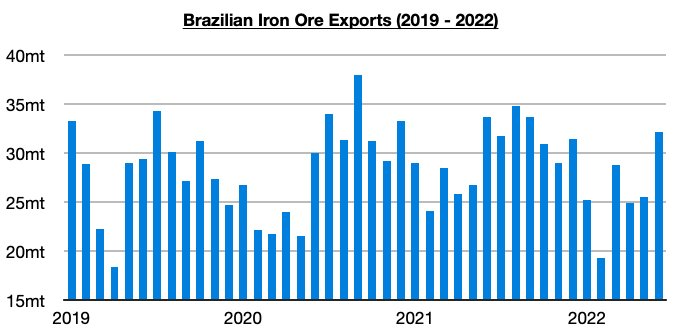
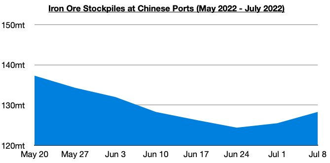

# Brazil Iron Ore Contraction Continues; Eventual China Improvement Likely

**Date:** July 14, 2022  
**Publisher:** Breakwave Advisors | **Category:** Market Insights  
**Original URL:** [https://www.breakwaveadvisors.com/insights/2022/7/14/brazil-iron-ore-contraction-continues-eventual-china-improvement-likely](https://www.breakwaveadvisors.com/insights/2022/7/14/brazil-iron-ore-contraction-continues-eventual-china-improvement-likely)  

---

*By*[*Jeffrey Landsberg*](https://www.linkedin.com/in/jeffrey-landsberg-70ab957/)

One of the most negative issues for the capesize market this year has been that Brazil’s iron ore exports have continued to contract on a year-on-year basis. Most recently, Brazil’s iron ore exports totaled 32.1 million tons in June. While this is 6.6 million tons (26%) more than was exported in May, it is 400,000 tons (-5%) less than was exported in June 2021. Brazil’s iron ore exports have now contracted on a year-on-year basis during nine of the last ten months, and so far this year they have contracted on a year-on-year basis by 11.9 million tons (-7%).

> **Figure 1: Chart 1 (38)**  
> [Local Asset](file:///C:/Users/Dell/Github/Shipping/corpus/03-breakwave/insights/2022/assets/2022-07-14_brazil-iron-ore-contraction-continues-eventual-china-improvement-likely_img_chart1283829_272c72e911c3.jpg)

The worst is likely over for Brazil's iron ore exports, and the strong month-on-month increase is a good sign. The 32.1 million tons exported last month has marked the largest monthly export volume seen this year, and looking forward Brazil’s iron ore exports are typically much stronger during the second half of every year compared with first half of the year volume. Going forward, we expect that a Chinese iron ore restock will be occurring during the second half of the year at the same time that Brazilian (and also Australian) iron ore production are undergoing their normal seasonal strength. 128.3 million tons of iron ore is now stockpiled at Chinese ports, which is 2.8 million tons (2%) more than was stockpiled a week ago but up year-on-year by only 1 million tons (1%). Stockpiles have now increased for two straight weeks after previously falling for eight straight weeks. As recently as in February, stockpiles stood at 160 million tons.

> **Figure 2: Chart 2 (35)**  
> [Local Asset](file:///C:/Users/Dell/Github/Shipping/corpus/03-breakwave/insights/2022/assets/2022-07-14_brazil-iron-ore-contraction-continues-eventual-china-improvement-likely_img_chart2283529_b5616cf933fd.jpg)

Also significant in China is that the central government has very clearly been continuing to work to stimulate the economy. Sustained strength is likely to begin whenever coronavirus restrictions are fully lifted. Most recently, it was reported last week that the government is considering allowing local governments to sell 1.5 trillion yuan ($220 billion) of special bonds in the second half of the year to be mainly used on infrastructure funding. This development would be a positive for China’s economy — but not extremely significant on its own. The bond sales would reportedly be brought forward from next year’s quota rather than being in addition to next year sales. Overall, though, such an action will be helpful in providing more immediate support to China's economy.
