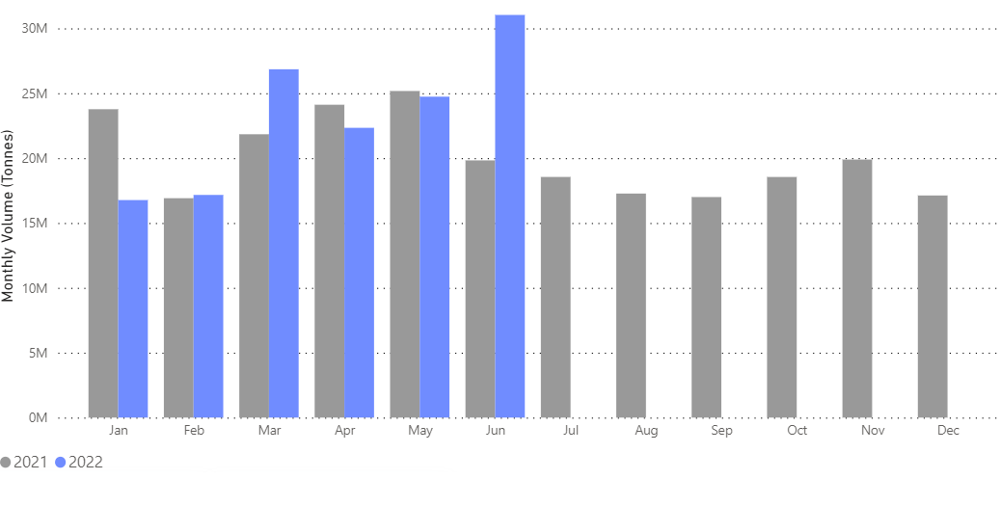
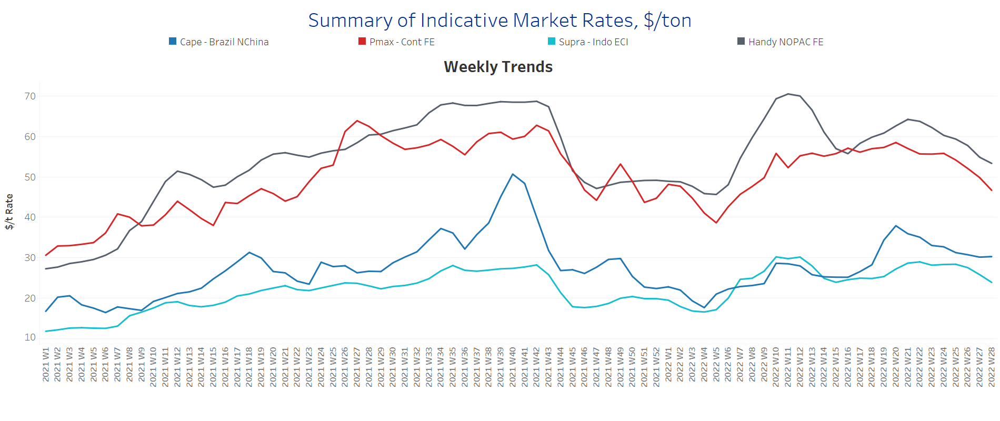
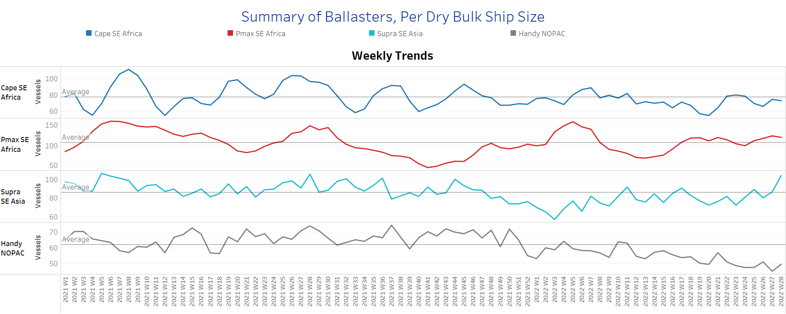
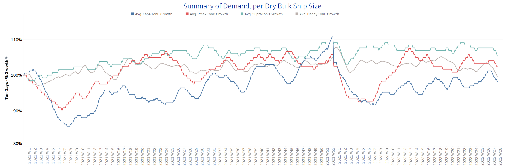
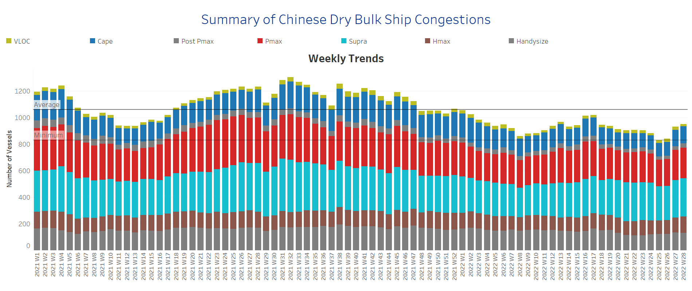

# Signal Dry Bulk Weekly Report

**Date:** July 15, 2022  
**Publisher:** Breakwave Advisors | **Category:** Market Insights  
**Original URL:** [https://www.breakwaveadvisors.com/insights/2022/7/15/signal-dry-bulk-weekly-report](https://www.breakwaveadvisors.com/insights/2022/7/15/signal-dry-bulk-weekly-report)  

---

Sentiment in the freight market has weakened further for smaller ship sizes, while the Capesize segment is still in a recovery phase.

In the iron ore market, prices picked up again on Wednesday. According to Fastmarkets MB, the 62% Fe benchmark imported to North China changed hands for $108.91/tonne, up 3.72%. However, with ongoing concerns over weak demand from China, prices remain below $110 per tonne, a level not seen since December last year. Concerns over repeated outbreaks of COVID -19 and low profitability at Chinese steel mills continue to overshadow reports of a massive stimulus package and earlier political promises of support from the world's largest steelmaker. In addition, the market continued to be weighed down by growing fears of a possible recession-related global drop in demand.

In the coal segment, it is surprising that Asian imports are holding up despite record prices. With thermal coal and liquefied natural gas (LNG) prices near record highs in Asia, it would be logical to expect a drop in demand, especially in developing countries that are considered price sensitive.

The chart below, with data from The Signal Ocean Platform, shows the record level of Indian coal imports in June, up 55% from the same period last year.

In the Western world, Germany is said to stop buying Russian coal from August 1 and Russian oil from December 31. This will fundamentally change the country's energy supply, said Joerg Kukies, State Secretary in the German federal chancellery, at a conference in Sydney.
​​​​​​

> **Figure 1: Chart of the Week:dry Bulk Flows, Coal, to India: Record High in June**  
> [Local Asset](file:///C:/Users/Dell/Github/Shipping/corpus/03-breakwave/insights/2022/assets/2022-07-15_signal-dry-bulk-weekly-report_img_unnamed283829_fb611bcf8101.png)

Data Source: The Signal Ocean Platform, Dry Bulk Flows, Coal, from ALL Countries to India, 2021-2022

## Section 1 - Freight -Market Rates ($/T) - Weaker

‘The Big Picture’ - Capesize and Panamax Bulkers and Smaller Ship Sizes

> **Figure 2: Market Chart 2**  
> [Local Asset](file:///C:/Users/Dell/Github/Shipping/corpus/03-breakwave/insights/2022/assets/2022-07-15_signal-dry-bulk-weekly-report_img_unnamed283929_088ee47e0af5.png)

The Capesize segment showed a sustained upward trend, while the other vessel categories continued to show a downward trend over the last three weeks.

- **Capesize**Brazil-to-North China freight rates held at a level of about $31/tonne with an upward trend.
- **Panamax**Continent-to-Far East freight rates fell to $48/tonne, down $8/tonne from week 24.
- **Supramax**Indo-to-ECI freight rates fell to $24.5 per tonne, and the decline was significant this week compared to levels recorded in weeks 24 and 25.
- **Handysize**NOPAC-to-Far East freight rates fell to $54/tonne, down $10/tonne from week 21.

## Section 2 - Supply - Ballasters View

## Number of Vessels -Increasing

> **Figure 3: Supply Trend Lines for Key Load Areas**  
> [Local Asset](file:///C:/Users/Dell/Github/Shipping/corpus/03-breakwave/insights/2022/assets/2022-07-15_signal-dry-bulk-weekly-report_img_unnamed284029_3ccbfea69c20.png)

The number of ships sailing ballast increased sharply in the Supramax segment, while there was a sudden drop in Handysize.

- **Capesize**SE Africa: The number of vessels increased to 73, 7 more than week 26.
- **Panamax**SE Africa: The number of ships remained at the high level of the previous week, with 120 ships, 12 above the annual average.
- **Supramax**SE Asia: The number of vessels increased to 100, 13 more than the previous week.
- **Handysize**NOPAC: The number of vessels decreased to 47, 24% below the annual average.

## Section 3 - Demand - In Ton Days

## Decreasing

> **Figure 4: Decreasing**  
> [Local Asset](file:///C:/Users/Dell/Github/Shipping/corpus/03-breakwave/insights/2022/assets/2022-07-15_signal-dry-bulk-weekly-report_img_unnamed284129_0a13d8d6ca46.png)

A downward trend emerged in the second week of July, with the Handysize and Capesize segments showing significantly lower growth.

- **Capesize**demand ton-days: The percentage increase this week shows a downward trend and disappoints expectations for an upturn in July.
- **Panamax**demand ton-days: There is no further impetus for recovery as growth has slowed since last week.
- **Supramax**demand ton-days: Percentage growth also shows a continued downward trend, which has intensified since late last week.
- **Handysize**demand ton-days: After the sudden increase in week 25, the percentage growth has weakened in the last three weeks.

## Section 4 - Chinese Port Congestions -

## Number of Vessels - Increasing

> **Figure 5: Dry Bulk Ships Congested at Chinese Ports**  
> [Local Asset](file:///C:/Users/Dell/Github/Shipping/corpus/03-breakwave/insights/2022/assets/2022-07-15_signal-dry-bulk-weekly-report_img_unnamed284229_af668fbab458.png)

The number of congested vessels has remained excessive since the end of June.

- **Capesize:**The number of congested vessels increased to 130, 7 more than the previous week.
- **Panamax:**The number of vessels was 238, a 20% increase from the low in week 20.
- **Supramax:**The number of congested vessels is still approaching the threshold of 300.
- **Handysize**: The number of congested vessels appeared to drop to 130 ships, which contrasts with earlier weekly estimates of about 150.
