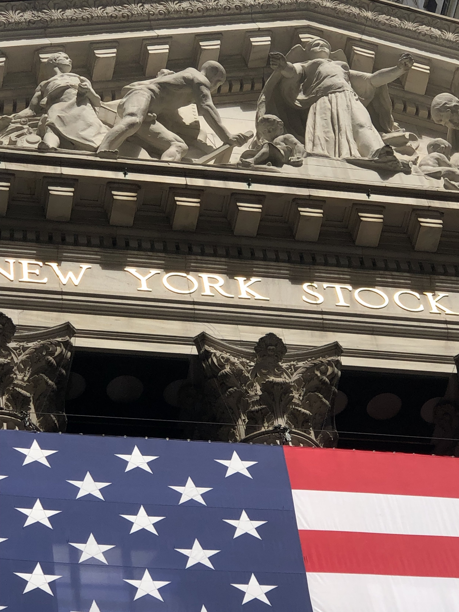
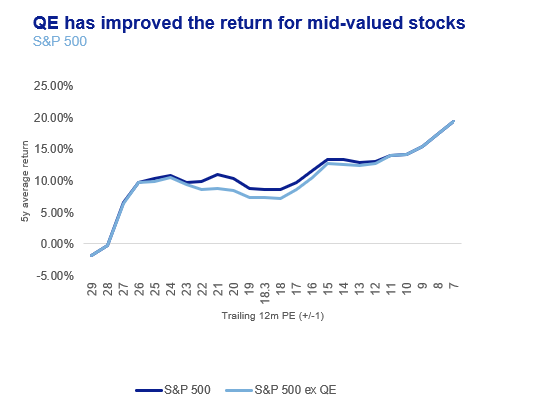
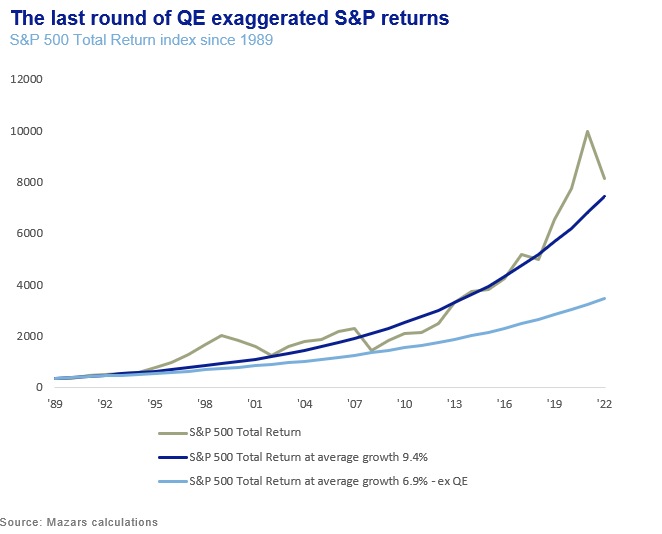

# 5 rules to manage money in an unmanageable world

**Date:** July 19, 2022  
**Publisher:** Breakwave Advisors | **Category:** Market Insights  
**Original URL:** [https://www.breakwaveadvisors.com/insights/2022/7/18/5-rules-to-manage-money-in-an-unmanageable-world](https://www.breakwaveadvisors.com/insights/2022/7/18/5-rules-to-manage-money-in-an-unmanageable-world)  

---

*By*[*George Lagarias*](https://www.linkedin.com/in/george-lagarias-mba-3baa769/)

There is no more recurring truth these days than the constant failure of predictions. A year ago, the Federal Reserve felt that inflation was transitory and manageable. By January, however, before the war in Ukraine, it was already aggressively tightening rates. Ukraine was predicted to be manageable as well, both from a Russian and a European perspective. European nations would 'cancel' the Russian economy to force Mr Putin to stop the aggression. It turned into the biggest cost-of-living crisis in a couple of generations, while Russia is raking in billions selling its now highly-priced natural gas to other countries and pressing on with the offensive. Mr Putin himself thought the invasion would be a simple affair too. The realities of modern warfare have proved him wrong too.

And round we go. Globalised supply chains have undeniably globalised the whole economy. Borders mean little from a policy standpoint and even less from an economic perspective. The emergence and impact of China, a non-capitalist country- as a rival to the the 450-year capitalist status quo, is complicating matters. The infinite amount of interconnections globalisation is producing, is making it virtually impossible for policymakers to make any decision with a good grasp on how the consequences will play out. Climate change, which will certainly affect output and productivity, is throwing an additional spanner in the works.

Knowing that international cooperation would be key in a globalised economy, nations created forums, like Davos, the G7, the G20 and various unofficial conclaves of central banks. Even unions like the EU. We tried to create a framework with the World Trade Organisation. However, decisions are still being taken in the sum of what is deemed to be 'national interests', which are mostly short-term calculations of how voters may react. However, forums may just become platforms for cross-talking. Organisations often succumb to pressures from their key contributors, which causes them to lose credibility.

Thus, policy playbooks crafted for more closed economies and simpler times are virtually useless in globalised world, where consequences are too random to calculate in advance of a decision. Policymakers professing certainty in what is clearly an uncertain world know that the electorate will soon call them out.

**The complexity of the global economy has outstripped our ability to understand it, let alone manage it .**As a result, developed markets are faced with runaway inflation, while global supply chains remain in disarray for the third consecutive year. Failure to effectively manage the unmanageable is creating the impression on electorates that whichever way they vote doesn't matter. If one can't vote on interests, because outcomes are so unclear, then one votes for identity. This is why the UK PM race has now turned to a debacle on the stance on various social positions, as opposed to a serious debate on social and economic issues. It is now often that political office is sought to further one's image, as a way of profiting more in the future, rather than the apex of a career in civil service. This significantly warps incentives of policymakers altogether. Civic frustration leads to a very quick turnover in political figures in democratic countries, which itself fuels populism or gives rise to authoritarian figures where democratic institutions are weak.

How do we deal with the unmanageable 'beast' that is the global economy? One obvious way is to scale down globalisation. 'Taking back control', or 'putting [one's country] first' sounds like a solid strategy to go about it. So does scaling down economic unions. If, the thinking goes, the drawbacks of a globalised economy outweigh its benefits, all we have to do is to reduce complexity. We need to reduce outward mobility and movement of capital, to essentially de-globalise the economy. This, however, has proven much more of wishful thinking that practical reality. The vast complexities of Brexit are just a small sub-set of what awaits a country that would turn its back on globalisation. Truth is, that as long as the world remains interconnected to the present degree, economies will remain global and national institutions will struggle to catch up.

So, if policymakers can't really manage this world, where does that leave investors? Hoping for the creation of effective global institutions or the election of enlightened figures to sort this problem, while noble, is not much of an investment strategy.

Thankfully, investors don't have to think about the vagaries of a globalised world.**If the top-down approach doesn't make sense, then the solution has to come from the bottom-up.**

Corporations aren't at the mercy of globalisation. They drive it. Corporations have a solid handle on their supply chains. A policy maker won't rest until a supply issue that affects all of society is solved, never really in a perfect way. A corporation only has to worry about sorting one supply chain, its own. It can re-rout shipments, manage inventories, outsource faster than any policymaker can reach any sort of accord.

> **Figure 1: 243**  
> [Local Asset](file:///C:/Users/Dell/Github/Shipping/corpus/03-breakwave/insights/2022/assets/2022-07-19_5-rules-to-manage-money-in-an-unmanageable-world_img_243_523fa61fa1a6.jpg)

**Unmanageable doesn't mean not navigable. A CEO can do for shareholders much more than a Prime Minister, President of even a Dictator can do for their constituents. The system is called 'capitalism'. That we struggle as citizens does not mean we can't still thrive as shareholders.**

Investors need to remember that the larger part of their investments is corporate. Investing in equities, is solely a corporate investment, and thus more manageable. Investing in bonds is either corporate or sovereign. Sovereign investments don't require governments to thrive. Just not go bankrupt. In the age of monetarism, this is less of a worry.

Yes, global inflation is an issue. And yes, withdrawal of quantitative easing is bad for equities. But for all the bluster, inflation is mostly supply-driven which means that it will eventually pass. And while quantitative easing has driven stocks for more than a decade, that does not mean that fundamentals don't apply at all. QE affects stocks only from a certain valuation onwards, above 15x times forward earnings.

> **Figure 2: $1.jpg**  
> [Local Asset](file:///C:/Users/Dell/Github/Shipping/corpus/03-breakwave/insights/2022/assets/2022-07-19_5-rules-to-manage-money-in-an-unmanageable-world_img_241jpg_deb70ba18f79.png)

Below a certain point, it's not QE that will be driving equity returns, but earnings. Lack of QE will simply mean less excess valuations, less of a stock market impetus.

> **Figure 3: $2.jpg**  
> [Local Asset](file:///C:/Users/Dell/Github/Shipping/corpus/03-breakwave/insights/2022/assets/2022-07-19_5-rules-to-manage-money-in-an-unmanageable-world_img_242jpg_3c35348b9601.png)

Lack of any central paradigm, someone to underwrite risk, will mean lower portfolio resilience to shocks. But it does not mean the abandonment of time-honoured investing principles. If anything, it means a return to first principles.

### So What Do Investors Need to Watch Out for in This Unbalanced World ?

1. Mind the top down, mostly as a source of risk. Pinpoint major structural weakness and avoid it. Stay in markets that have depth and sound infrastructure.
2. In a post-QE world, top-down will not be the major driver returns for risk assets. This means that investors, or their chosen managers, understand the holdings in their portfolio.
3. Expect volatility, and strategize ways to profit from it. Maintaining margins of safety (knowing the true value of a company and have money at hand to buy it at a discount) is a proven strategy.
4. Rely on fundamentals more than momentum. In this world, good companies are not the ones' others will massively buy'. They are the ones whose value and earnings potential will become visible to all, preferably after they have been added to a client's portfolio.
5. Mind the hedge. If the world is truly unmanageable, then taking a long-term perspective on currencies is not really feasible. One can of course take tactical perspectives, based on the assumption of policies and then hedge and diversify accordingly.

---

**Tags:** Economy, Investing, Markets  
