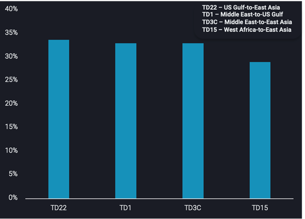
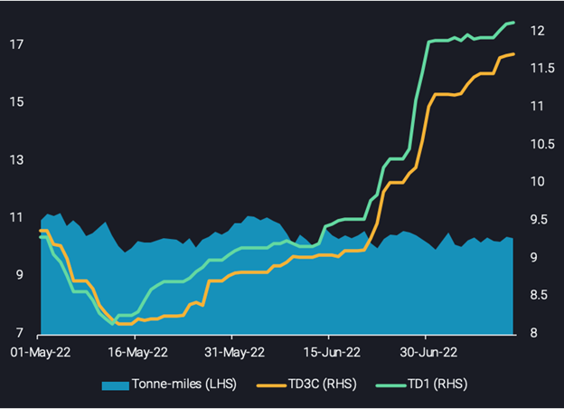

# VLCC freight rate recovery challenged by stormy waters ahead

**Date:** July 20, 2022  
**Publisher:** Breakwave Advisors | **Category:** Market Insights  
**Original URL:** [https://www.breakwaveadvisors.com/insights/2022/7/17/vlcc-freight-rate-recovery-challenged-by-stormy-waters-ahead](https://www.breakwaveadvisors.com/insights/2022/7/17/vlcc-freight-rate-recovery-challenged-by-stormy-waters-ahead)  

---

VLCCs have had a tough first half in 2022, with increasing vessel supply and weak crude demand in East Asia keeping earnings well below break-even. Recently, VLCC rates staged their third rally, and we take a deep dive into the at best mixed picture behind this development.

*By*[*Dylan Simpson*](https://www.linkedin.com/in/dsimpson09/)

In the last two quarters, VLCC tankers have battled bleak markets prompted by weak demand fundamentals for crude, as well as high newbuild numbers causing oversupply globally. This has seen VLCC freight rates unable to sustain any surges this year. The recent increase in VLCC freight rates has occurred over a longer period than previous surges, which suggests a more persistent improvement. With supply and demand factors giving few clues, the question is: what is causing this increase in freight rates?

> **Figure 1: 244**  
> **Interactive Data & Source:** [Vortexa](https://www.vortexa.com//oil-gas-data-traders-analysts-data-scientists?gclid=Cj0KCQjw8_qRBhCXARIsAE2AtRZKOvMnbilZ_6_91d7huSFFy71pWLrnPwGwOHVzXsmsG-1a1mZnQw8aAt89EALw_wcB&hsa_acc=1782073842&hsa_ad=548425387665&hsa_cam=14746637662&hsa_grp=125038601902&hsa_kw=&hsa_mt=&hsa_net=adwords&hsa_src=g&hsa_tgt=dsa-1431852288425&hsa_ver=3&utm_campaign=%5BCD%5D%20-%20DSA%20-%20EMEA&utm_medium=cpc&utm_medium=ppc&utm_source=google&utm_source=adwords&utm_term=) | [Local Asset](file:///C:/Users/Dell/Github/Shipping/corpus/03-breakwave/insights/2022/assets/2022-07-20_vlcc-freight-rate-recovery-challenged-by-stormy-waters-ahead_img_244_3e8d0cd23280.png)

### Td22, Td1, Td3c and Td15 Freight Rate Percentage Increases Since 1 June 2022

## What Is Supply and Demand Telling Us?

Tanker tonne-mile demand is the most baffling metric, with VLCC tonne-miles out of the Middle East and West Africa staying flat and no noticeable increases seen on TD22 (US Gulf-to-East Asia) either. Even though tonne-miles are a historical representation of tanker demand, rates have increased since June, leaving plenty of time for tonne-miles to display strength but to no avail.

Similarly, on the crude demand side flows to the US have remained stagnant. Flows towards East Asia have shown a slight uptick from May to June, but are still below the average for H1 2022. There was a lot of optimism for China to speed up economic growth post Covid lockdowns, but renewed question marks about the health of Chinese and global markets are spreading fast – with recession increasingly becoming a base case assumption rather than a risk factor. Additionally we are post the peak driving season from a crude procurement perspective and refining margins have taken a significant hit over recent weeks, as have outright crude prices. All this makes it difficult to align the VLCC rate increase with crude demand fundamentals.

The current situation on the tanker supply side also contradicts increasing freight rates. VLCC availability in the Middle East and the US Gulf has reached multi-year highs, while in West Africa tanker supply is ticking upwards, approaching relatively high levels.

> **Figure 2: 245**  
> **Interactive Data & Source:** [Vortexa](https://www.vortexa.com//oil-gas-data-traders-analysts-data-scientists?gclid=Cj0KCQjw8_qRBhCXARIsAE2AtRZKOvMnbilZ_6_91d7huSFFy71pWLrnPwGwOHVzXsmsG-1a1mZnQw8aAt89EALw_wcB&hsa_acc=1782073842&hsa_ad=548425387665&hsa_cam=14746637662&hsa_grp=125038601902&hsa_kw=&hsa_mt=&hsa_net=adwords&hsa_src=g&hsa_tgt=dsa-1431852288425&hsa_ver=3&utm_campaign=%5BCD%5D%20-%20DSA%20-%20EMEA&utm_medium=cpc&utm_medium=ppc&utm_source=google&utm_source=adwords&utm_term=) | [Local Asset](file:///C:/Users/Dell/Github/Shipping/corpus/03-breakwave/insights/2022/assets/2022-07-20_vlcc-freight-rate-recovery-challenged-by-stormy-waters-ahead_img_245_3701882eb79e.png)

**VLCC tonne-miles out of the Middle East vs VLCC freight rates originating in the Middle East**

## What Are the Expectations in the Market?

While most fundamentals are not supportive of rising VLCC rates, there is a glimmer of hope. Fixtures for VLCCs out of the US showed 8 vessels heading East in June, with 9 already recorded in July (due to load in the coming weeks), which is high compared to historical fixtures. US SPR releases of more sweet crude recently, paired with rising North American production and the upcoming refinery maintenance season in autumn speak for higher export availability. If a growing share of those volumes goes long-haul to Asia, that could be a consistent game changer for VLCC rates.

Current crude inventory drawdowns in East Asia and Europe may also increase crude demand as countries seek to build inventories amid a deepening energy crisis, which would drive tanker demand. The prospective re-opening of China’s economy in the months ahead and peak demand in Northeast Asia in Q4 may bolster tanker demand across the board. However, with Covid outbreaks flaring up regularly in China, this demand boost is constantly at risk.

West African supply is on a constant declining path, but from the very low levels right now there could be some upside, at least according to the Nigerian president. Also US President Biden’s visit in Saudi Arabia is expected to contribute to higher crude oil exports out of the Middle East, and the first 13 days of this month are already encouraging.

On the vessel supply side we are past the quarter with the highest number of VLCC newbuilds. New deliveries are expected to decrease q-o-q for the rest of this year, and remain very low in 2023 all the way through to 2025. The worst is behind us in terms of VLCC supply pressure for the foreseeable future, which may also be supporting freight rates.

## Outlook: Still Ground to Cover

Although there has been a significant rise in tanker rates, there is still some way left to call this a real recovery in VLCC profitability. A crucial detail to note is that daily VLCC earnings are still mostly in negative territory, with TD15 being the only profitable VLCC freight rate. As noted above there are some indications that the outlook is brightening, but we are still living in a supply-constrained environment with record energy inflation, which is set to also curtail the demand side. A persistent and big step higher in oil transportation is difficult to see for now in this market environment.

Data Source:[Vortexa](https://www.vortexa.com//oil-gas-data-traders-analysts-data-scientists?gclid=Cj0KCQjw8_qRBhCXARIsAE2AtRZKOvMnbilZ_6_91d7huSFFy71pWLrnPwGwOHVzXsmsG-1a1mZnQw8aAt89EALw_wcB&hsa_acc=1782073842&hsa_ad=548425387665&hsa_cam=14746637662&hsa_grp=125038601902&hsa_kw=&hsa_mt=&hsa_net=adwords&hsa_src=g&hsa_tgt=dsa-1431852288425&hsa_ver=3&utm_campaign=%5BCD%5D%20-%20DSA%20-%20EMEA&utm_medium=cpc&utm_medium=ppc&utm_source=google&utm_source=adwords&utm_term=)

---

**Tags:** Tankers, Shipping, Investing  
