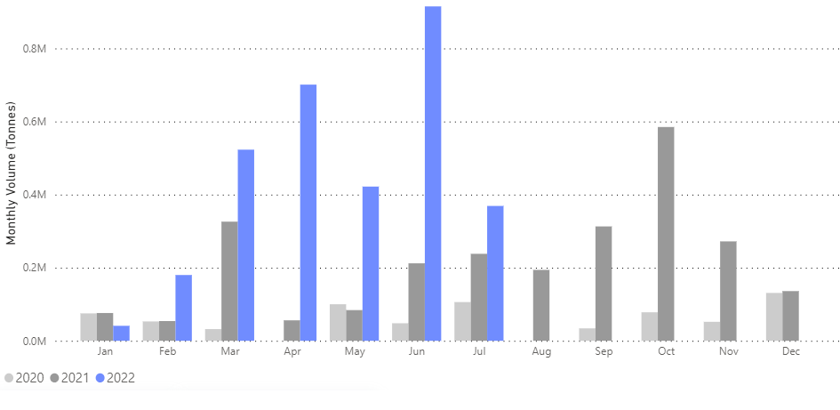
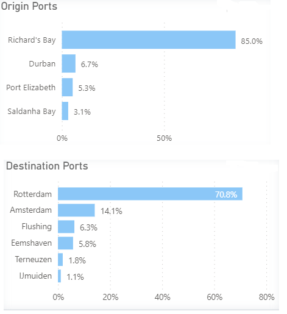
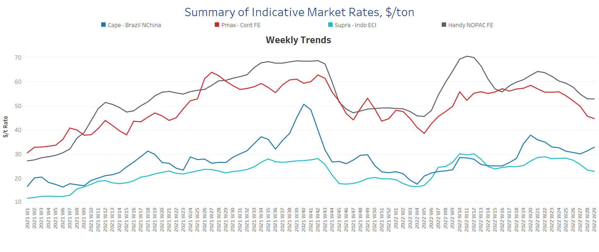
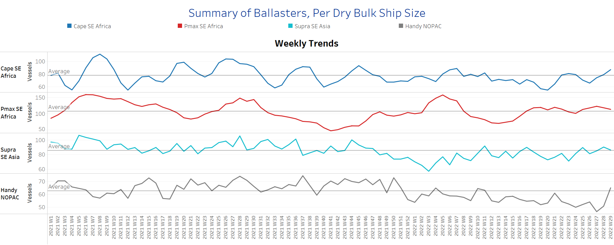
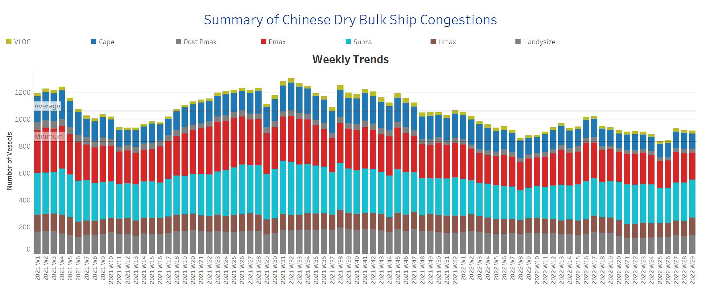

# Signal Dry Bulk Weekly Report

**Date:** July 21, 2022  
**Publisher:** Breakwave Advisors | **Category:** Market Insights  
**Original URL:** [https://www.breakwaveadvisors.com/insights/2022/7/21/signal-dry-bulk-weekly-report](https://www.breakwaveadvisors.com/insights/2022/7/21/signal-dry-bulk-weekly-report)  

---

Freight rates maintained the weak momentum seen in recent weeks, while seaborne flows are gradually recovering, which will have a positive impact on the future development of rates.

In the iron ore market, the price of iron ore rose above $100 as China intervened to alleviate real estate problems. Recent news underscored that China is planning a state-backed iron ore company to oversee everything from massive mining investments in West Africa to buying steel from global suppliers. The plan would be China's biggest attempt yet to combat what its officials have long called excessive pricing power by mining companies such as BHP Group Ltd. and Rio Tinto Plc.

In the coal sector, expectations are growing that China's leader Xi Jinping will reverse his unofficial ban on Australian coal imports as the country's economic woes continue to mount. China's Ministry of Commerce has not yet officially announced it will lift the ban, but analysts in China say the rising cost of imported coal from other countries is hurting both steelmakers and the energy sector. China lifting the nearly two-year ban on Australian coal imports would be an important step toward restoring relations between the two countries.

Meanwhile, coal imports to northwest Europe have reached a remarkable peak, with the second quarter of the year seeing a resurgence in seaborne shipments, from a variety of origins, to unprecedented levels. The chart below, using data from the Signal Ocean Platform, shows that seaborne coal imports from South Africa to the Netherlands reached an unexpected record level between March and June, with the last month recording the highest increase since 2020.​​​​​

## Chart of the Week: Seaborne Coal Imports, South Africa to the Netherlands

> **Figure 1: Accelerated Growth After 2 Years of Near Standstill**  
> **Interactive Data & Source:** [Signal Ocean Platform](https://www.thesignalgroup.com/signal-ocean-platform) | [Local Asset](file:///C:/Users/Dell/Github/Shipping/corpus/03-breakwave/insights/2022/assets/2022-07-21_signal-dry-bulk-weekly-report_img_unnamed284329_380606c5716c.png)

## Top Origin and Top Destination Ports, % Share, From Africa to the Netherlands

> **Figure 2: Market Chart 2**  
> **Interactive Data & Source:** [Signal Ocean Platform](https://www.thesignalgroup.com/signal-ocean-platform) | [Local Asset](file:///C:/Users/Dell/Github/Shipping/corpus/03-breakwave/insights/2022/assets/2022-07-21_signal-dry-bulk-weekly-report_img_unnamed284429_4dcd44042f2a.png)

Data Source: The Signal Ocean Platform, Dry Bulk Flows, Coal, from South Africa to the Netherlands, 2020-2022

## Section 1 - Freight -Market Rates ($/T) - Weaker

‘The Big Picture’ - Capesize and Panamax Bulkers and Smaller Ship Sizes

> **Figure 3: Market Chart 3**  
> **Interactive Data & Source:** [Signal Ocean Platform](https://www.thesignalgroup.com/signal-ocean-platform) | [Local Asset](file:///C:/Users/Dell/Github/Shipping/corpus/03-breakwave/insights/2022/assets/2022-07-21_signal-dry-bulk-weekly-report_img_unnamed284529_8158a917146f.png)

Freight sentiment remained unchanged compared to the previous weeks of July, as a downward trend continued to be observed in the smaller vessel categories. The Capesize segment continued its ongoing upward trend in July, while the Panamax and Handysize segments recorded a steady decline.

- **Capesize**Brazil-to-North China freight rates increased to $33/tonne, up $2/tonne from the previous week, with the upward trend now in its third week.
- **Panamax**Continent-to-Far East freight rates fell to $44.5/tonne, down $3.5/tonne from last week.
- **Supramax**Indo-to-ECI freight rates fell to $23/tonne, and the decline continued from the peak in week 24.
- **Handysize**NOPAC-to-Far East freight rates appeared to have reached a low of about $53/tonne over the past two weeks, down $12/tonne from week 21.

## Section 2 - Supply - Ballasters View

## Number of Vessels -Increasing

> **Figure 4: Supply Trend Lines for Key Load Areas**  
> **Interactive Data & Source:** [Signal Ocean Platform](https://www.thesignalgroup.com/signal-ocean-platform) | [Local Asset](file:///C:/Users/Dell/Github/Shipping/corpus/03-breakwave/insights/2022/assets/2022-07-21_signal-dry-bulk-weekly-report_img_unnamed284629_5be730eb0f80.png)

In the Supramax segment, the number of ships continued to increase, while, there was also a clear upward trend in the number of Capesize vessels.

- **Capesize**SE Africa: The number of vessels increased to 88, 23 more than week 26.
- **Panamax**SE Africa: The number of ships recorded a slight decrease to 114 vessels, 6 above the annual average.
- **Supramax**SE Asia: The number of vessels is approaching the annual average of 86 ships, with a downward trend expected in the coming days.
- **Handysize**NOPAC: The number of vessels reached a high of 70, up 24 from two weeks ago.

## Section 3 - Demand - In Ton Days

## Decreasing

> **Figure 5: Decreasing**  
> **Interactive Data & Source:** [Signal Ocean Platform](https://www.thesignalgroup.com/signal-ocean-platform) | [Local Asset](file:///C:/Users/Dell/Github/Shipping/corpus/03-breakwave/insights/2022/assets/2022-07-21_signal-dry-bulk-weekly-report_img_unnamed284629_5be730eb0f80.png)

The downward trend continued in the third week of July, with the Handysize, Panamax, and Capesize segments recording significantly lower growth.

- **Capesize**demand ton-days: The percentage increase this week shows another clear downward trend, approaching the low point in weeks 21 and 22.
- **Panamax**demand ton-days: The growth persisted slower than the peak in Week 26 with a sustained decrease over the last three weeks.
- **Supramax**demand ton-days: Percentage growth seems to have settled at a weaker level in the last two weeks than in weeks 25 and 27.
- **Handysize**demand ton-days: The downward trend continues and there are no signs of recovery since Week 27.

## Section 4 - Chinese Port Congestions -

## Number of Vessels - Increasing

> **Figure 6: Dry Bulk Ships Congested at Chinese Ports**  
> **Interactive Data & Source:** [Signal Ocean Platform](https://www.thesignalgroup.com/signal-ocean-platform) | [Local Asset](file:///C:/Users/Dell/Github/Shipping/corpus/03-breakwave/insights/2022/assets/2022-07-21_signal-dry-bulk-weekly-report_img_unnamed284829_41f85b162a22.png)

While the number of congested vessels is still below average, we have seen a week-over-week rise in recent days. There was a further increase in the Handysize segment, while a downward trend was recorded in the larger ship categories.

- **Capesize:**The number of congested vessels decreased to 116, 5 less than the previous week.
- **Panamax:**The number of vessels was 208, down 6% from the previous week.
- **Supramax:**The number of congested vessels is now almost 10 vessels below the threshold of 300.
- **Handysize**: The number of congested vessels increased to 137 ships, 10 more than the previous week.

Data Source:[Signal Ocean Platform](https://www.thesignalgroup.com/signal-ocean-platform)
