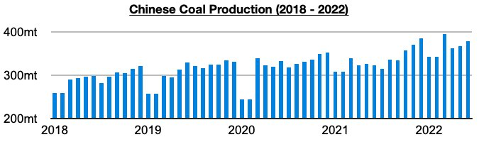
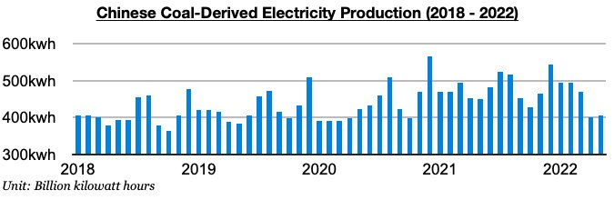
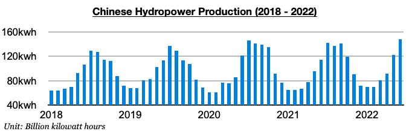

# China's Coal Production Continues to Fare Much Better than Coal-Derived Electricity Generation; Hydropower Output Has Set All-Time High

**Date:** July 26, 2022  
**Publisher:** Breakwave Advisors | **Category:** Market Insights  
**Original URL:** [https://www.breakwaveadvisors.com/insights/2022/7/26/chinas-coal-production-continues-to-fare-much-better-than-coal-derived-electricity-generation-hydropower-output-has-set-all-time-high](https://www.breakwaveadvisors.com/insights/2022/7/26/chinas-coal-production-continues-to-fare-much-better-than-coal-derived-electricity-generation-hydropower-output-has-set-all-time-high)  

---

*By*[*Jeffrey Landsberg*](https://www.linkedin.com/in/jeffrey-landsberg-70ab957/)

China's coal production in June totaled 379.3 million tons. This has marked a month-on-month rise of 11.5 million tons (3%) and is up year-on-year by 56.1 million tons (17%). While again not setting a record (as was previously seen in March, December, November, and October), China’s coal production has remained quite strong. Prior to October, China had never even produced 352 million tons of coal in a single month.

> **Figure 1: Chart 1 (40)**  
> [Local Asset](file:///C:/Users/Dell/Github/Shipping/corpus/03-breakwave/insights/2022/assets/2022-07-26_chinas-coal-production-continues-to-fare-much-better-than-coal-derived-electrici_img_chart1284029_757a01a59adc.jpg)

It remains detrimental for China’s coal import prospects that coal production has stayed so strong. Also remaining concerning is that coal production growth continues to fare much better than coal-derived electricity generation growth. Coal-derived electricity generation is still likely to start finding growth again whenever coronavirus restrictions do end, but we continue to expect that coal production growth will remain stronger. Coal-derived electricity generation last month totaled 455.3 billion kilowatt hours. This is 50.8 billion kilowatt hours (13%) more than was produced in May but is down year-on-year by 26 billion kilowatt hours (-5%).

> **Figure 2: Chart 2 (37)**  
> [Local Asset](file:///C:/Users/Dell/Github/Shipping/corpus/03-breakwave/insights/2022/assets/2022-07-26_chinas-coal-production-continues-to-fare-much-better-than-coal-derived-electrici_img_chart2283729_24aa067827db.jpg)

Also of note is that China's hydropower production ended up setting a record last month from some heavy rain and more hydro stations being put into operation recently. Hydropower output totaled 148.1 billion kilowatt hours in June, which is up from May by 26.4 billion kilowatt hours (22%) and up year-on-year by 33.9 billion kilowatt hours (30%).

> **Figure 3: Chart 3 (29)**  
> [Local Asset](file:///C:/Users/Dell/Github/Shipping/corpus/03-breakwave/insights/2022/assets/2022-07-26_chinas-coal-production-continues-to-fare-much-better-than-coal-derived-electrici_img_chart3282929_58b2b478ba22.jpg)
