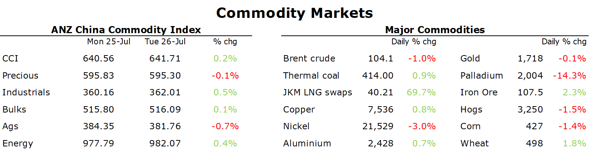

# Energy markets surge higher amid further curbs on Russian gas

**Date:** July 27, 2022  
**Publisher:** Breakwave Advisors | **Category:** Market Insights  
**Original URL:** [https://www.breakwaveadvisors.com/insights/2022/7/27/energy-markets-surge-higher-amid-further-curbs-on-russian-gas](https://www.breakwaveadvisors.com/insights/2022/7/27/energy-markets-surge-higher-amid-further-curbs-on-russian-gas)  

---

*By*[*Daniel Hynes*](https://www.linkedin.com/in/dahynes/)

Commodity markets were mixed as supply tightness amid a weakening economic backdrop saw large moves across metals and energy.

> **Figure 1: 1658874834186**  
> **Interactive Data & Source:** [Publications Anz](https://publications.anz.com/SingletrackCMS__DownloadDocument?docRef=4d689440-30a6-4eb9-a7b3-351b260b1049&uid=bd219b92-f5cc-400e-9646-4178791864b7&jobRef=a8a3b288-c634-4b83-9c6c-3715d0bf1d3d) | [Local Asset](file:///C:/Users/Dell/Github/Shipping/corpus/03-breakwave/insights/2022/assets/2022-07-27_energy-markets-surge-higher-amid-further-curbs-on-russian-gas_img_1658874834186_ceba56c79f84.png)

**Energy markets**surged higher as Russia curbed gas supplies further. Dutch front month futures rallied more than 13% to end the session just shy of EUR200/MWh following Gazprom’s announcement yesterday that gas flows through Nord Stream would be cut to 20% of capacity. Only one major turbine remains in working condition based on Gazprom’s statements. The other five turbines need to be returned to Canada for additional repairs. However, sanctions are likely to make that process difficult. With the prospect of gas flows remaining curbed for the foreseeable future, the European Union pressed ahead with a plan to cut gas use by 15% through next winter. Fears of an energy crunch sent power prices higher, with Germany year-ahead power climbing as much as 11% to EUR380/MWh.

Russia’s move to cut natural gas supply to Europe increased fears of competition for LNG cargoes.**North Asian LNG**rose more than 2% to push above USD40/MMBtu as Asian consumers, including South Korea and Japan, scrambled to secure any available shipments being offered on the spot market. Even price sensitive buyers such as India and Thailand were active in the market. There is also some concern that LNG will become even more scarce when China returns to the market following several months on the sidelines as it battles outbreaks of COVID-19. The urgency in the market was exacerbated by workers on Shell’s Prelude floating LNG facility in Australia extending industrial action.

The gas crisis also sent**coal**markets higher. European coal futures on ICE hit a record high while Newcastle futures climbed more than 8% to USD440/t. Coal markets have tightened up significantly as the recent extreme weather has seen strong demand from power utilities. However, the reliance on coal-generated electricity[**is set to grow in 2022**](https://publications.anz.com/SingletrackCMS__DownloadDocument?docRef=4d689440-30a6-4eb9-a7b3-351b260b1049&uid=bd219b92-f5cc-400e-9646-4178791864b7&jobRef=a8a3b288-c634-4b83-9c6c-3715d0bf1d3d)as gas use is cut.

The energy crisis in Europe also weighed on**crude oil**markets, with Brent crude rising sharply in early trade. This is being compounded by ongoing signs of tightness in the physical market. Earlier this week, ship tracking data showed that Russian oil exports to buyers have declined for five straight weeks, falling 480kb/d or 13% since mid-June. This tightness is reflected in the huge premiums being paid by consumers. However, oil succumbed to broader market pressures late in the session. A slew of tepid earnings reports showed that inflation was battering consumer behaviour. High gasoline prices are also weighing on demand. A survey of over 1000 adults in the US showed that 64% had adapted their driving or lifestyle habits in response to high prices. Of these, 88% said they drove less while many postponed taking holidays this year.

**Copper**climbed for a third consecutive day as better than expected economic data in China boosted sentiment. China’s economic recovery gained momentum in July as[**business activities resumed**](https://publications.anz.com/SingletrackCMS__DownloadDocument?docRef=46af673b-20cf-4646-8c50-2d44e1d45fa3&uid=bd219b92-f5cc-400e-9646-4178791864b7&jobRef=a8a3b288-c634-4b83-9c6c-3715d0bf1d3d). Small business confidence improved on stronger expectations and better credit conditions. The energy crisis is also expected to further weigh on supply. European smelters continue to curtail output in zinc and aluminium amid rising energy prices. This comes amid depleted inventories and supply challenges across the broader metals sector.

**Gold**was steady as investors prepare for another aggressive rate hike by the US Federal Reserve. Traders are pricing in a 75bp increase at the FOMC meeting this week. Weak economic data, including a sharp fall in US consumer confidence saw strong support for haven assets, including the precious metal.

Data source:[Commodities Wrap](https://www.linkedin.com/newsletters/commodities-wrap-6692196755876012032/?fbclid=IwAR3kiXJqZdxmp9ZcRwBNI7FsBySI-XSC0pfPur1qzjt7OZp7PTE59Tsl1QI)
