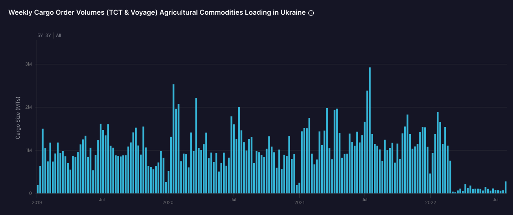
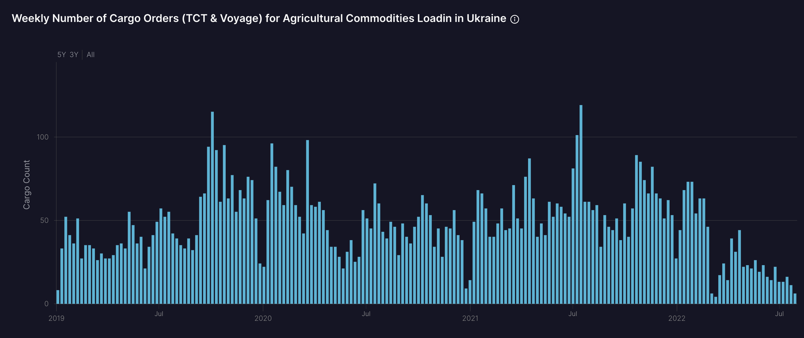

# A Recovery for the Ukrainian Grains Trade?

**Date:** July 28, 2022  
**Publisher:** Breakwave Advisors | **Category:** Market Insights  
**Original URL:** [https://www.breakwaveadvisors.com/insights/2022/7/28/a-recovery-for-the-ukrainian-grains-trade](https://www.breakwaveadvisors.com/insights/2022/7/28/a-recovery-for-the-ukrainian-grains-trade)  

---

*By*[*Ulf Bergman*](https://www.linkedin.com/in/ulf-bergman-81570425/)

The deal that will allow Ukraine to recommence exports of grains from its ports in the Black Sea is only a few days old. Yet, its survival is already in doubt following the Russian missile attack on the docks of Odesa. While Ukrainian authorities have stated that the attack may jeopardise the agreement signed in Turkey last week, there appears to be a strong desire to make it work despite the uncertainty over the Russian commitment to the implementation. Russia faced widespread condemnation for the attack, notably from the United Nations, but has not yet provided a plausible explanation for the contradictory behaviour.

However, the financial benefits for Ukraine would be substantial should the exports start to flow and would also free up space in the country’s grain silos for this year's harvest. In addition, the return of Ukraine as a significant grains exporter would ease the global supply constraints, which have seen prices rising sharply during the first half of the year and raised fears of famine in parts of the world.

Since the peak in the middle of May, wheat prices have given up considerable ground as the supply outlook has improved and are currently trading nearly 40 per cent below the levels recorded two months ago. The rising prospects of robust harvests in some parts of the world, ironically in Russia, have put pressure on the prices. Speculations of an impending deal and the actual announcement of it contributed to further price declines. However, traders have since become increasingly concerned over the apparent lukewarm commitment from the Russian side, and the contracts have recuperated some losses in the early parts of this week. Also, in a historical context, the futures are trading near the highest levels recorded in the past fifty years, as prices above 790 dollars per bushel remain a rarity.

In addition to having to second-guess Russia’s intentions, any attempts to resume grains exports from the Ukrainian Black Sea port will face a number of challenges. The infrastructure in the ports may have sustained damages during the five months of conflict, and there may be additional problems with getting the shipments to the docks. There are also mines in the waters off the Ukrainian coast, which need to be cleared before operations can begin in earnest. The multiple hazards involved in moving the Ukrainian wheat and other agricultural commodities out of the Black Sea will also mean that shipowners will be facing high insurance costs, suggesting that any charter rates will be elevated.

Despite the difficulties that the Ukrainian exporters are facing, the deal has translated into rising cargo order volumes for agricultural commodities loading in Ukrainian ports. The quantities recorded by Shipfix for the first day of this week are significantly higher than what has been observed for whole weeks in recent months. For obvious reasons, order volumes dropped in the immediate aftermath of the Russian invasion and have not shown any signs of recovery until this week. The forward-looking nature of the data may suggest that shippers are gearing up to start exporting grains rapidly.

> **Figure 1: 1**  
> **Interactive Data & Source:** [Shipfix](https://shipfix.com/) | [Local Asset](file:///C:/Users/Dell/Github/Shipping/corpus/03-breakwave/insights/2022/assets/2022-07-28_a-recovery-for-the-ukrainian-grains-trade_img_1_5bc3d7d33755.png)

*Source: Shipfix*

Another interesting development is that, despite the rising cargo order volumes, the number of cargoes has decreased. The development suggests that shippers are looking to use larger vessels rather than coasters and barges to move their precious shipments.

> **Figure 2: Agri Cargoes Loading Ukraine 0726 Nbr of Cargoes**  
> **Interactive Data & Source:** [Shipfix](https://shipfix.com/) | [Local Asset](file:///C:/Users/Dell/Github/Shipping/corpus/03-breakwave/insights/2022/assets/2022-07-28_a-recovery-for-the-ukrainian-grains-trade_img_agricargoesloadingukraine0726nbrofca_3a703b2036e8.png)

*Source: Shipfix*

While Shipfix’s cargo order data provide some suggestions that the Ukrainian grains exports could recover, at least partially, considerable challenges lie ahead. Above all, a further deterioration of the situation in and around the Black Sea could prove terminal for the agreement, with shipments failing to materialise as a result.

Data Source:[Shipfix](https://shipfix.com/)
