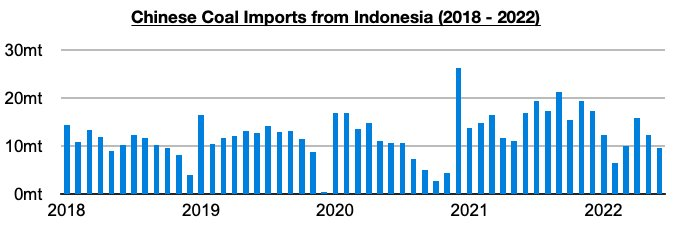
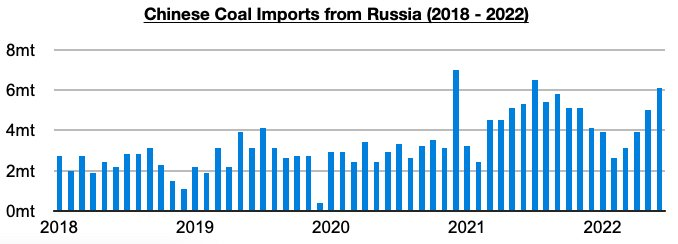

# China's Coal Imports From Russia Continue to Climb as Predicted

**Date:** August 01, 2022  
**Publisher:** Breakwave Advisors | **Category:** Market Insights  
**Original URL:** [https://www.breakwaveadvisors.com/insights/2022/7/29/chinas-coal-imports-from-russia-continue-to-climb-as-predicted](https://www.breakwaveadvisors.com/insights/2022/7/29/chinas-coal-imports-from-russia-continue-to-climb-as-predicted)  

---

*By*[*Jeffrey Landsberg*](https://www.linkedin.com/in/jeffrey-landsberg-70ab957/)

China's coal import data for June by origin has been released and shows imports from Indonesia have remained the primary source of imports and Russia the second largest source of imports. Also of note regarding Russian imports is that their volume came in at the highest level seen in twelve months and contributed to a very significant 32% of all of China’s coal imports. China's coal imports from Indonesia totaled only 9.6 million tons in June, which is down from May by 2.8 million tons (-23%) and down year-on-year by 7.4 million tons (-44%).

> **Figure 1: Chart 1 (41)**  
> [Local Asset](file:///C:/Users/Dell/Github/Shipping/corpus/03-breakwave/insights/2022/assets/2022-08-01_chinas-coal-imports-from-russia-continue-to-climb-as-predicted_img_chart1284129_693f5b5184fd.jpg)

Indonesia has been exporting more of its coal to other buyers, and at the same time China has also been continuing to strengthen its relationship with Russia as we have been stressing in Commodore's Weekly China Reports and Weekly Dry Bulk Reports. As we first discussed back in February, just as Russia’s tensions with Ukraine shifted into Russia launching its unjust war, Russia’s Ministry of Energy announced it had signed an agreement to increase its coal exports to China to 100 million tons in three to five years (in comparison, 2021 saw China import 57 million tons of coal from Russia). New more recently has been April’s coal import tariff being cut to zero, which we continue to believe was carried out with Russia coal imports in mind. As we stressed after that tariff announcement was made, China’s thermal coal imports from Russia previously had a 6% tariff. Imports from Indonesia already had a tariff rate of zero.

Imports from Russia totaled 6.1 million tons, which is up from May by 1.1 million tons (22%) and up year-on-year by 800,000 tons (15%). Imports from Russia have risen significantly since the tariff cut, with the last two months seeing imports average 5.6 million tons. This marks an impressive 2.2 million tons (65%) increase from the 3.4 million ton average that was seen this year before the tariff cut. Going forward, China's coal imports from Russia are likely to continue to climb.

> **Figure 2: Chart 2 (38)**  
> [Local Asset](file:///C:/Users/Dell/Github/Shipping/corpus/03-breakwave/insights/2022/assets/2022-08-01_chinas-coal-imports-from-russia-continue-to-climb-as-predicted_img_chart2283829_8a3c5f9a4013.jpg)
