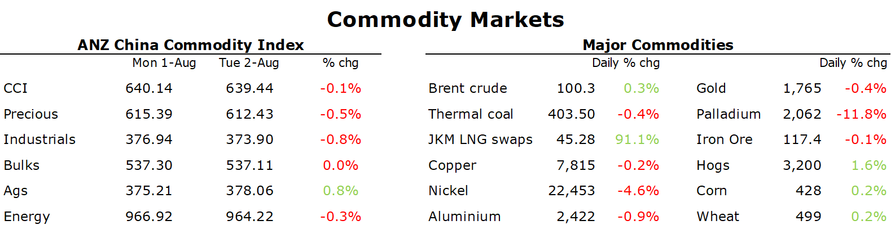

# Natural gas and coal extend gains amid supply shortages

**Date:** August 03, 2022  
**Publisher:** Breakwave Advisors | **Category:** Market Insights  
**Original URL:** [https://www.breakwaveadvisors.com/insights/2022/8/3/natural-gas-and-coal-extend-gains-amid-supply-shortages](https://www.breakwaveadvisors.com/insights/2022/8/3/natural-gas-and-coal-extend-gains-amid-supply-shortages)  

---

*By*[*Daniel Hynes*](https://www.linkedin.com/in/dahynes/)

Rising geopolitical risks saw a risk-off tone across markets. This weighed on commodity markets, which struggled to hold gains achieved earlier this week.

> **Figure 1: 1659477249508**  
> **Interactive Data & Source:** [Linkedin](https://www.linkedin.com/newsletters/commodities-wrap-6692196755876012032/?fbclid=IwAR3kiXJqZdxmp9ZcRwBNI7FsBySI-XSC0pfPur1qzjt7OZp7PTE59Tsl1QI) | [Local Asset](file:///C:/Users/Dell/Github/Shipping/corpus/03-breakwave/insights/2022/assets/2022-08-03_natural-gas-and-coal-extend-gains-amid-supply-shortages_img_1659477249508_265a15553b90.png)

**Crude oil**ended higher in a choppy session as traders counted down to an OPEC meeting on supply. The producer group is due to gather virtually on Wednesday to review its output policy for September. The likelihood they announce an increase in output remains low amid the uncertain economic backdrop and signs of weakness in demand. This comes after US President Joe Biden urged Saudi Arabia to pump more oil during a visit to the kingdom last month. The last meeting saw members agree to return all the supplies it took offline following the pandemic. However, data suggests they continue to struggle. OPEC’s crude production rose by 270kb/d in July, with two-thirds coming from Saudi Arabia. That’s well below the increase in quotas.

**European natural gas**pushed higher amid ongoing curbs on Russian supply. Dutch front month futures remained above EUR200/MWh as flows in the Nord Stream pipeline remain at about 20% of capacity. However, flows have fluctuated, falling well below that level for short periods of time. The shortages are starting to have an impact on industry in Europe. Germany’s Covestro AG, a provider of high-tech polymers, warned of further risks to its facilities and the sector if gas flows are rationed. The gas shortages are being exacerbated by extreme heat, which is driving demand for**electricity**higher. German power for next year hit a record high EUR405/MWh, while in France they were trading above EUR520/MWh. The extreme weather is also threatening to curtail a key transit point for commodities. The Rhine River in Germany is set to fall perilously close to the point at which it would effectively close. Coal is barged along the river, an energy source that its region is increasingly reliant on amid the gas shortages. European benchmark**coal**futures subsequent rallied 8% to USD355/t.

**Asian spot LNG**extended recent gains, as curbs on Russia gas stocks increased competition for LNG cargoes. Singapore’s trade and industry minister warned that global energy markets are expected to remain volatile amid supply constraints and strong demand. Traders are also wary that Australian LNG exports may be curtailed after the Australian competition regulator recommended triggering the Australian Domestic Gas Supply Mechanism, which could force exporters to divert gas away from Asian markets.

**Copper**drifted lower amid mounting geopolitical risks. US House Speaker Nancy Pelosi visited Taiwan, which raised tensions between the US and China. Since her arrival, China have announced military drills and missile tests. This adds to concerns over demand in China. Economic data for July showed that factory output and new orders slowed to a pace not seen since the middle of 2020. Supply side issues also eased. Peru’s Carmen Alto community lifted protests against MMG’s Las Bambas copper mine after a one-day blockade. The two sides will now meet on 11 August. Copper led the rest of the complex lower. Nevertheless, the growing energy crisis in Europe is providing some support, with output likely to be curbed further in coming months amid record high energy prices.

China’s property crisis continued to weigh on sentiment in the**steel and iron ore**markets. Almost a third of China’s steel mills could go into bankruptcy in a squeeze that could last five years, warned Hebei Jingye Steel Group’s founder Li Ganpo.

**Gold**gained in early trade amid the heightened geopolitical tensions. However, hawkish talk from Fed speakers saw it give up most of the gains.

Data source:[Commodities Wrap](https://www.linkedin.com/newsletters/commodities-wrap-6692196755876012032/?fbclid=IwAR3kiXJqZdxmp9ZcRwBNI7FsBySI-XSC0pfPur1qzjt7OZp7PTE59Tsl1QI)
