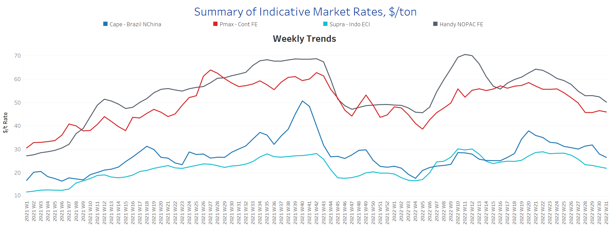
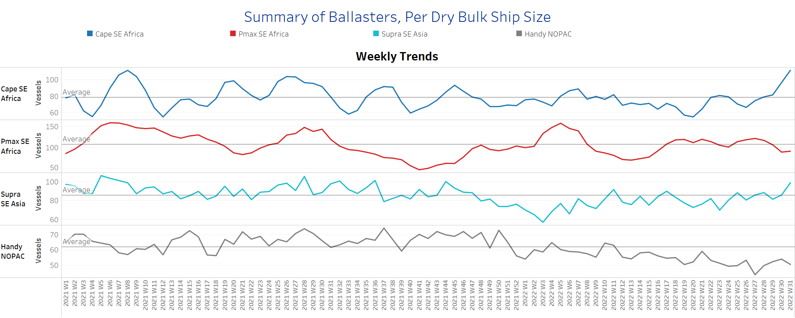
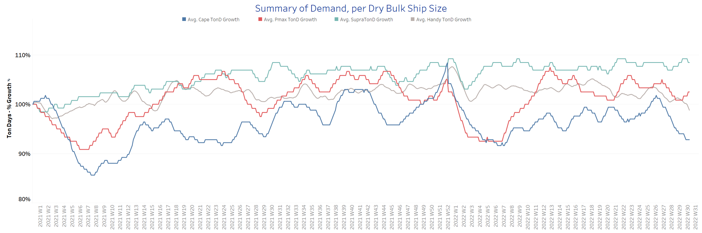
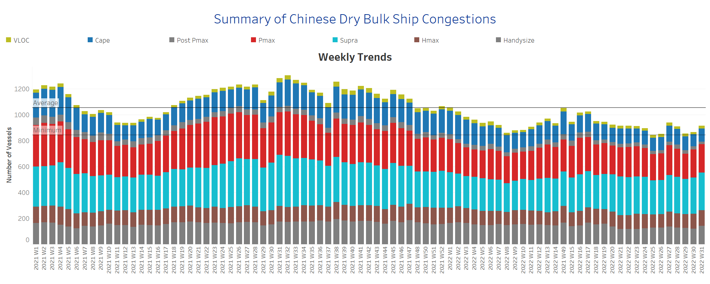

# Signal Dry Bulk Weekly Report

**Date:** August 03, 2022  
**Publisher:** Breakwave Advisors | **Category:** Market Insights  
**Original URL:** [https://www.breakwaveadvisors.com/insights/2022/8/3/signal-dry-bulk-weekly-report](https://www.breakwaveadvisors.com/insights/2022/8/3/signal-dry-bulk-weekly-report)  

---

Iron ore prices rose to their highest level in more than four weeks on Monday, continuing last week's solid gains spurred by hopes of higher Chinese infrastructure spending. The price of the most-traded iron ore for September delivery on China's Dalian Commodity Exchange rose 4.7% to 817.50 yuan ($121.15) a tonne in early trading, the highest since June 30.

On the Singapore Exchange, the front-month September contract for the steelmaking material climbed as much as 5.2% to $120.95 a tonne, also its highest level since June 30. China has urged local governments to speed up the use of special bonds for mature and profitable infrastructure projects, state media reported Friday. China's policy banks also reportedly plan to issue 800 billion yuan in credit facilities to close the financing gap for large-scale projects and boost infrastructure investment. Concerns about continued market volatility remain, however, as the Chinese government and steel industry have reportedly agreed to order further steel production cuts in the second half of 2022. A possible global recession and the real estate crisis in China will contribute to weak global demand and a significant surplus in the iron ore market in the second half of 2022, which in turn poses a significant downside risk to prices.

In the coal segment, Newcastle coal futures, the benchmark for the region with the highest consumption in Asia, hit a low of around $400 per tonne, falling from a near-record high of $430, as investors unwound some long positions in anticipation of greater supply. China, the world's largest coal consumer, announced it may lift a nearly two-year ban on Australian coal as tensions ease while it tries to replace supplies from Russia. Still, coal prices are likely to remain high amid robust demand and ongoing global supply shortages, exacerbated by the war in Eastern Europe. Europe is now turning to coal from South Africa and even Australia after halting imports from Russia.

In the grain segment, the first ship carrying grain left a Ukrainian port early Monday under a U.N.-negotiated deal to ease the global food crisis triggered by Russia's invasion of Ukraine. Experts, however, believe the resumption of Ukrainian grain exports will make little difference to the global food crisis, which U.N. Secretary-General António Guterres said could take years to resolve.

## Section 1 - Freight -Market Rates ($/T) - Weaker

‘The Big Picture’ - Capesize and Panamax Bulkers and Smaller Ship Sizes

> **Figure 1: Market Chart 1**  
> **Interactive Data & Source:** [Signal Ocean Platform](https://www.thesignalgroup.com/signal-ocean-platform) | [Local Asset](file:///C:/Users/Dell/Github/Shipping/corpus/03-breakwave/insights/2022/assets/2022-08-03_signal-dry-bulk-weekly-report_img_unnamed285229_ea77660856a9.png)

Bearish sentiment continued for Capesize and Supramax in early August, while Panamax freight rates trended firmer over the past two weeks.

- **Capesize**Brazil-to-North China freight rates fell to $26.5/tonne, down $5.5/tonne from week 29, with the recession continuing in early August.
- **Panamax**Continent-to-Far East freight rates held above $46/tonne, trending upward.
- **Supramax**Indo-to-ECI freight rates fell to $22/tonne in early August, the lowest level since the end of Week 15.
- **Handysize**NOPAC-to-Far East freight rates fell to $52/tonne, down 12 points from the week 21 peak.

## Section 2 - Supply - Ballasters View

## Number of Vessels -Increasing

> **Figure 2: Supply Trend Lines for Key Load Areas**  
> **Interactive Data & Source:** [Signal Ocean Platform](https://www.thesignalgroup.com/signal-ocean-platform) | [Local Asset](file:///C:/Users/Dell/Github/Shipping/corpus/03-breakwave/insights/2022/assets/2022-08-03_signal-dry-bulk-weekly-report_img_unnamed285329_0a6dbdb78d51.png)

Early August saw a significant increase in the number of Capesize vessels and a continued upward trend in Handysize vessels.

- **Capesize**SE Africa: The number of vessels increased to 112, up 37% from week 29.
- **Panamax**SE Africa: The number of vessels has fallen below the annual average since last week and now stands at 92 vessels, down 30 from week 27.
- **Supramax**SE Asia: The number of vessels increased to 98 ships, 11 more than the previous week.
- **Handysize**NOPAC: The number of vessels remained high (60) from the previous week, 16 more than the low of week 27.

## Section 3 - Demand - In Ton Days

## Decreasing

> **Figure 3: Decreasing**  
> **Interactive Data & Source:** [Signal Ocean Platform](https://www.thesignalgroup.com/signal-ocean-platform) | [Local Asset](file:///C:/Users/Dell/Github/Shipping/corpus/03-breakwave/insights/2022/assets/2022-08-03_signal-dry-bulk-weekly-report_img_unnamed285429_5f720f618382.png)

The downward trend has continued more strongly in the Capesize segment since the last days of July, while an upward trend has been seen in Panamax and Supramax.

- **Capesize**demand ton-days: The percentage increase is now at its lowest level since the end of week 6 with a tendency for a further decline in the coming days.
- **Panamax**demand ton-days: The potential upward trend that has been emerging since last week is confirmed by signs of further recovery in early August.
- **Supramax**demand ton-days: Percentage growth held firmer than the low point in week 27.
- **Handysize**demand ton-days: The downward trend continues over the last four weeks and is now approaching the weakest point for this year.

## Section 4 - Chinese Port Congestions -

## Number of Vessels - Increasing

> **Figure 4: Dry Bulk Ships Congested at Chinese Ports**  
> **Interactive Data & Source:** [Signal Ocean Platform](https://www.thesignalgroup.com/signal-ocean-platform) | [Local Asset](file:///C:/Users/Dell/Github/Shipping/corpus/03-breakwave/insights/2022/assets/2022-08-03_signal-dry-bulk-weekly-report_img_unnamed285529_2f7398004aca.png)

The number of ships in congestion in the Capesize, Supramax, and Handysize size classes increased significantly, while the number of Panamax ships remained about the same as the previous week.

- **Capesize:**The number of congested vessels increased to 105, 13 more than the previous week.
- **Panamax:**The number of vessels remained at the same level as the previous week at 214, 20 more than in week 29.
- **Supramax:**The number of congested vessels is now at 298, 13 more than the previous week.
- **Handysize**: The number of congested vessels increased to 137 vessels, 15 more than the previous week.

Data Source:[Signal Ocean Platform](https://www.thesignalgroup.com/signal-ocean-platform)
