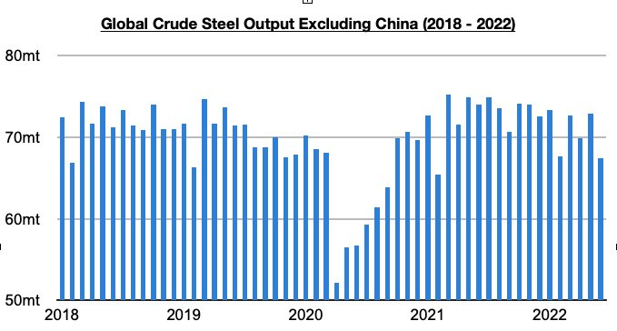

# Tensions and Weakness in the World Outside of China

**Date:** August 04, 2022  
**Publisher:** Breakwave Advisors | **Category:** Market Insights  
**Original URL:** [https://www.breakwaveadvisors.com/insights/2022/8/3/tensions-and-weakness-in-the-world-outside-of-china](https://www.breakwaveadvisors.com/insights/2022/8/3/tensions-and-weakness-in-the-world-outside-of-china)  

---

*By*[*Jeffrey Landsberg*](https://www.linkedin.com/in/jeffrey-landsberg-70ab957/)

We remain most bearish for the world outside of China for the near-term. Global crude steel production outside of China totaled only 67.4 million tons last month. This is down month-on-month by 5.5 million tons (-8%) and is 6.6 million tons (-9%) less than was reported last year for June 2021’s production. Concerning is that global crude steel production outside of China has now contracted on a year-on-year basis for four straight months. Prior to this period, global crude steel production outside of China had grown on a year-on-year basis for twelve consecutive months. In addition to remaining in contraction, also of note is that the 9% year-on-year contraction seen last month has marked the largest contraction since August 2020.

> **Figure 1: Chart 1 (42)**  
> [Local Asset](file:///C:/Users/Dell/Github/Shipping/corpus/03-breakwave/insights/2022/assets/2022-08-04_tensions-and-weakness-in-the-world-outside-of-china_img_chart1284229_fb3aa0bb431c.jpg)

Conditions in much of the world are deteriorating and there are no signs that an improvement will be occurring anytime soon. Also of note throughout the world is that the global food and energy crises remain ongoing and some nations (including Sri Lanka, Panama, the Netherlands, and Italy) have witnessed intense protests/riots in recent days. More positive at least is that Ukraine and Russia (with help from the United Nations and Turkey) recently signed an agreement that will allow grain to be shipped from Ukrainian Black Sea ports, but tensions remain and Russia somewhat shockingly attacked targets at the Black Sea port of Odessa right after the agreement was signed.

Overall, the war in Ukraine is also continuing to serve as a divide of sorts as many nations are not shunning Russia. As we have discussed in our Weekly Dry Bulk Reports, governments representing over half of the world's population voted either no or abstained in removing Russia from the United Nations Human Rights Council. The no’s and abstentions included China (the world’s most populous country), India (the world’s second most populous country), Indonesia (the world’s fourth most populous country), Pakistan (the world’s fifth most populous country), Nigeria (the world’s sixth most populous country), Brazil (the world’s seventh most populous country), Bangladesh (the world’s eighth most populous country), Russia (the world’s ninth most populous country), and Mexico (the world’s tenth most populous country).
