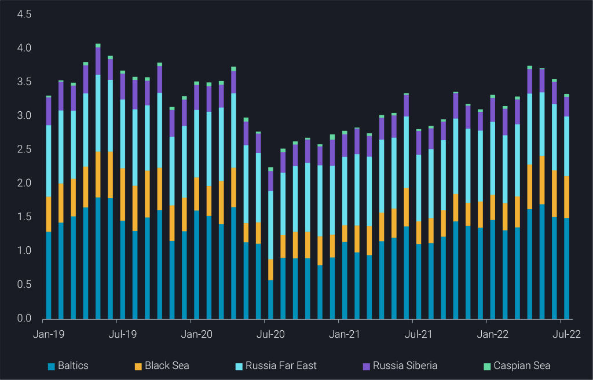
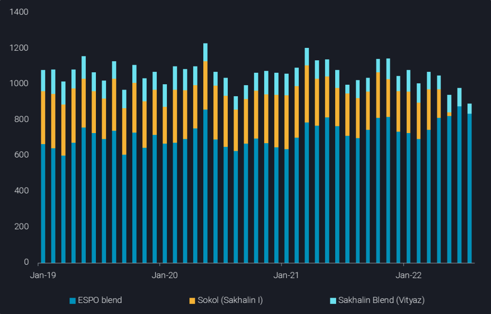
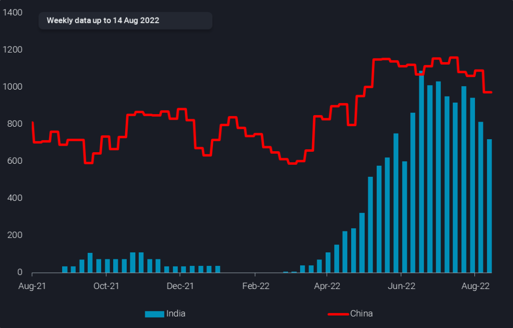
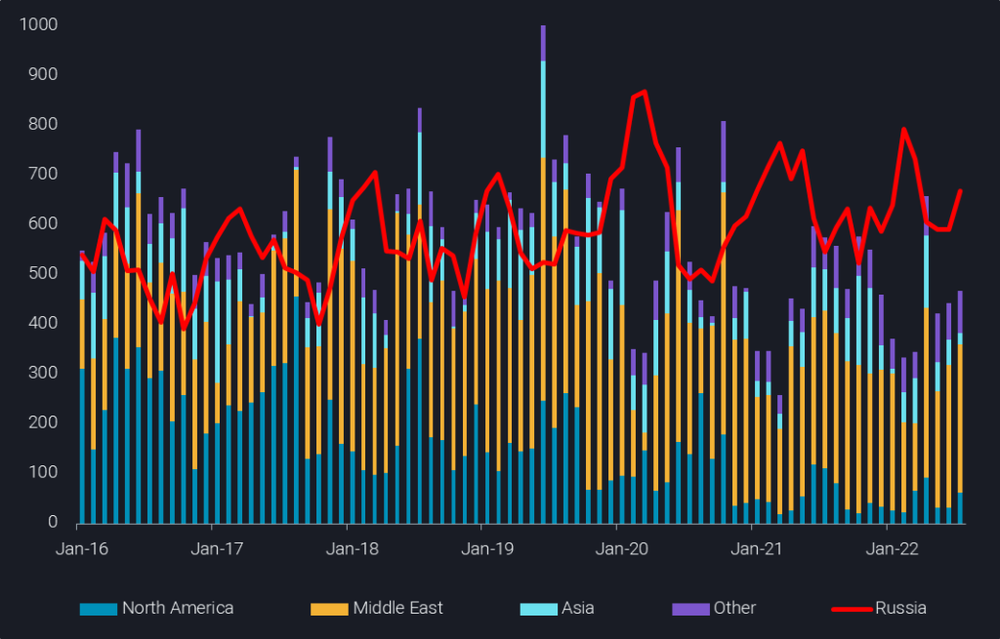
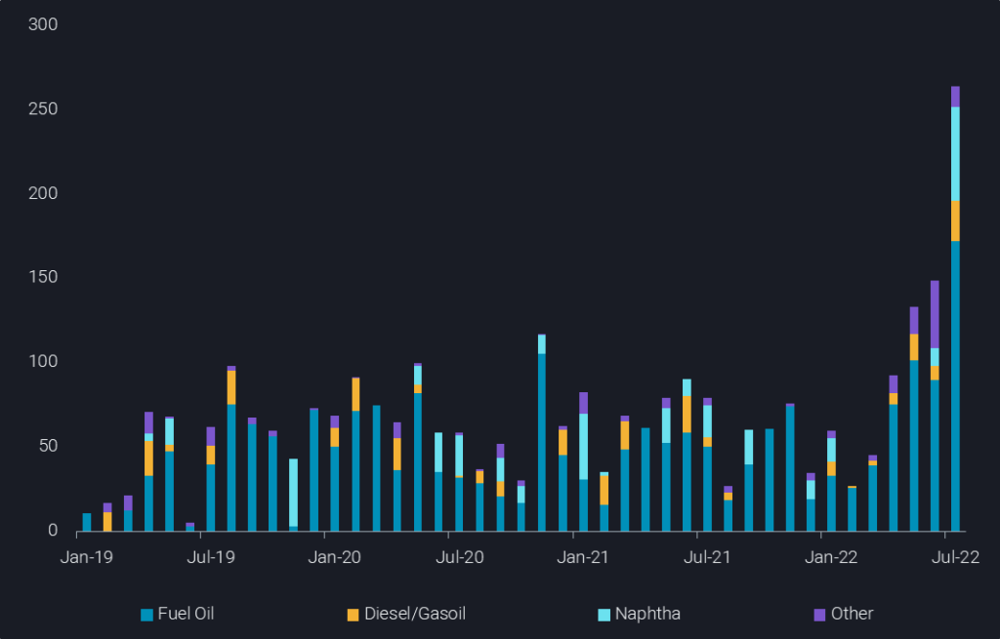

# The latest trends in Russian oil flows

**Date:** August 05, 2022  
**Publisher:** Breakwave Advisors | **Category:** Market Insights  
**Original URL:** [https://www.breakwaveadvisors.com/insights/2022/8/4/the-latest-trends-in-russian-oil-flows](https://www.breakwaveadvisors.com/insights/2022/8/4/the-latest-trends-in-russian-oil-flows)  

---

The latest data for July shows falling Russian crude and rising product exports. While China and India are the undisputed leaders on the crude importing side, the Middle East emerges as Russian product importer. Europe, meanwhile, is far from freeing itself from Russian diesel.

*By*[*David Wech*](https://www.linkedin.com/in/david-wech-83a163165/)

Seaborne exports of Russian crude stood at about 3.34mbd in July, down 220kbd m-o-m and 420kbd from a Covid-era peak reached in April. A declining pattern is observed in all regional outlets, but is most pronounced in the Far East.

> **Figure 1: 241**  
> **Interactive Data & Source:** [Analytics Vortexa](https://analytics.vortexa.com/?dateRange=2019-01-01T00%3A00%3A00.000Z__2022-07-31T23%3A59%3A59.999Z&filtersEnabled=%5B%22p%22%2C%22o%22%2C%22d%22%2C%22d_r%22%2C%22v%22%2C%22intra%22%2C%22sts_o%22%2C%22c_o%22%2C%22v_o%22%5D&metric=bpd&page=Flows&products=%5B%22c8803c073c2980d9849784c16bcd41d7f7b7561d2c8c1799a16166527b120242%22%2C%2220c87d7477f8cfe103904d9af911668c9a69bd03690e74e52e4386ad34e054ee%22%2C%220c703e0e14d99572c62f15a26fdf2c9f0c00e111e625cd40b8b337154e81d46d%22%2C%2204c4ea46fc6fccfe8388717f399b40e5e348f9a98c451d99e7366caa998191a7%22%2C%227cab5376bbb441feabdafc7b9f6272c2f9cbd10deb604bed8fa7f9986b2a39a9%22%2C%22a6c0a31f361b480bddfb93b1b93f38f4989013ae54b2b147ab18116fdfbebdb7%22%2C%22fef83ff1194c77d969693ee17c08e1112878e184e3449400e5904bc47b0119fe%22%2C%220fff12441aa3bf28aa568134ef527d09f741c543a49c0db8c03a195a0bbc481e%22%2C%224aebc156649b4c9691cdf3a9c81758426d10ffc944ba441f907f9fbe0964e879%22%2C%224ff810b966104a658d22e7155596c11bedcd1e3e81594e6187ab88ec816d95d6%22%2C%221dfa78c965d56ab9d7b953e424d9160e9f79d0275e460c74994193a328f51537%22%2C%22054b79baa9a54171be2582c9b4f8fa82d0386d41c1914700a498dc5b95e8daba%22%2C%22c56c8a9d8404573236950b3644825b6928bf0c1f47abccc08e5aeff1afeabb5c%22%2C%2274a8bc823d4742318d38072f81068fac1ac02ac66e0d491ea4366007bb95c602%22%5D&tabId=f8e25f10-4cd1-42b5-b2e7-1ea525ef59fb&timeSeriesHiddenSeries=%5B%22seasonal_comparison_24%22%5D&timeSeriesProperty=origin_trading_region) | [Local Asset](file:///C:/Users/Dell/Github/Shipping/corpus/03-breakwave/insights/2022/assets/2022-08-05_the-latest-trends-in-russian-oil-flows_img_241_376ca68d0c42.png)

[**Seaborne exports of Russian crude by origin region**](https://analytics.vortexa.com/?dateRange=2019-01-01T00%3A00%3A00.000Z__2022-07-31T23%3A59%3A59.999Z&filtersEnabled=%5B%22p%22%2C%22o%22%2C%22d%22%2C%22d_r%22%2C%22v%22%2C%22intra%22%2C%22sts_o%22%2C%22c_o%22%2C%22v_o%22%5D&metric=bpd&page=Flows&products=%5B%22c8803c073c2980d9849784c16bcd41d7f7b7561d2c8c1799a16166527b120242%22%2C%2220c87d7477f8cfe103904d9af911668c9a69bd03690e74e52e4386ad34e054ee%22%2C%220c703e0e14d99572c62f15a26fdf2c9f0c00e111e625cd40b8b337154e81d46d%22%2C%2204c4ea46fc6fccfe8388717f399b40e5e348f9a98c451d99e7366caa998191a7%22%2C%227cab5376bbb441feabdafc7b9f6272c2f9cbd10deb604bed8fa7f9986b2a39a9%22%2C%22a6c0a31f361b480bddfb93b1b93f38f4989013ae54b2b147ab18116fdfbebdb7%22%2C%22fef83ff1194c77d969693ee17c08e1112878e184e3449400e5904bc47b0119fe%22%2C%220fff12441aa3bf28aa568134ef527d09f741c543a49c0db8c03a195a0bbc481e%22%2C%224aebc156649b4c9691cdf3a9c81758426d10ffc944ba441f907f9fbe0964e879%22%2C%224ff810b966104a658d22e7155596c11bedcd1e3e81594e6187ab88ec816d95d6%22%2C%221dfa78c965d56ab9d7b953e424d9160e9f79d0275e460c74994193a328f51537%22%2C%22054b79baa9a54171be2582c9b4f8fa82d0386d41c1914700a498dc5b95e8daba%22%2C%22c56c8a9d8404573236950b3644825b6928bf0c1f47abccc08e5aeff1afeabb5c%22%2C%2274a8bc823d4742318d38072f81068fac1ac02ac66e0d491ea4366007bb95c602%22%5D&tabId=f8e25f10-4cd1-42b5-b2e7-1ea525ef59fb&timeSeriesHiddenSeries=%5B%22seasonal_comparison_24%22%5D&timeSeriesProperty=origin_trading_region)**(mbd)**

Issues with Sakhalin grades resultied in exports from Russia’s Far East falling to a 5-year low of 880kbd in spite of strong ESPO exports. Sakhalin exports were at just above 50kbd, down from 370kbd in 2020 and still 325kbd in March. A lot of non-Russian companies are stakeholders in these challenging production assets, and Russia appears to be seeking ownership of these stakes.

> **Figure 2: 242**  
> **Interactive Data & Source:** [Analytics Vortexa](https://analytics.vortexa.com/?dateRange=2019-01-01T00%3A00%3A00.000Z__2022-07-31T23%3A59%3A59.999Z&filtersEnabled=%5B%22p%22%2C%22o%22%2C%22d%22%2C%22d_r%22%2C%22v%22%2C%22intra%22%2C%22sts_o%22%2C%22c_o%22%2C%22w%22%5D&geoBreakdownOriginGlobal=trading_region&metric=bpd&page=Flows&products=%5B%2204c4ea46fc6fccfe8388717f399b40e5e348f9a98c451d99e7366caa998191a7%22%2C%22a6c0a31f361b480bddfb93b1b93f38f4989013ae54b2b147ab18116fdfbebdb7%22%2C%22fef83ff1194c77d969693ee17c08e1112878e184e3449400e5904bc47b0119fe%22%5D&sortDirection=asc&sortField=destination&tabId=c6f9e5c5-5194-4257-8a66-ff4ad1067951&timeSeriesProperty=product_grade&vesselClassChartView=count&vesselClassesExcluded=%5B%22tiny_tanker%22%5D) | [Local Asset](file:///C:/Users/Dell/Github/Shipping/corpus/03-breakwave/insights/2022/assets/2022-08-05_the-latest-trends-in-russian-oil-flows_img_242_6e24b4dcdfa6.png)

[**Russian Far Eastern crude exports by grade**](https://analytics.vortexa.com/?dateRange=2019-01-01T00%3A00%3A00.000Z__2022-07-31T23%3A59%3A59.999Z&filtersEnabled=%5B%22p%22%2C%22o%22%2C%22d%22%2C%22d_r%22%2C%22v%22%2C%22intra%22%2C%22sts_o%22%2C%22c_o%22%2C%22w%22%5D&geoBreakdownOriginGlobal=trading_region&metric=bpd&page=Flows&products=%5B%2204c4ea46fc6fccfe8388717f399b40e5e348f9a98c451d99e7366caa998191a7%22%2C%22a6c0a31f361b480bddfb93b1b93f38f4989013ae54b2b147ab18116fdfbebdb7%22%2C%22fef83ff1194c77d969693ee17c08e1112878e184e3449400e5904bc47b0119fe%22%5D&sortDirection=asc&sortField=destination&tabId=c6f9e5c5-5194-4257-8a66-ff4ad1067951&timeSeriesProperty=product_grade&vesselClassChartView=count&vesselClassesExcluded=%5B%22tiny_tanker%22%5D)**(kbd)**

The decline in exports suggests a decline in domestic production, a notion that is furthermore underpinned by our onshore crude inventory data showing the lowest reading since March 2021. However, apart from the Sakhalin story, the production declines are not a straightforward assumption. In fact, product exports (especially diesel and naphtha) are up by a combined 230kbd over the last two months, hinting at higher domestic crude use in refinery processing. Overall, it looks to be a firm assumption that Russian crude exports have peaked in April.

On the importing side, China maintains its position as No1 importer of seaborne Russian crude. India had temporarily outpaced China in the three weeks to 24 July, importing 1.17mbd over that period. But for the last week of July as well as the first week of August we see Indian imports of Russian crude averaging below 400kbd, less than half than the usual volume over recent months. However, in the second week of August Indian imports are set to surge strongly above 1mbd again. The monthly tally in July sees China at 1.06mbd and India at 910kbd.

> **Figure 3: 243**  
> **Interactive Data & Source:** [Analytics Vortexa](https://analytics.vortexa.com/?dateRange=2021-01-01T00%3A00%3A00.000Z__2022-08-14T23%3A59%3A59.999Z&filtersEnabled=%5B%22p%22%2C%22o%22%2C%22d%22%2C%22d_r%22%2C%22v%22%2C%22intra%22%2C%22sts_o%22%2C%22c_o%22%2C%22w%22%5D&frequency=week&from=%5B%22b996521be9c996db3560ca234a56286ac38f798d34be229437555fab4f12a6a5%22%5D&geoBreakdownOriginGlobal=shipping_region&intraMovementFilter=0&metric=bpd&movementEvent=unloading_start&page=Flows&products=%5B%22c8803c073c2980d9849784c16bcd41d7f7b7561d2c8c1799a16166527b120242%22%2C%2220c87d7477f8cfe103904d9af911668c9a69bd03690e74e52e4386ad34e054ee%22%2C%220c703e0e14d99572c62f15a26fdf2c9f0c00e111e625cd40b8b337154e81d46d%22%2C%2204c4ea46fc6fccfe8388717f399b40e5e348f9a98c451d99e7366caa998191a7%22%2C%227cab5376bbb441feabdafc7b9f6272c2f9cbd10deb604bed8fa7f9986b2a39a9%22%2C%22a6c0a31f361b480bddfb93b1b93f38f4989013ae54b2b147ab18116fdfbebdb7%22%2C%22fef83ff1194c77d969693ee17c08e1112878e184e3449400e5904bc47b0119fe%22%2C%220fff12441aa3bf28aa568134ef527d09f741c543a49c0db8c03a195a0bbc481e%22%2C%224aebc156649b4c9691cdf3a9c81758426d10ffc944ba441f907f9fbe0964e879%22%2C%224ff810b966104a658d22e7155596c11bedcd1e3e81594e6187ab88ec816d95d6%22%2C%221dfa78c965d56ab9d7b953e424d9160e9f79d0275e460c74994193a328f51537%22%2C%22054b79baa9a54171be2582c9b4f8fa82d0386d41c1914700a498dc5b95e8daba%22%2C%22c56c8a9d8404573236950b3644825b6928bf0c1f47abccc08e5aeff1afeabb5c%22%2C%2274a8bc823d4742318d38072f81068fac1ac02ac66e0d491ea4366007bb95c602%22%5D&sortField=unloading_start&tabId=c6f9e5c5-5194-4257-8a66-ff4ad1067951&timeSeriesProperty=destination_country&to=%5B%22934c47f36c16a58d68ef5e007e62a23f5f036ee3f3d1f5f85a48c572b90ad8b2%22%2C%2270425373a1836d6d0390dc6fef838a468717fba7776d66065a5043488f9f041b%22%5D) | [Local Asset](file:///C:/Users/Dell/Github/Shipping/corpus/03-breakwave/insights/2022/assets/2022-08-05_the-latest-trends-in-russian-oil-flows_img_243_4fb200df1ad9.png)

[**China and India seaborne imports of Russian crude**](https://analytics.vortexa.com/?dateRange=2021-01-01T00%3A00%3A00.000Z__2022-08-14T23%3A59%3A59.999Z&filtersEnabled=%5B%22p%22%2C%22o%22%2C%22d%22%2C%22d_r%22%2C%22v%22%2C%22intra%22%2C%22sts_o%22%2C%22c_o%22%2C%22w%22%5D&frequency=week&from=%5B%22b996521be9c996db3560ca234a56286ac38f798d34be229437555fab4f12a6a5%22%5D&geoBreakdownOriginGlobal=shipping_region&intraMovementFilter=0&metric=bpd&movementEvent=unloading_start&page=Flows&products=%5B%22c8803c073c2980d9849784c16bcd41d7f7b7561d2c8c1799a16166527b120242%22%2C%2220c87d7477f8cfe103904d9af911668c9a69bd03690e74e52e4386ad34e054ee%22%2C%220c703e0e14d99572c62f15a26fdf2c9f0c00e111e625cd40b8b337154e81d46d%22%2C%2204c4ea46fc6fccfe8388717f399b40e5e348f9a98c451d99e7366caa998191a7%22%2C%227cab5376bbb441feabdafc7b9f6272c2f9cbd10deb604bed8fa7f9986b2a39a9%22%2C%22a6c0a31f361b480bddfb93b1b93f38f4989013ae54b2b147ab18116fdfbebdb7%22%2C%22fef83ff1194c77d969693ee17c08e1112878e184e3449400e5904bc47b0119fe%22%2C%220fff12441aa3bf28aa568134ef527d09f741c543a49c0db8c03a195a0bbc481e%22%2C%224aebc156649b4c9691cdf3a9c81758426d10ffc944ba441f907f9fbe0964e879%22%2C%224ff810b966104a658d22e7155596c11bedcd1e3e81594e6187ab88ec816d95d6%22%2C%221dfa78c965d56ab9d7b953e424d9160e9f79d0275e460c74994193a328f51537%22%2C%22054b79baa9a54171be2582c9b4f8fa82d0386d41c1914700a498dc5b95e8daba%22%2C%22c56c8a9d8404573236950b3644825b6928bf0c1f47abccc08e5aeff1afeabb5c%22%2C%2274a8bc823d4742318d38072f81068fac1ac02ac66e0d491ea4366007bb95c602%22%5D&sortField=unloading_start&tabId=c6f9e5c5-5194-4257-8a66-ff4ad1067951&timeSeriesProperty=destination_country&to=%5B%22934c47f36c16a58d68ef5e007e62a23f5f036ee3f3d1f5f85a48c572b90ad8b2%22%2C%2270425373a1836d6d0390dc6fef838a468717fba7776d66065a5043488f9f041b%22%5D)**(4-week average, mbd)**

Altogether, India may be past a peak in Russian crude procurement for now, as export volumes are slightly easing and competition between China and India for Russian oil appears to be driving up prices. This is also the case for ESPO blend, historically not a choice for Indian refiners. But with alternative buyers to China, such as Japan, South Korea and the US dropping out of the market, it is now also in the Russian interest to diversify sales somewhat.

Europe imported below 1.9mbd of seaborne Russian crude oil in July, about 150kbd less than observed in the previous three months, and 0.8mbd below the Q1 average. At the same time, Europe has been importing more than 6mbd of crude from non-Russian, non-European sources, 1.25mbd more than in Q1.

> **Figure 4: 244**  
> **Interactive Data & Source:** [Analytics Vortexa](https://analytics.vortexa.com/?dateRange=2019-01-01T00%3A00%3A00.000Z__2022-07-31T23%3A59%3A59.999Z&filtersEnabled=%5B%22p%22%2C%22o%22%2C%22d%22%2C%22d_r%22%2C%22v%22%2C%22intra%22%2C%22sts_o%22%2C%22c_o%22%2C%22w%22%5D&metric=bpd&movementEvent=unloading_start&page=Flows&products=%5B%22deda35eb9ca56b54e74f0ff370423f9a8c61cf6a3796fcb18eaeeb32a8c290bb%22%5D&tabId=c6f9e5c5-5194-4257-8a66-ff4ad1067951&timeSeriesProperty=origin_region&to=%5B%22f39d455f5d38907394d6da3a91da4e391f9a34bd6a17e826d6042761067e88f4%22%5D&toExcluded=%5B%2269c53542ac9ee1fc4ba65a2af2da93739443a6b6918591ed820793a165b7fb1c%22%2C%2202c0b7bcc4d2aa75332fb32dadfd4eba09d1d351ca7215a94d20a12c40f4ebc9%22%2C%2280ccd59a719f2767156694923e74dcea96baa78e9220c697e1e8dddaeef7bd8f%22%2C%229b8bc70a7157cb4ae8712a23476fd320e98bc25ed523de6443ab3e9611d7f583%22%2C%22d64020634ef61665444e23e74946dd02b6ab9961efc7aaf52d5c161f3f55a953%22%5D&vesselClassesExcluded=%5B%22tiny_tanker%22%5D) | [Local Asset](file:///C:/Users/Dell/Github/Shipping/corpus/03-breakwave/insights/2022/assets/2022-08-05_the-latest-trends-in-russian-oil-flows_img_244_51f84d153594.png)

[**European (excl. Turkey) diesel imports by source**](https://analytics.vortexa.com/?dateRange=2019-01-01T00%3A00%3A00.000Z__2022-07-31T23%3A59%3A59.999Z&filtersEnabled=%5B%22p%22%2C%22o%22%2C%22d%22%2C%22d_r%22%2C%22v%22%2C%22intra%22%2C%22sts_o%22%2C%22c_o%22%2C%22w%22%5D&metric=bpd&movementEvent=unloading_start&page=Flows&products=%5B%22deda35eb9ca56b54e74f0ff370423f9a8c61cf6a3796fcb18eaeeb32a8c290bb%22%5D&tabId=c6f9e5c5-5194-4257-8a66-ff4ad1067951&timeSeriesProperty=origin_region&to=%5B%22f39d455f5d38907394d6da3a91da4e391f9a34bd6a17e826d6042761067e88f4%22%5D&toExcluded=%5B%2269c53542ac9ee1fc4ba65a2af2da93739443a6b6918591ed820793a165b7fb1c%22%2C%2202c0b7bcc4d2aa75332fb32dadfd4eba09d1d351ca7215a94d20a12c40f4ebc9%22%2C%2280ccd59a719f2767156694923e74dcea96baa78e9220c697e1e8dddaeef7bd8f%22%2C%229b8bc70a7157cb4ae8712a23476fd320e98bc25ed523de6443ab3e9611d7f583%22%2C%22d64020634ef61665444e23e74946dd02b6ab9961efc7aaf52d5c161f3f55a953%22%5D&vesselClassesExcluded=%5B%22tiny_tanker%22%5D)**(mbd)**

While the replacement of crude works reasonably well (albeit pricing implications are significant, especially on a differential basis), Europe is moving further away from freeing itself of Russian diesel. July diesel imports from Russia rose to an unseasonably high level of 680kbd, up 13% m-o-m and 22% y-o-y, and outpacing non-Russian supplies by about 200kbd. Year-to-date diesel imports are 230kbd higher from Russia than from non-Russian sources, while in the pre-Covid-era (2016-19), Europe actually imported 65kbd more diesel from non-Russian sources than from Russia.

Overall it appears questionable whether Europeans will manage to fully carry through on the announced diesel import ban, given record diesel prices already over the last five months, Europe’s rising rather than falling dependency on Russian diesel, limitations within the global refining system, and the likely significant role of diesel as a replacement fuel for natural gas and power shortfalls. The above will challenge the resolve of Europe and its politicians in particular.

> **Figure 5: 245**  
> **Interactive Data & Source:** [Analytics Vortexa](https://analytics.vortexa.com/?dateRange=2019-01-01T00%3A00%3A00.000Z__2022-07-31T23%3A59%3A59.999Z&filtersEnabled=%5B%22p%22%2C%22o%22%2C%22d%22%2C%22d_r%22%2C%22v%22%2C%22intra%22%2C%22sts_o%22%2C%22c_o%22%2C%22w%22%5D&from=%5B%22b996521be9c996db3560ca234a56286ac38f798d34be229437555fab4f12a6a5%22%5D&metric=bpd&movementEvent=unloading_start&page=Flows&products=%5B%22b68cbb746f8b9098c50e2ba36bcad83001a53bd362e9031fb49085d02c36659c%22%2C%225de0b00094e0fd7542c10f9f8a71b4008d55750f21dc905cda9b0f7f5f76bc08%22%5D&tabId=c6f9e5c5-5194-4257-8a66-ff4ad1067951&timeSeriesProperty=product_group_product&to=%5B%2280aa9e4f3014c3d96559c8e642157edbb2b684ea0144ed76cd20b3af75110877%22%5D&vesselClassesExcluded=%5B%22tiny_tanker%22%5D) | [Local Asset](file:///C:/Users/Dell/Github/Shipping/corpus/03-breakwave/insights/2022/assets/2022-08-05_the-latest-trends-in-russian-oil-flows_img_245_bcc9ada6bc9f.png)

[**Middle Eastern imports of Russian oil products by product**](https://analytics.vortexa.com/?dateRange=2019-01-01T00%3A00%3A00.000Z__2022-07-31T23%3A59%3A59.999Z&filtersEnabled=%5B%22p%22%2C%22o%22%2C%22d%22%2C%22d_r%22%2C%22v%22%2C%22intra%22%2C%22sts_o%22%2C%22c_o%22%2C%22w%22%5D&from=%5B%22b996521be9c996db3560ca234a56286ac38f798d34be229437555fab4f12a6a5%22%5D&metric=bpd&movementEvent=unloading_start&page=Flows&products=%5B%22b68cbb746f8b9098c50e2ba36bcad83001a53bd362e9031fb49085d02c36659c%22%2C%225de0b00094e0fd7542c10f9f8a71b4008d55750f21dc905cda9b0f7f5f76bc08%22%5D&tabId=c6f9e5c5-5194-4257-8a66-ff4ad1067951&timeSeriesProperty=product_group_product&to=%5B%2280aa9e4f3014c3d96559c8e642157edbb2b684ea0144ed76cd20b3af75110877%22%5D&vesselClassesExcluded=%5B%22tiny_tanker%22%5D)**(kbd)**

In a final observation, the Middle East, and in particular the United Arab Emirates, are outpacing China and India for now, when it comes to imports of Russian oil products. Russian residues are now regularly finding homes in the UAE and Saudi Arabia, presumably for bunker blending operations and power generation. When adding indirect volumes, coming via Egypt or Estonia, Middle Eastern oil product imports from Russia were close to 400kbd in July. In the meantime, European imports of dirty products from non-Russian sources are zooming to parity with Russian supplies, relying partly on imports from the Middle East. A trading pattern to the liking of the shipping industry, with a further upside if Europe carries through with its ban on seaborne imports of Russian oil.

Data Source:[Vortexa](https://www.vortexa.com//oil-gas-data-traders-analysts-data-scientists?gclid=Cj0KCQjw8_qRBhCXARIsAE2AtRZKOvMnbilZ_6_91d7huSFFy71pWLrnPwGwOHVzXsmsG-1a1mZnQw8aAt89EALw_wcB&hsa_acc=1782073842&hsa_ad=548425387665&hsa_cam=14746637662&hsa_grp=125038601902&hsa_kw=&hsa_mt=&hsa_net=adwords&hsa_src=g&hsa_tgt=dsa-1431852288425&hsa_ver=3&utm_campaign=%5BCD%5D%20-%20DSA%20-%20EMEA&utm_medium=cpc&utm_medium=ppc&utm_source=google&utm_source=adwords&utm_term=)

---

**Tags:** Crude Oil, Tankers, Freight Rates  
