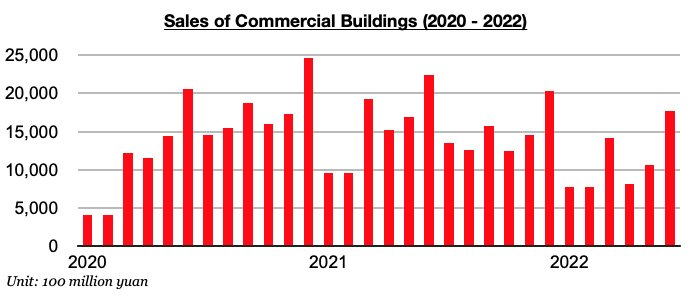
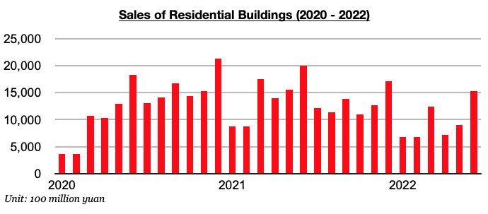

# Smaller Contraction in Chinese Housing Sales

**Date:** August 08, 2022  
**Publisher:** Breakwave Advisors | **Category:** Market Insights  
**Original URL:** [https://www.breakwaveadvisors.com/insights/2022/8/6/smaller-contraction-in-chinese-housing-sales](https://www.breakwaveadvisors.com/insights/2022/8/6/smaller-contraction-in-chinese-housing-sales)  

---

*By*[*Jeffrey Landsberg*](https://www.linkedin.com/in/jeffrey-landsberg-70ab957/)

As we have been highlighting in our recent Weekly China Reports, sales of commercial buildings in China (the vast majority of which are residential homes) have remained under pressure, but so far this year the largest year-on-year contraction was in April. Commercial building sales last month totaled just 1.77 trillion yuan. This is up month-on-month by 68% and is down year-on-year by 21%. The year-on-year contraction has now narrowed during each of the last two months. Still, though, sales have now contracted on a year-on-year basis for twelve consecutive months.

> **Figure 1: 241**  
> [Local Asset](file:///C:/Users/Dell/Github/Shipping/corpus/03-breakwave/insights/2022/assets/2022-08-08_smaller-contraction-in-chinese-housing-sales_img_241_ce805f81a214.jpg)

Also of note is that sales of residential buildings (which last year contributed to 89% of all commercial building sales) continue to experience a similar trajectory. Sales totaled 1.54 trillion yuan, which is up month-on-month by 70% and is down year-on-year by 23% This has also marked the largest year-on-year contraction seen this decade. As with commercial building sales, the year-on-year contraction in residential building sales has narrowed during each of the last two months. Sales, though, have now contracted on a year-on-year basis for twelve consecutive months.

> **Figure 2: 242**  
> [Local Asset](file:///C:/Users/Dell/Github/Shipping/corpus/03-breakwave/insights/2022/assets/2022-08-08_smaller-contraction-in-chinese-housing-sales_img_242_e0d0d47bff59.jpg)

Overall, the government continues to lend support to several large real estate developers — including recently announcing that a real estate fund exceeding 300 billion yuan ($44 billion) will be set up to aid more than ten developers. In addition, 1 trillion yuan in loans ($148 billion) will be issued to finance stalled property projects. The last thing that China’s government — or any government — wants is for there to be a collapse in the nation’s housing market.

---

**Tags:** China, Real Estate, Construction  
