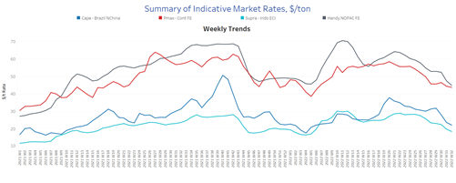
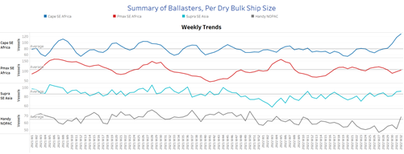
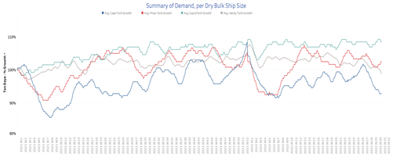
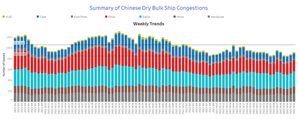

# Signal Dry Bulk Weekly Report

**Date:** August 10, 2022  
**Publisher:** Breakwave Advisors | **Category:** Market Insights  
**Original URL:** [https://www.breakwaveadvisors.com/insights/2022/8/10/signal-dry-bulk-weekly-report](https://www.breakwaveadvisors.com/insights/2022/8/10/signal-dry-bulk-weekly-report)  

---

### Snapshot of Spot Freight Rates, Supply-Demand Trends, Port Congestions

Customs data show that Chinese iron ore imports rose 1% in July compared to last year, as steelmakers' profit margins improve demand concerns. The world's largest iron ore consumer imported 91.24 million tonnes last month, up from 88.51 million tonnes in July 2021, according to the General Administration of Customs. Imports also rose 2.6% in July compared to June. Improved profitability has prompted smelters in China to restart some blast furnaces that had been previously shut down as widespread COVID -19 closures hurt demand. According to metal information service provider SMM, a total of 23 blast furnaces in China resumed production between July 21 and Aug. 1.

Meanwhile, hopes that China's curbs on steel production to meet decarbonization targets will be less severe in the second half of the year have supported iron ore prices. According to Fastmarkets MB, prices for 62% iron ore imported into northern China were trading at $110 per tonne on Monday morning, up 2.7%. The most-traded January 2023 iron ore contract on China's Dalian Commodity Exchange ended the trading day 4.3% higher at 737.50 yuan ($109.06) per tonne.

In the coal segment, Chinese imports rose 24 percent to meet peak power generation demand. Imports of the fuel totaled 23.52 million tonnes last month, up significantly from the previous month's 18.98 million tonnes but down 22 percent year-on-year, according to data from the General Administration of Customs. In the first seven months of the year, China imported 138.52 million tonnes of coal, down 18 percent from the same period in 2021.

In the grain segment, the pace of Ukrainian shipments is picking up, as six more grain ships carrying corn, soybeans, and sunflower oil left Ukrainian Black Sea ports on August 7. This is part of the agreement signed by Russia and Ukraine on July 22 that allows grain exports from Ukraine's Black Sea ports. The United Nations and Turkey brokered the agreement, allowing more than 20 million tonnes of grain stored since Feb. 24 due to Russia's blockade of Black Sea ports to be exported to countries with food needs, mainly in Africa and the Middle East.

## Section 1 - Freight -Market Rates ($/T) - Weaker

‘The Big Picture’ - Capesize and Panamax Bulkers and Smaller Ship Sizes

> **Figure 1: 241**  
> **Interactive Data & Source:** [Signal Ocean Platform](https://www.thesignalgroup.com/signal-ocean-platform) | [Local Asset](file:///C:/Users/Dell/Github/Shipping/corpus/03-breakwave/insights/2022/assets/2022-08-10_signal-dry-bulk-weekly-report_img_241_4244b984ee38.png)

Weaker freight rate sentiment persisted across all ship size categories in the second week of August.

- **Capesize**freight rates from Brazil to North China fell to $22/tonne, down $10/tonne from the week 29 peak.
- **Panamax**freight rates from the Continent to the Far East fell slightly to $44/tonne, with a slower downward trend than other vessel sizes.
- **Supramax**freight rates for the Indo-ECI route fell to $19/tonne in the second week of August, down nearly $10/tonne from week 25.
- **Handysize**vessel freight rates from NOPAC to the Far East fell to $45/tonne, down $7/tonne from week 30.

## Section 2 - Supply (#Vessels) - Ballasters View

### Number of Vessels - Increasing

Supply Trend Lines for Key Load Areas

> **Figure 2: 242**  
> **Interactive Data & Source:** [Signal Ocean Platform](https://www.thesignalgroup.com/signal-ocean-platform) | [Local Asset](file:///C:/Users/Dell/Github/Shipping/corpus/03-breakwave/insights/2022/assets/2022-08-10_signal-dry-bulk-weekly-report_img_242_7ca4295e0037.png)

The number of Capesize vessels sailing ballast continued to increase significantly in August, while the number of Handysize and Supramax vessels increased at a similar rate. Panamax appears to be the only size class in which the number of ships sailing in ballast approaches the annual average.

- **Capesize**SE Africa: The number of vessels has increased to 123, a 50% increase from week 29.
- **Panamax**SE Africa: The number of vessels is approaching the annual average of 107 ships, an increase of 20% from week 30.
- **Supramax**SE Asia: The number of vessels increased to 96, up 17% from week 30.
- **Handysize**NOPAC: The number of vessels exceeded 60, 10 more than the previous week.

## Section 3 - Demand - In Ton Days

### Decreasing

> **Figure 3: 243**  
> **Interactive Data & Source:** [Signal Ocean Platform](https://www.thesignalgroup.com/signal-ocean-platform) | [Local Asset](file:///C:/Users/Dell/Github/Shipping/corpus/03-breakwave/insights/2022/assets/2022-08-10_signal-dry-bulk-weekly-report_img_243_471a232cfc63.png)

The downward trend in the Capesize segment continued in the second week of August, while Panamax and Supramax have been trending upward since late July.

- **Capesize**demand ton-days: The percentage increase remains at the lowest level since the end of week 6.
- **Panamax**demand ton days: The upward trend that started last week is now confirmed with signs of further recovery in the second half of August.
- **Supramax**demand ton-days: The percentage increase remained firmer than the low in week 27.
- **Handysize**demand ton-days: The downward trend continues and has now approached the weakest point this year.

## Section 4 - Chinese Port Congestions -

### Number of Vessels - Decreasing

### Dry Bulk Ships Congested at Chinese Ports

> **Figure 4: 244**  
> **Interactive Data & Source:** [Signal Ocean Platform](https://www.thesignalgroup.com/signal-ocean-platform) | [Local Asset](file:///C:/Users/Dell/Github/Shipping/corpus/03-breakwave/insights/2022/assets/2022-08-10_signal-dry-bulk-weekly-report_img_244_b408357fbede.png)

The number of congested vessels continued the upward trend of the previous week, with Supramax and Handysize vessels showing significantly higher congestion levels than other vessel categories.

- **Capesize:**The number of congested ships remained constant at 103, as in the previous week.
- **Panamax:**The number of vessels is still over 200, the highest level since the end of week 29.
- **Supramax:**The number of congested vessels is now at 294, 20 more than the previous week.
- **Handysize**: The number of congested vessels increased to 153, 8 more than the previous week.

Data Source:[Signal Ocean Platform](https://www.thesignalgroup.com/signal-ocean-platform)
