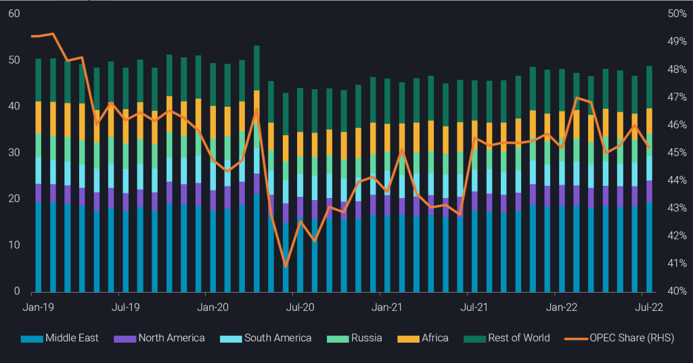
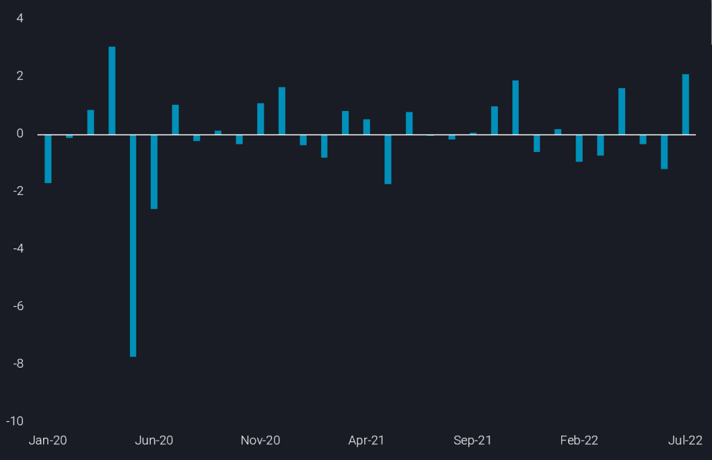

# Global crude/condensates loadings rise in July but OPEC lose share

**Date:** August 11, 2022  
**Publisher:** Breakwave Advisors | **Category:** Market Insights  
**Original URL:** [https://www.breakwaveadvisors.com/insights/2022/8/11/global-crudecondensates-loadings-rise-in-july-but-opec-lose-share](https://www.breakwaveadvisors.com/insights/2022/8/11/global-crudecondensates-loadings-rise-in-july-but-opec-lose-share)  

---

Global seaborne liftings in July rose sharply m-o-m to almost 49mbd, the highest monthly total seen since April 2020. Amid a worsening macroeconomic outlook, rising waterborne supplies may well add even more pressure to short term crude prices.

*By*[*Jay Maroo*](https://www.linkedin.com/in/jay-m-336a3633/)

Global crude/condensate loadings in July posted a 2.1mbd m-o-m rise, reversing the previous two months’ declines. Most of the rise in July stems from non-OPEC loadings rather than those from producer group, supporting concerns over OPEC spare capacity (see chart below). As seen in previous months, higher total OPEC crude/condensate loadings in July were led by Saudi Arabia, with firm increases also coming from UAE and Iraq.

> **Figure 1: 241**  
> **Interactive Data & Source:** [Analytics Vortexa](https://analytics.vortexa.com/?dateRange=2019-01-01T00%3A00%3A00.000Z__2022-07-31T23%3A59%3A59.999Z&filtersEnabled=%5B%22p%22%2C%22o%22%2C%22d%22%2C%22d_r%22%2C%22v%22%2C%22intra%22%2C%22sts_o%22%2C%22c_o%22%2C%22w%22%5D&geoBreakdownOriginGlobal=shipping_region&intraMovementFilter=0&metric=bpd&page=Flows&products=%5B%2254af755a090118dcf9b0724c9a4e9f14745c26165385ffa7f1445bc768f06f11%22%5D&tabId=679b11a1-8566-4725-bf54-e0e6d32c3057&timeSeriesHiddenSeries=%5B%22seasonal_comparison_12%22%2C%22seasonal_comparison_24%22%5D&timeSeriesProperty=origin_region) | [Local Asset](file:///C:/Users/Dell/Github/Shipping/corpus/03-breakwave/insights/2022/assets/2022-08-11_global-crudecondensates-loadings-rise-in-july-but-opec-lose-share_img_241_9c95008b1df8.png)

### Key Takeaways for July Loadings:

- Total OPEC crude loadings stood at around 22mbd in July, approx. 600kbd higher than June, but loadings from the rest of the word (excluding Russia), rose by 1.55mbd over the same period to also reach 22mbd
- Russian loadings remain largely unchanged m-o-m at 4.9mbd, but a reduction in flows from the Far East Russia, Siberia and the Baltics was offset by higher Black Sea loadings
- Within the core OPEC group, Saudi loadings continued to be the main source of growth, rising by around 700kbd m-o-m to 8.2mbd – the highest monthly total seen since April 2020 – UAE and Iraq loadings also increased m-o-m by a combined 550kbd
- Nigerian loadings continued their downward trajectory in July, falling to just 1.2 mbd, a new record low – changes to loadings schedules and more general concerns over the reliability of exports have also dampened traders’ interest
- Looking at non-OPEC+ loadings, a key source of growth in July was from the Americas, as the US, Brazil and Mexico all increased loading activity by a combined 600kbd – though Europe is keen on taking more transatlantic crude, stronger Asian demand has pulled more cargoes further east

Given the backdrop of weaker pricing across the oil complex – affecting outright prices, crude differentials, product cracks and market structure – and the large increase in July seaborne crude flows, price pressure is likely to persist, at least for the short term, with refineries also starting to enter autumn maintenance season from a crude procurement perspective.

Looking back at data from January 2020 (see chart below) it is interesting to note that global crude loadings have rarely risen strongly for two consecutive months. And early indications for August loadings from key producers (Saudi Arabia, UAE) do not suggest momentum for higher loadings has continued. Given how obvious the fundamental weakening of the oil market is now amid deepening recession worries, it is also questionable whether OPEC countries with leeway have any incentive to bring more production online, as the announced marginal 100kbd increase in the September OPEC+ production target may indicate.

> **Figure 2: 242**  
> **Interactive Data & Source:** [Analytics Vortexa](https://analytics.vortexa.com/?dateRange=2019-01-01T00%3A00%3A00.000Z__2022-07-31T23%3A59%3A59.999Z&filtersEnabled=%5B%22p%22%2C%22o%22%2C%22d%22%2C%22d_r%22%2C%22v%22%2C%22intra%22%2C%22sts_o%22%2C%22c_o%22%2C%22w%22%5D&geoBreakdownOriginGlobal=shipping_region&intraMovementFilter=0&metric=bpd&page=Flows&products=%5B%2254af755a090118dcf9b0724c9a4e9f14745c26165385ffa7f1445bc768f06f11%22%5D&tabId=e935766d-d0c0-4f40-b3c3-d9fc2a25fa43&timeSeriesChartView=change&timeSeriesHiddenSeries=%5B%22seasonal_comparison_12%22%2C%22seasonal_comparison_24%22%5D) | [Local Asset](file:///C:/Users/Dell/Github/Shipping/corpus/03-breakwave/insights/2022/assets/2022-08-11_global-crudecondensates-loadings-rise-in-july-but-opec-lose-share_img_242_706fc8e8e722.png)

Data Source:[Vortexa](https://www.vortexa.com//oil-gas-data-traders-analysts-data-scientists?gclid=Cj0KCQjw8_qRBhCXARIsAE2AtRZKOvMnbilZ_6_91d7huSFFy71pWLrnPwGwOHVzXsmsG-1a1mZnQw8aAt89EALw_wcB&hsa_acc=1782073842&hsa_ad=548425387665&hsa_cam=14746637662&hsa_grp=125038601902&hsa_kw=&hsa_mt=&hsa_net=adwords&hsa_src=g&hsa_tgt=dsa-1431852288425&hsa_ver=3&utm_campaign=%5BCD%5D%20-%20DSA%20-%20EMEA&utm_medium=cpc&utm_medium=ppc&utm_source=google&utm_source=adwords&utm_term=)

---

**Tags:** Tankers, Crude Oil, Commodities  
