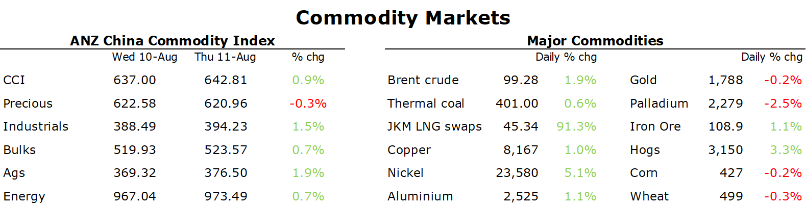

# Iron ore gains as China further supports property market

**Date:** August 12, 2022  
**Publisher:** Breakwave Advisors | **Category:** Market Insights  
**Original URL:** [https://www.breakwaveadvisors.com/insights/2022/8/12/iron-ore-gains-as-china-further-supports-property-market](https://www.breakwaveadvisors.com/insights/2022/8/12/iron-ore-gains-as-china-further-supports-property-market)  

---

*By*[*Daniel Hynes*](https://www.linkedin.com/in/dahynes/)

Signs of strong demand boosted sentiment across commodity markets. This was aided by the slight cooling of inflation, which eased concerns of more aggressive rate hikes and weaker economic activity.

> **Figure 1: 241**  
> **Interactive Data & Source:** [Publications Anz](https://publications.anz.com/SingletrackCMS__DownloadDocument?docRef=4556a5e8-a5e5-4102-8e77-b9f607b7335e&uid=bd219b92-f5cc-400e-9646-4178791864b7&jobRef=92c7d078-fb7e-4c32-9799-231c9def2a45) | [Local Asset](file:///C:/Users/Dell/Github/Shipping/corpus/03-breakwave/insights/2022/assets/2022-08-12_iron-ore-gains-as-china-further-supports-property-market_img_241_f5f8189e30ae.png)

**Crude oil**gained as hopes of stronger demand rose. The International Energy Agency (IEA) lifted its consumption estimate by 380kb/d, saying soaring gas prices amid strong demand for electricity is driving utilities to switch to oil. This could be aided by lower gasoline prices, which have dented demand during the US driving season. Prices fell below USD4/gallon for the first time since March. IEA data showed that US gasoline demand rose by 582kb/d to 9.12mb/d last week. The IEA also warned about impending supply disruptions. It’s forecasting a further 20% fall in Russian output by the start of 2023 as European sanctions bite. This comes as short-term issues impact the market. Six oil and gas fields in the Gulf of Mexico were shut after a leak at a Louisiana booster station halted two pipelines. OPEC may struggle to raise output in coming months due to limited spare capacity.

**European natural gas**edged higher as the continent grapples with strong demand and tighter supply. A heatwave across the region has seen cooking oil demand surge. However, it is facing severe shortages of gas as Russian flows diminish. Concerns of running out of gas over winter has prompted Germany to raise its target for natural gas storage to 95% full by 1 November, compared with 90% previously. Alternative sources may be difficult to find. Extreme weather has seen the Rhine River become almost impassable. It’s forecast to drop below the critical depth of 40cm on 12 August. At that level, barges hauling everything from diesel to coal are effectively unable to transit the river. This resulted in German day-ahead power prices surging more than 12% to EUR398/MWh.

**North Asian LNG**followed European gas markets higher. The high prices have even prompted one Chinese buyer to resell a previously purchased cargo for profit. Nevertheless, interest in the spot market remains strong as utilities look to secure supply ahead of increased competition from Europe.

Signs of a peak in US inflation boosted sentiment across the**base metals**sector. Following the weaker than expected CPI number, another report showed US price pressures were easing. This could see the Fed refrain from getting more aggressive with rate hikes. Demand may be aided by reports that China’s State Reserve Bureau is looking to replenish its copper and nickel stockpiles this year, after it sold supplies in 2021 to control prices. Supply side issues in**copper**also supported prices. Tongling Nonferrous Metals Group, a top Chinese producer said it cut production after authorities reduced electricity supplies to save energy.**Gold**was little changed, with the precious metal giving up early gains with the USD paring losses.

**Iron ore**prices gained following reports that China will further support the property sector. Financial regulators will shore up support for property financing while several provinces have pledged to meet their growth goals. Nevertheless, the iron ore market remains on shaky ground. There is a long way to go before the property sector will see any meaningful rebound. Environmental constraints are also likely to reduce China’s crude steel output, so we have lowered our steel production assumptions and[**now expect a second consecutive year of contraction**](https://publications.anz.com/SingletrackCMS__DownloadDocument?docRef=4556a5e8-a5e5-4102-8e77-b9f607b7335e&uid=bd219b92-f5cc-400e-9646-4178791864b7&jobRef=92c7d078-fb7e-4c32-9799-231c9def2a45). For the moment, supply side issues are keeping the market tight. That will eventually wane, with the market swinging back into a small surplus in 2023.

Data source:[Commodities Wrap](https://www.linkedin.com/newsletters/commodities-wrap-6692196755876012032/?fbclid=IwAR3kiXJqZdxmp9ZcRwBNI7FsBySI-XSC0pfPur1qzjt7OZp7PTE59Tsl1QI)
