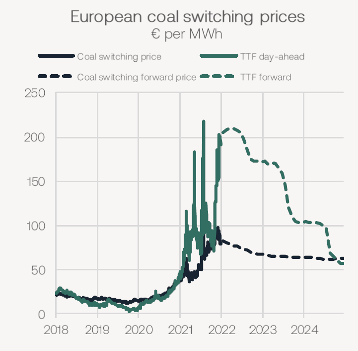
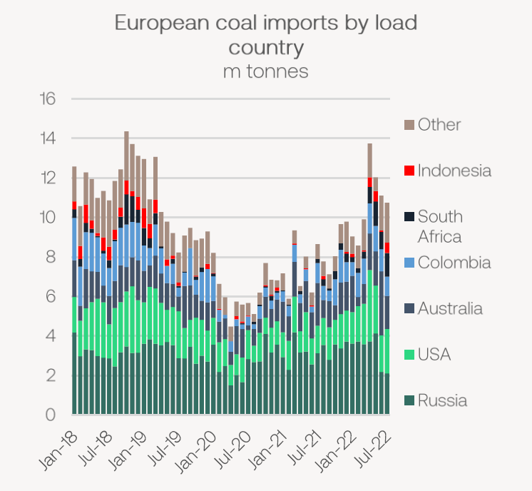
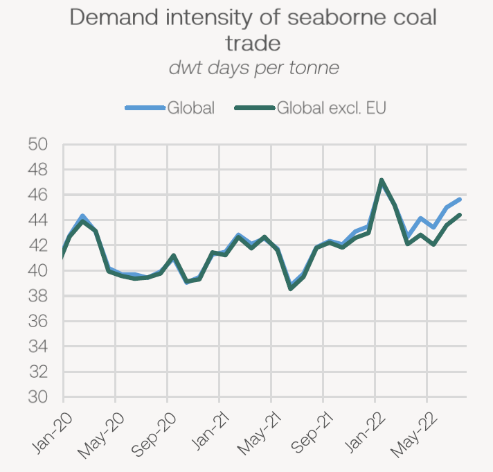

# The Big Picture: EU coal sanctions

**Date:** August 12, 2022  
**Publisher:** Breakwave Advisors | **Category:** Market Insights  
**Original URL:** [https://www.breakwaveadvisors.com/insights/2022/8/12/the-big-picture-eu-coal-sanctions](https://www.breakwaveadvisors.com/insights/2022/8/12/the-big-picture-eu-coal-sanctions)  

---

### No More Russian Coal

*The European sanctions have now taken full effect on Russian coal. We look at the current state of European seaborne coal demand and what the situation may look like going forward.*

*By*[*Mark Nugent*](https://www.linkedin.com/in/mark-nugent-3724a3192/)

### Sanctions Now in Place

The EU announced a ban on all new purchases of Russian coal shortly after the war started, with existing contracts allowed to be fulfilled until 10 August. Since March, 16.2m tonnes of Russian coal has landed in Europe on bulk carriers. While power utilities have sought after alternative sources of coal, this has been difficult for many reasons, hence the continued strength in liftings from Russia in the lead up to the full ban. We expect the sanctions to be in place for a lengthy period going forward and thus the ’new’ coal trade routes to continue through 2022 and likely 2023 at least. This, of course, entails more Atlantic and Australian coal heading into Europe and most Russian coal moving east to India and China. Day-ahead TTF natural gas prices are continuing to firm on reduced flows from Russian pipelines, with forward prices indicating coal will be more economical for utilities out to 2024.

> **Figure 1: 241**  
> [Local Asset](file:///C:/Users/Dell/Github/Shipping/corpus/03-breakwave/insights/2022/assets/2022-08-12_the-big-picture-eu-coal-sanctions_img_241_a58142efb27c.png)

This comes at a time when Europe’s energy picture continues to look weaker heading into the winter months. Several coal power stations due to be decommissioned will now remain operational, confirming the bloc has little choice but to revert to coal burn for energy. This improves seaborne coal trade expectations going forward.

### European Imports Declining

Perhaps a surprise to some, European coal imports have slowed in recent months despite the bloc’s energy position worsening. The bloc imported 11.3m tonnes of coal in July, increasing by 30.7% YoY. An influx of coal cargoes landing into the ARAG region saw inventories rise at ports significantly in recent months. Inventories in ARA ports now lie near 7m tonnes, the highest level for several years. However, logistical issues in-land have arisen, as barges heading down the Rhine are loading to very limited capacity due to low river levels. For now, weather forecasts suggest continued dryness throughout August. As port storage becomes less available, this makes it difficult for bulk carriers to discharge, hence the slowdown in imports.

> **Figure 2: As We Have Noted Previously**  
> *As we have noted previously, there have been several constraints facing most of Europe’s alternative coal suppliers. From the US, shipments are at capacity and thus we do not expect any substantial increase from the 2.5m tonnes per month on average since the war started. The rains and disruptions in east Australia are starting to subside and shipments are ramping up again, which bodes well for backhaul flows. As we noted in this week’sResearch Update, in South Africa the rail network from mine-to-port has enhanced security measures against stolen cables. However, this has yet to show in the country’s export volumes. In July, South Africa exported 4.8m tonnes of coal, declining by 10.8% YoY. As the rail improvements take shape we expect to see an increase in coal shipments out of South Africa, largely to the benefit of European buyers. The easing of these supply constraints raises the likelihood Europe can wholly replace Russian coal as the bloc appears willing to pay any price to maintain energy supplies.*  
> [Local Asset](file:///C:/Users/Dell/Github/Shipping/corpus/03-breakwave/insights/2022/assets/2022-08-12_the-big-picture-eu-coal-sanctions_img_242_221a03eb4424.png)

For the coal producers we expect Europe to import from going forward, volumes have improved but have not yet proven they can fully replace the lost Russian volumes. The extent to which this is currently possible is limited, but improving. Some miners are reportedly switching coking coal to thermal, particularly lower-grade met, as thermal coal prices achieve a considerable premium to coking.

### Demand Impact Taking Shape

Historically, Europe has had little to no effect on the demand intensity of seaborne coal trade. Since the war started, however, we can see the positive effect European coal imports have had on bulk carrier demand. This is not only a reflection of the longer voyages, but also simply the greater volumes imported. The demand intensity of coal shipments has increased by 9.6% YoY and is at its strongest level for this time of year. While this added demand has not been enough to support freight rates, it is an effect that we expect to continue for the foreseeable future. Not only is bulk carrier demand from coal improving due to European imports from further afield, it is also down to the change in flows out of Russia. Russian coal imports to India doubled YoY to 1.9m tonnes, while China imported 6.8m tonnes, a 22.7% YoY increase and the highest monthly total on record for this trade.

The downside to the increase in vessels arriving into Europe with coal, particularly on the Capesizes, is that many ships have been left open in the Atlantic with few options to look for a subsequent cargo. As we now enter the rainy season in Guinea and bauxite volumes slowdown, this further limits employment opportunities in the Atlantic and thus has contributed to increasing tonnage supply heading to Brazil.

> **Figure 3: 243**  
> [Local Asset](file:///C:/Users/Dell/Github/Shipping/corpus/03-breakwave/insights/2022/assets/2022-08-12_the-big-picture-eu-coal-sanctions_img_243_5d0e5101525e.png)

### Indonesian Capacity Reduced

This week, the Indonesian Energy and Mineral resources minister announced that 71 miners in the country failed to meet their domestic market obligations (DMOs) and 48 of them are now banned from exporting coal. As of today, coal stockpiles at Indonesian utilities remain at healthy levels so for now, any total ban seems unlikely. This does, however, reduce Indonesia’s export capacity. Some miners are said to be willing to pay fines and not meet the 25% DMO given the high price environment for coal. Despite this largely affecting Asian coal buyers, rather than European, it creates more competition for resources from the fewer suppliers that Europe will be looking to for coal. Buyers such as India, for example, may have to import more from elsewhere with Russia being the likely candidate, but also Australia and South Africa. Moving forward, it remains to be seen how long these miners will be restricted.

---

**Tags:** Dry Bulk, Shipping, Coal  
