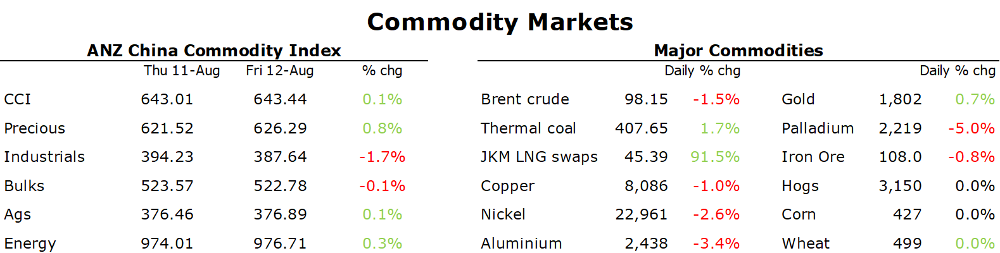

# Signs of stronger demand boosts sentiment in commodity markets

**Date:** August 15, 2022  
**Publisher:** Breakwave Advisors | **Category:** Market Insights  
**Original URL:** [https://www.breakwaveadvisors.com/insights/2022/8/15/signs-of-stronger-demand-boosts-sentiment-in-commodity-markets](https://www.breakwaveadvisors.com/insights/2022/8/15/signs-of-stronger-demand-boosts-sentiment-in-commodity-markets)  

---

*By*[*Daniel Hynes*](https://www.linkedin.com/in/dahynes/)

Commodity markets were buoyed by better-than-expected data. Energy led the gains, as the positive demand backdrop met ongoing supply issues.

> **Figure 1: 241**  
> **Interactive Data & Source:** [Publications Anz](https://publications.anz.com/SingletrackCMS__DownloadDocument?docRef=4556a5e8-a5e5-4102-8e77-b9f607b7335e&uid=bd219b92-f5cc-400e-9646-4178791864b7&jobRef=e20b4f5f-cdcc-4485-afda-1fcc0fcc0750) | [Local Asset](file:///C:/Users/Dell/Github/Shipping/corpus/03-breakwave/insights/2022/assets/2022-08-15_signs-of-stronger-demand-boosts-sentiment-in-commodity-markets_img_241_9f06b813b77b.png)

**Crude oil**posted a weekly gain, despite edging lower on Friday as the prospect of stronger demand improved. The International Energy Agency last week lifted its consumption estimate by 380kb/d, saying soaring gas prices amid strong demand for electricity are driving utilities to switch their fuel to oil. This could be aided by a fall in gasoline prices, which dented demand by being high during the US driving season. EIA data showed that US gasoline demand rose last week, but that gain was trimmed on Friday by reports that Iran is considering accepting a European-brokered nuclear deal if it receives certain guarantees. This follows the US Secretary of State, Antony Blinken, signing several sanction waivers related to Iran’s nuclear activities. The oil market is coming into a crucial period, with European sanctions on Russia kicking in fully by the end of the year. To-date, OPEC may also be reluctant to raise output in coming months due to limited spare capacity.

**European natural gas**recorded its fourth consecutive week of gains amid persistent supply side issues. Russian shipments via the Nord Stream pipeline briefly fell to around 18% of capacity on Friday, pushing Dutch front month futures as high as EUR210/MWh. With only two months before the winter heating season begins, European authorities are concerned they will not get through the winter if Russian gas remains at current levels. Germany is proposing additional energy-saving initiatives such as reducing the minimum temperature in offices. Its ability to store gas will go some way to mitigating the shortages. Its gas storage facilities reached 75% last week but remain short of its 95% target by November. The continent is also battling the effects of extreme weather, which has boosted electricity demand and made the Rhine River become almost impassable. This could severely impact the movement and supply of other energy sources such as coal.**North Asian LNG**followed European gas markets higher last week. High prices don’t appear to have tempered demand, with the prospect of increased competition from European buyers keeping interest in the spot market high.

**Iron ore**fell on Friday, snapping a two-day rally amid signs of weaker demand. Inventories at Chinese ports grew 1.3% last week, taking their increase since mid-July to almost 7%. Sentiment wasn’t helped after Komatsu reported Chinese demand for excavators fell 35% y/y in July. The market gained last week following reports that China will further support the property sector, but it remains on shaky ground. There is a long way to go before the sector will see any meaningful rebound. Environmental constraints are also likely to reduce China’s crude steel output, which could see[**a second consecutive year of contraction**](https://publications.anz.com/SingletrackCMS__DownloadDocument?docRef=4556a5e8-a5e5-4102-8e77-b9f607b7335e&uid=bd219b92-f5cc-400e-9646-4178791864b7&jobRef=e20b4f5f-cdcc-4485-afda-1fcc0fcc0750).

**Copper**led the base metal sector higher last week as signs of a peak in US inflation boosted sentiment. This could see the Fed refrain from getting more aggressive with rate hikes. However, it trimmed some of those gains on Friday after China’s credit growth slowed more than expected. Aggregate financing was CNY756bn in July, down from CNY5.2trn in June. Supply side issues may limit the losses. Tongling Nonferrous Metals Group, a top Chinese producer, said it cut production after authorities reduced electricity supplies to save energy.**Gold**recorded its fourth consecutive weekly gain amid easing inflationary pressures. However, those same issues may ultimately be a negative. History shows that[**falls in inflation expectations**](https://publications.anz.com/SingletrackCMS__DownloadDocument?docRef=1373cd71-69d9-4445-a469-591e99211fa4&uid=bd219b92-f5cc-400e-9646-4178791864b7&jobRef=e20b4f5f-cdcc-4485-afda-1fcc0fcc0750)push gold prices lower.

Data source:[Commodities Wrap](https://www.linkedin.com/newsletters/commodities-wrap-6692196755876012032/?fbclid=IwAR3kiXJqZdxmp9ZcRwBNI7FsBySI-XSC0pfPur1qzjt7OZp7PTE59Tsl1QI)

---

**Tags:** Commodities, Shipping, Demand  
