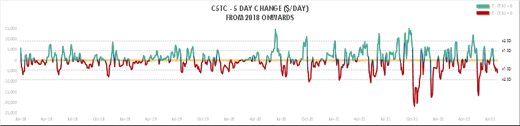
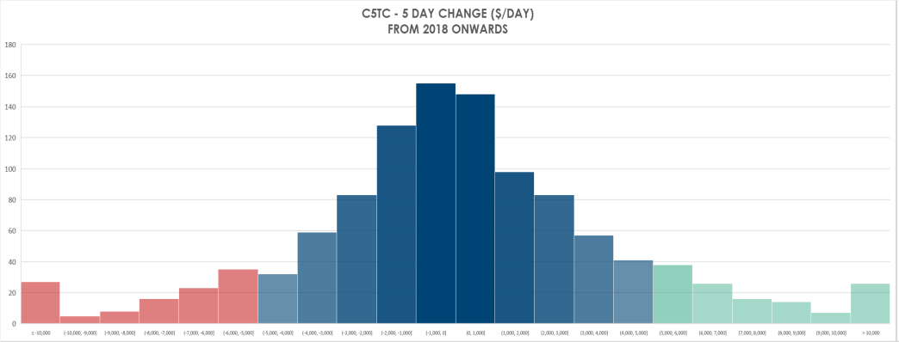
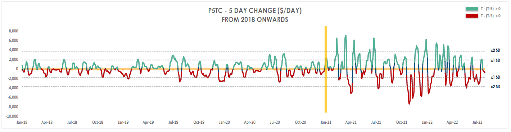
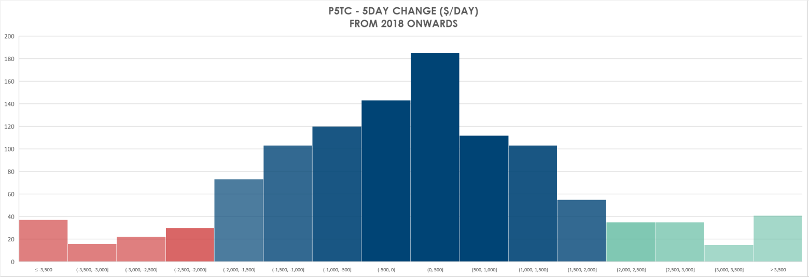
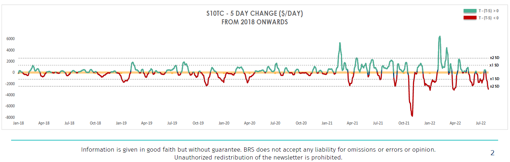
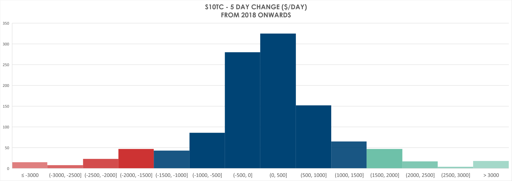

# Topic of the Week: MEASURING VOLATILITY

**Date:** August 15, 2022  
**Publisher:** Breakwave Advisors | **Category:** Market Insights  
**Original URL:** [https://www.breakwaveadvisors.com/insights/2022/8/12/topic-of-the-week-measuring-volatility](https://www.breakwaveadvisors.com/insights/2022/8/12/topic-of-the-week-measuring-volatility)  

---

Volatility, stemmed from the Latin word, ‘Volatilis’ which meant “fleeting, transitory, swift”. Spot freight rates which can be literally impacted, influenced or distorted by a mix of physical fundamentals, technical corrections and irrational market sentiment certainty embodied this dangerous trait.

In this topic, we will take a brief look at the physical price movements of the various vessel-size segments (C5TC / P5TC / S10TC).

> **Figure 1: 241**  
> [Local Asset](file:///C:/Users/Dell/Github/Shipping/corpus/03-breakwave/insights/2022/assets/2022-08-15_topic-of-the-week-measuring-volatility_img_241_f6ac1ecec14b.png)

To visually gauge the Capesize’s volatility, we tracked the ‘5-day change’ of spot C5TC since 2018. Looking at the above chart, C5TC had the largest penchant for extreme swings, whereby within 1 working week, the spot could either swiftly crashed by more than $10K or rapidly print north of $10K.

This is a raw testament of Capesize relying more than 70% of its employment on a single commodity, iron ore, which itself is subjected to the whims of a sole economy, China which could change the fortunes of the steel industry through direct fiscal initiatives / policy mandates on steel production or subtle signaling that iron ore prices need to be tame due to perceived speculation risk.

It is worth noting, that once the 5-day change hits/exceed 2 times standard deviation (SD) at c.$10K, the momentum will begin to reverse (and quicky), offering a possible method to avoid “buying high or selling low” when market sentiment is at extreme polars.

> **Figure 2: 242**  
> [Local Asset](file:///C:/Users/Dell/Github/Shipping/corpus/03-breakwave/insights/2022/assets/2022-08-15_topic-of-the-week-measuring-volatility_img_242_47ba1db261a5.png)

Based on above histogram, 78.6% of the time C5TC’s 5-day change is within the ±$5000 range (±1 SD)

> **Figure 3: 243**  
> [Local Asset](file:///C:/Users/Dell/Github/Shipping/corpus/03-breakwave/insights/2022/assets/2022-08-15_topic-of-the-week-measuring-volatility_img_243_2a9feaeee617.png)

Panamax volatility, represented by P5TC’s 5-days change is more subdued relative to Capesize, with a price swing of ± $2-4K within 1 working week. Though its worth noting that from Jan-18 to Dec-20, P5TC’s gyrations were modest in nature, by an magnitude ±$2K. By 2021, the short-term swings had gotten more volatile, ±$4K (x2 SD).

This is a consequence of grains playing a more prominent role in Panamax employment (especially on the Front-haul) over the past 2 years. Grain shipments which are susceptible to unforeseen changes to weather on yield, harvesting time and China’s ravenous appetite for soybeans/corn over the past 2 years amidst the US-China trade war and most recently the closure of Black Sea ports. Meantime, coal tradeflows had also been disrupted and reshaped starting from the China’s ban on Australian coal up to Russian coal being sanctioned by European countries. Such new developments had induced greater unpredictability into these grain and coal carriers.

> **Figure 4: 244**  
> [Local Asset](file:///C:/Users/Dell/Github/Shipping/corpus/03-breakwave/insights/2022/assets/2022-08-15_topic-of-the-week-measuring-volatility_img_244_940a4e36b2d1.png)

Based on the above histogram, 79.5% of the time, P5TC’s 5-day change is within the ±$2000 range (±1 SD)

> **Figure 5: 245**  
> [Local Asset](file:///C:/Users/Dell/Github/Shipping/corpus/03-breakwave/insights/2022/assets/2022-08-15_topic-of-the-week-measuring-volatility_img_245_fda82678c352.png)

S10TC’s fluctuations had remained modest and predictable since 2018, within ±1 SD. However, since 2021, its volatility had become more pronounced, consistently reaching or exceeding ±2 SD. This reflects how (rising) container market, for the past 2 years, had reshaped the demand dynamics of geared bulkers.

Moving forward, with container market expected to face several headwinds (new containerships arrivals in 2023/24, lack of US stimulus spending of physical goods, pivot from physical to services, global inflation) would mean that geared bulkers could possibly decoupled its fate with the boxships in the foreseeable future, reverting to its past reputation as a “slow and steady” earnings asset.

### Until Then, Buckle Up and Sit Tight!!

> **Figure 6: 246**  
> [Local Asset](file:///C:/Users/Dell/Github/Shipping/corpus/03-breakwave/insights/2022/assets/2022-08-15_topic-of-the-week-measuring-volatility_img_246_620740b59783.png)

Based on the above histogram, 84.2% of the time, S10TC’s 5-day change is within the ±$1500 range (±1 SD)

---

**Tags:** Volatility, Shipping, Rates  
