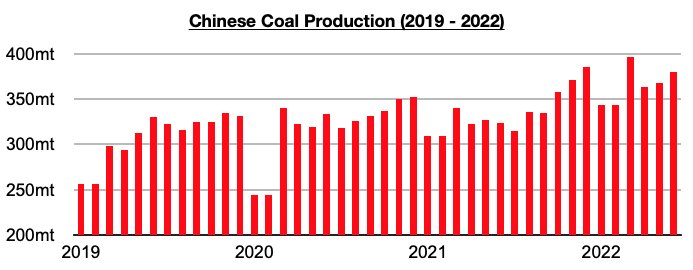

# Daily Coal Burn In China Has Set Another Record

**Date:** August 17, 2022  
**Publisher:** Breakwave Advisors | **Category:** Market Insights  
**Original URL:** [https://www.breakwaveadvisors.com/insights/2022/8/17/daily-coal-burn-in-china-has-set-another-record](https://www.breakwaveadvisors.com/insights/2022/8/17/daily-coal-burn-in-china-has-set-another-record)  

---

*By*[*Jeffrey Landsberg*](https://www.linkedin.com/in/jeffrey-landsberg-70ab957/)

The most recently released data as of August 7th shows that the daily coal burn rate at China's six major coastal power plants has come in at 916,000 tons. This is up week-on-week by 2%, up year-on-year by 15%, and is a new record. Coal burn has now set records during three of the last four weeks as China continues to experience warmer than usual temperatures and in some places new records. In addition, new daily coronavirus cases and restrictions remain much lower than seen during May's peak.

As we have continued to stress for our clients in our Weekly China Reports, however, China still remains fairly well supplied with thermal coal. This year continues to serve as a stark contrast to 2021, and Chinese coal import prospects are still not very encouraging. As we discussed most recently in this week's Weekly China Report, the Chinese government last year was very much in denial and a thermal coal shortage emerged -- but lessons were learned and a reversal in policy remains in place. Demand for thermal coal is even stronger this year, but China is not experiencing a coal shortage. Chinese coal imports remain likely to end this year showing a significant year-on-year contraction.

As we also discussed for our clients in this week's Weekly China Report, a large number of coal mine accidents have occurred in China in recent weeks -- but unlike in 2021, this has not led to major changes in coal production. As we have stressed in previous work, during previous years coal mine accidents received much more attention in China and were very often followed by regional and national inspections and restrictions. After China began to experience a coal shortage leading up to last winter, however, a shift occurred in which increasing coal production became much more of a priority than new safety inspections and restrictions. So far this year, production has continued to be prioritized, even despite the most recent accidents. Domestic coal production in China continues to fare a great deal better than thermal coal-derived electricity generation.

> **Figure 1: Chart 1 (43)**  
> [Local Asset](file:///C:/Users/Dell/Github/Shipping/corpus/03-breakwave/insights/2022/assets/2022-08-17_daily-coal-burn-in-china-has-set-another-record_img_chart1284329_4802d2a740f7.jpg)
