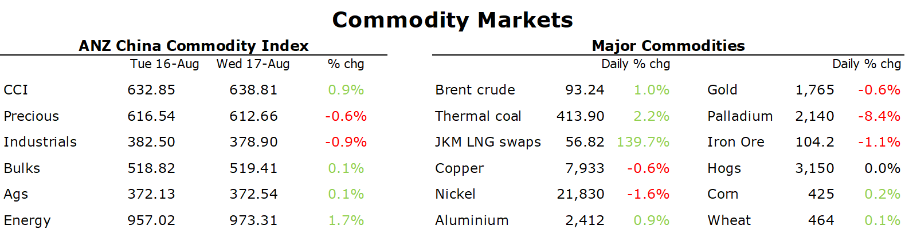

# Crude oil gains as inventories fall and gasoline demand picks up

**Date:** August 19, 2022  
**Publisher:** Breakwave Advisors | **Category:** Market Insights  
**Original URL:** [https://www.breakwaveadvisors.com/insights/2022/8/19/crude-oil-gains-as-inventories-fall-and-gasoline-demand-picks-up](https://www.breakwaveadvisors.com/insights/2022/8/19/crude-oil-gains-as-inventories-fall-and-gasoline-demand-picks-up)  

---

*By*[*Daniel Hynes*](https://www.linkedin.com/in/dahynes/)

Signs of robust demand helped assuage concerns that rising interest rates would curb economic growth. Supply issues are also in focus, amid the ongoing energy crisis.

> **Figure 1: 241**  
> **Interactive Data & Source:** [Publications Anz](https://publications.anz.com/SingletrackCMS__DownloadDocument?docRef=4556a5e8-a5e5-4102-8e77-b9f607b7335e&uid=bd219b92-f5cc-400e-9646-4178791864b7&jobRef=e5c1bf28-09d3-42f7-bda5-94206ac73d52) | [Local Asset](file:///C:/Users/Dell/Github/Shipping/corpus/03-breakwave/insights/2022/assets/2022-08-19_crude-oil-gains-as-inventories-fall-and-gasoline-demand-picks-up_img_241_c3b9728726bc.png)

**Aluminium**gained after Europe’s energy crisis claimed another victim. Norsk Hydro ASA said it plans to close a smelter in Slovakia at the end of next month. Ongoing high electricity prices would see it suffer substantial losses beyond 2022. The 175kt a year smelter was operating at only 60% capacity. Hydro also said another aluminium plant in Norway would be impacted by a strike starting 22 August. This follows news that Nystar would close its Budel zinc smelter in the Netherlands for similar reason. Aluminium uses one of the most energy intensive processed and is sometimes referred to as a solid form of electricity. Traders are monitoring the situation in Sichuan, an aluminium hub, where officials are rationing electricity, amid extreme weather. The rest of the sector struggled to keep its head above water, with risk appetite subdued as the focus retuned to the Fed and its tightening path.

**Iron ore**futures fell on the Dalian and Singapore exchanges on a gloomy outlook for demand. Premier Li Keqiang urged six key provinces to step up pro-growth measures, but there is a long way to go before the sector will see any meaningful rebound. Environmental constraints are also likely to reduce China’s crude steel output, which could see[**a second consecutive year of contraction**](https://publications.anz.com/SingletrackCMS__DownloadDocument?docRef=4556a5e8-a5e5-4102-8e77-b9f607b7335e&uid=bd219b92-f5cc-400e-9646-4178791864b7&jobRef=e5c1bf28-09d3-42f7-bda5-94206ac73d52).

**Crude oil**rebounded after several days of losses after data showed US inventories fell sharply. WTI rose 1.8% to USD88/bbl after EIA’s weekly report showed commercial inventories fell 7,065kbbl last week. The fall was driven by a pick-up in exports, which jumped to 5mb/d. Gasoline demand hit its highest level this year at 9.35mb/d. This eased concerns that record high gasoline prices are hurting demand. Sentiment was also supported by comments from OPEC’s new Secretary-General, Haitham Al Ghais, that world oil demand will rise by almost 3mb/d this year. He also said there is a high chance of a supply squeeze this year, in part because fears of lowing usage in China are exaggerated. This took the focus off Iran, where talks continue over reviving the 2015 nuclear deal. The Biden administration is evaluating Iran’s response to an EU proposal. Both sides have indicated the possibility of a deal after more than a year of false starts.

**European energy**markets remained on edge amid strong demand and supply shortages. Dutch front month futures were little changed but remained near record highs.**Coal**prices soared, with the European coal benchmark API2 rising 7% to USD380/t as utilities increasing burn the fuel to fill gaps left by the reduce supply of gas from Russia. Concerns are being partially countered by storage sites continuing to be replenished using imported LNG. European facilities are now 75% full. However, gas supplies would last less than three months this winter if Russia totally cuts off supply, even if they are able to fill storage facilities to 95% capacity by November, warned German’s energy regulator.**North Asian LNG**were little changed, ending the session at USD56.82/MMBtu.

**Gold**pared losses after FOMC minutes showed officials will need to dial back the pace of rate hikes. The USD reversed course to weaken into the close, while Treasury yields gave up early gains.

Data source:[Commodities Wrap](https://www.linkedin.com/newsletters/commodities-wrap-6692196755876012032/?fbclid=IwAR3kiXJqZdxmp9ZcRwBNI7FsBySI-XSC0pfPur1qzjt7OZp7PTE59Tsl1QI)

---

**Tags:** Commodities, Crude, Tankers  
