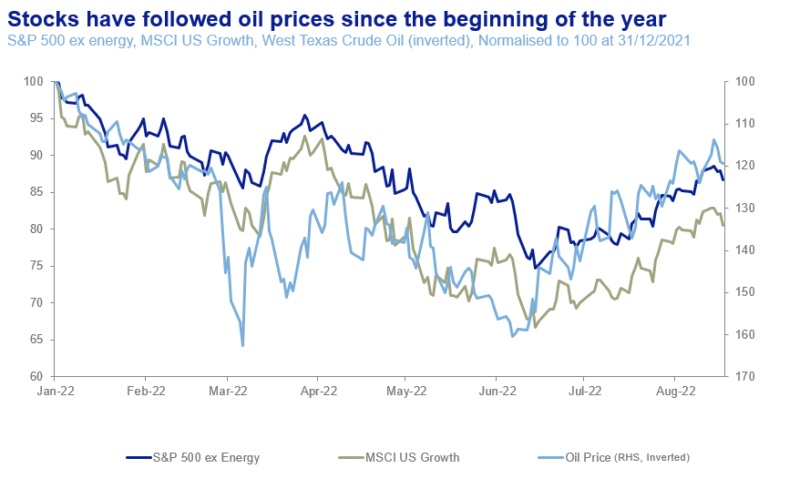
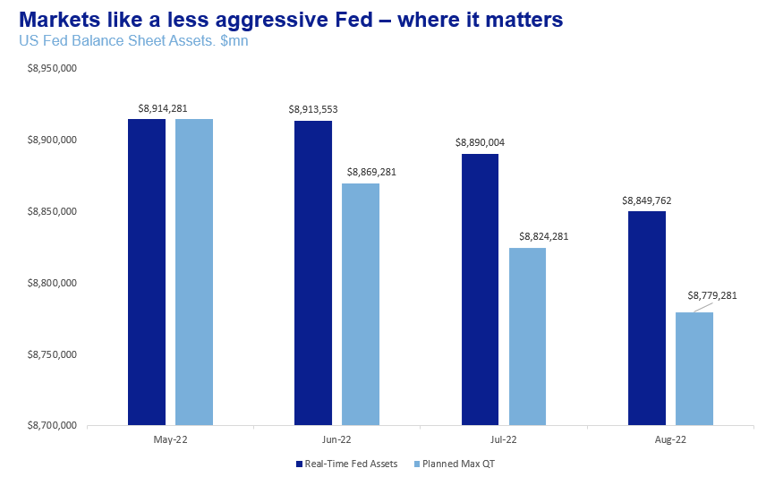

# Market Comment: ‘Paradigm shift’ deferred, but not for long

**Date:** August 22, 2022  
**Publisher:** Breakwave Advisors | **Category:** Market Insights  
**Original URL:** [https://www.breakwaveadvisors.com/insights/2022/8/22/market-comment-paradigm-shift-deferred-but-not-for-long](https://www.breakwaveadvisors.com/insights/2022/8/22/market-comment-paradigm-shift-deferred-but-not-for-long)  

---

*By*[*George Lagarias*](https://www.linkedin.com/in/george-lagarias-mba-3baa769/)

Frank Herbert’s ‘[Dune](https://en.wikipedia.org/wiki/Dune_(novel))’, one of the most epic sci-fi novels of all time (and the subject of a less-great 1984 Kyle MacLachlan[movie](https://www.imdb.com/title/tt0087182/)), featured, amongst other things, a mystical far-future sisterhood, called the Bene Gesserit. The Sisterhood had developed a secret sign language, to be used alongside real spoken words. So while two Sisters would publicly discuss embroidery, their hand sign signals would be about plans to take down their enemies who would blithely sit at the next table.

The more I listen to the Fed and watch market reactions, the more I’m getting the feeling that this is what we have been witnessing all summer.

We have often said that for investors, interest rates mattered less than quantitative easing (or tightening). Market action during this summer confirms that finding. The S&P 500 has rebounded 15% from its lows and is now near 10% from its highs. This movement is difficult to reconcile with a looming recession, slower earnings, especially for Big Tech, an energy crunch in Europe, wobbly real estate markets and a China still in[obvious trouble](https://www.ft.com/content/17fb88ca-d648-4670-a292-bbf93c1fed0a).

To the world, the Fed talks with open and very hawkish statements. It tightens interest rates faster and faster, to the point that consecutive triple rate hikes are becoming a norm.

But, at the very same time, it talks to investors in a second language, beyond headlines and statements. It is a complex language of signalling, founded on years of[operant conditioning](assets/2022-08-22_market-comment-paradigm-shift-deferred-but-not-for-long_operant-conditioning_dd3c33fd816b.html)by the US central bank. And in that language, Fed officials signal to investors: “relax, we’re still on your side”.

In the past few months markets have been fixated with oil prices. Higher oil prices drive asset prices down and vice versa.

> **Figure 1: 241**  
> [Local Asset](file:///C:/Users/Dell/Github/Shipping/corpus/03-breakwave/insights/2022/assets/2022-08-22_market-comment-paradigm-shift-deferred-but-not-for-long_img_241_efb0d38fe62a.png)

On the one hand, this is a good sign. It means that markets recognize current inflation to be mostly driven by energy price and supply chain factors, not monetary easing. By implication, this means that they believe the Fed will follow inflation trends, rather than actually be able to reverse them.

On the other hand, it also means that the much-vaunted ‘paradigm shift’ has failed to materialise. The Fed is still ‘The only game in town’ for markets. When the US central bank even hints at accommodation, or at least less tightening, stocks, and especially leading growth and tech stocks go up. When the Fed is hawkish, the market goes down. Fed officials know that. That is why they have been so careful to hike rates, trying to maintain their credibility as inflation-fighters (instead of mere inflation ‘exorcists’), while signalling to markets that the central bank’s balance sheet will remain extended for a long time.

So, while performing sharp rate hikes and remaining hawkish, the Fed’s dovish approach to its balance sheet is the real signal markets awaited to rebound. After May, the Fed had announced Quantitative Tightening of $45bn per month, a total of $135b. Instead, it delivered less than half that, $64b.

> **Figure 2: 242**  
> [Local Asset](file:///C:/Users/Dell/Github/Shipping/corpus/03-breakwave/insights/2022/assets/2022-08-22_market-comment-paradigm-shift-deferred-but-not-for-long_img_242_1da710c6e44f.png)

From the next month, max withdrawals go up to $95bn per month, from $45bn today. Given what we have seen until today, we would be surprised if the Fed punches up quantitative tightening so abruptly.

Is that such a bad thing?

Short-term, maybe not. Long-term, definitely yes. For one, oil prices may stop receding. This would cause inflation to rebound ‘unexpectedly’ and traders would again lose money.

However, the larger issue is that investors cling to the previous paradigm, one of perpetual money printing at the slightest sign of market distress. That time is, well and truly, over. For one, the Global Financial Crisis is 14 years in the past. Banks are much more secure and risk has been transferred into the less systemic private equity market. Secondly, the paradigm was founded on the explicit expectation that inflation would never really rebound, at least not over the longer term. We got used to a world where inflation would not pass 2%, even if central banks printed trillions. Yet the effects of the pandemic and deteriorating geopolitics on the global supply chain, as well as the lingering excess money supply after a year of unfettered government spending, not to mention the ‘Green Transition’, suggest that inflation may not return to that point. Central banks know this. So the era we knew is still, probably, over.

Which is why the Fed’s signalling is problematic. Not because it is incongruent with sharp rate hikes -although a sound political argument could be made against aggressively withdrawing money from the real economy while keeping the financial economy flush with cash. The real problem is that investors' dreams of a regime that was and can never be again are kept alive. For a short term, this may serve a purpose. A market meltdown along with a recession may be too much to handle. But over the long term, investors should know that they need to be looking for the next paradigm. And until they find the next ‘beta’ play, they should remain focused on those timeless fundamentals that serve truly long-term portfolios.
