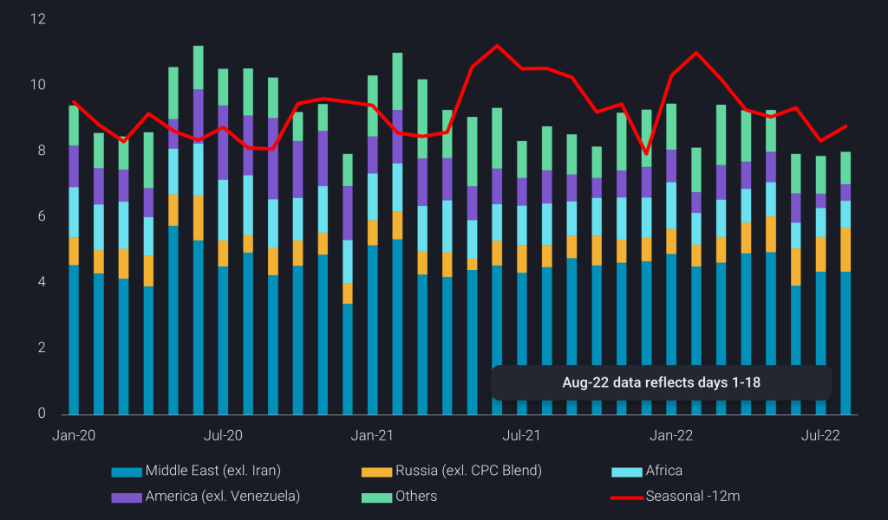
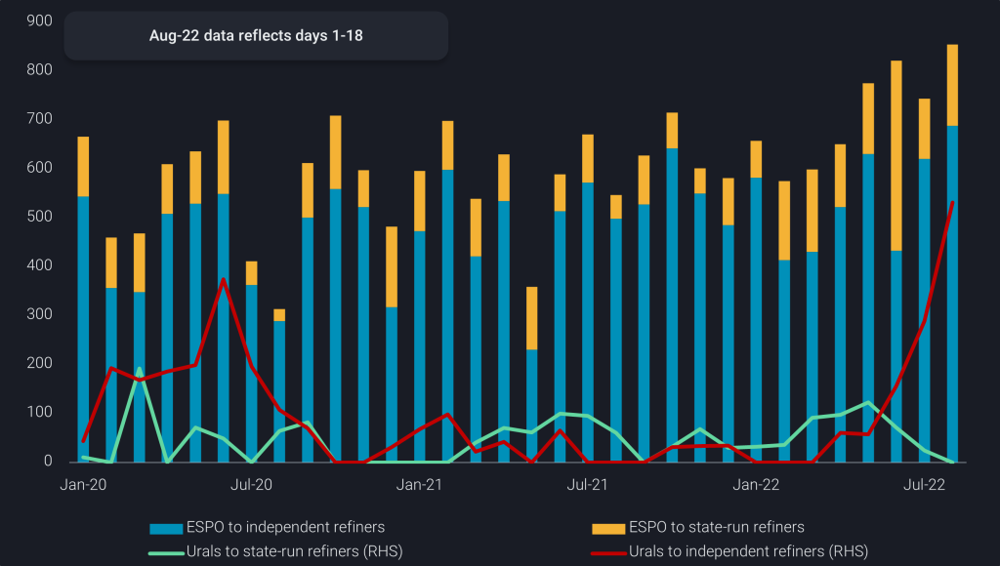
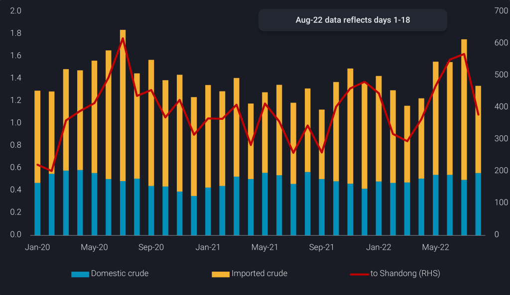
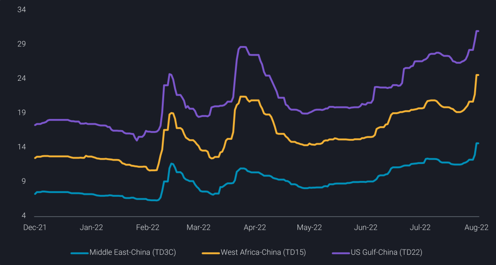

# Are China’s crude imports on a path to recovery?

**Date:** August 23, 2022  
**Publisher:** Breakwave Advisors | **Category:** Market Insights  
**Original URL:** [https://www.breakwaveadvisors.com/insights/2022/8/22/are-chinas-crude-imports-on-a-path-to-recovery](https://www.breakwaveadvisors.com/insights/2022/8/22/are-chinas-crude-imports-on-a-path-to-recovery)  

---

China’s refining industry has been languishing amidst sluggish demand and thin margins since March. Is a long-awaited recovery in sight?

*By*[*Emma Li*](https://www.linkedin.com/in/emma-li-73003443/)

China’s seaborne crude imports in August (days representing 1-18) have breached the 8mbd mark, up marginally from the 7.9mbd average seen in the past two months but remains 10% below last year’s volumes. The country’s crude import recovery has been slower than anticipated as oil prices remain high despite cooling recently, whilst domestic refining margins have been lacklustre with strict Covid policies denting domestic fuel demand.

Despite the stubbornly weak demand, several Chinese state-run refiners may look to restock crude in anticipation of autumn demand recovery and a narrowing oil price backwardation.[Crude stocks held by Sinopec](https://analytics.vortexa.com/?dateRange=2021-01-01T00%3A00%3A00.000Z__2022-08-18T23%3A59%3A59.999Z&onshoreInventoriesLocations=%5B%22b5fafce6e20de2dc307fb7e0b89978ee91a49a7b6ec6f5461daf2633f3c56674%22%5D&owners=%5B%220378fb82d2401de13a59bd08bb385f1a20adf21e2da07db44a946af23130f729%22%5D&page=OnShoreCrudeInventories&selectedRegion=%5B%22b5fafce6e20de2dc307fb7e0b89978ee91a49a7b6ec6f5461daf2633f3c56674%22%5D&tabId=0cd16ff6-30e9-4ff7-a5c6-915250d00cc2)have picked up since July 21, after a steep 800kbd draw for three consecutive weeks, according to Vortexa’s onshore crude inventory data.

## A Rebalance Among the “Baseload” Suppliers

Looking at imports by origin, seaborne imports of Middle Eastern crudes have extended gains for a third consecutive month over 1-18 Aug, with volumes from Saudi Arabia rising over 10% month-on-month to 1.8mbd, exceeding the 1.4mbd from Russia, as Saudi Aramco managed to retain its top customer by maintaining steady supplies, despite growing demand from Europe.

In contrast to India’s state-run refiner Indian Oil (IOC), Chinese state-run refiners have been more conservative in increasing their uptake of Russian crude after the Russia-Ukraine invasion. In fact, Sinopec lifted more US crude in July with a total of five VLCCs (or 320kbd), compared to only one each month in the last two months, at the expense of Russian ESPO Blend cargos, likely signalling a rebalancing of its purchases to its regular suppliers, included those in the Atlantic Basin.

> **Figure 1: 241**  
> **Interactive Data & Source:** [Analytics Vortexa](https://analytics.vortexa.com/?dateRange=2019-01-01T00%3A00%3A00.000Z__2022-08-18T23%3A59%3A59.999Z&filtersEnabled=%5B%22p%22%2C%22o%22%2C%22d%22%2C%22d_r%22%2C%22intra%22%2C%22sts_o%22%2C%22c_o%22%2C%22v%22%5D&metric=bpd&movementEvent=unloading_start&page=Flows&products=%5B%2254af755a090118dcf9b0724c9a4e9f14745c26165385ffa7f1445bc768f06f11%22%5D&sortField=unloading_start&tabId=79e451b4-c797-47b5-940c-9821caee6759&timeSeriesProperty=origin_region&to=%5B%22b5fafce6e20de2dc307fb7e0b89978ee91a49a7b6ec6f5461daf2633f3c56674%22%5D) | [Local Asset](file:///C:/Users/Dell/Github/Shipping/corpus/03-breakwave/insights/2022/assets/2022-08-23_are-chinas-crude-imports-on-a-path-to-recovery_img_241_8da9fbb0b86d.png)

## Refiners Enjoy More Discounted Grade Options

Chinese refiners’ appetite for Russian crude varies by their profiles. State-run refiners prefer to diversify their crude supplies, importing a large proportion of their crude from the Middle East, while supplementing with spot barrels from West Africa, Brazil, and the US, and more recently Russia. The independent integrated refiners are not prepared to risk buying Russian crude and have stuck to their usual crude suppliers.

Meanwhile, the smaller independent refiners, also called teapot refiners, are most price-sensitive and have ramped up purchases of their favoured ESPO blend crude almost immediately after Russian crude prices tumbled. Imports of ESPO blend cargos by teapot refiners in Shandong and surrounding area reached a new record in July, as Russia boosted ESPO exports whilst Chinese state-run refiners cut purchases, driving[Aframax tanker rates on the Kozmino-Shandong (TD24) route](https://analytics.vortexa.com/?dateRange=last-24-months&page=FreightPricing&preset=TD24&ratesBreakdownProperty=cost&tabId=55b2af8a-973e-464e-a9bd-83466720fa8c)to a near four-fold jump from pre-war levels.

Besides ESPO blend, the teapot refiners also turned to Urals, as the Russian flagship grade was offered at a discount to Iranian crude on a delivered basis, an already discounted crude grade with similar quality, between March-June, resulting in a 30% month-on-month decline in[China’s Iranian crude imports](https://analytics.vortexa.com/?dateRange=2020-01-01T00%3A00%3A00.000Z__2022-07-31T23%3A59%3A59.999Z&filtersEnabled=%5B%22p%22%2C%22o%22%2C%22d%22%2C%22d_r%22%2C%22intra%22%2C%22sts_o%22%2C%22c_o%22%2C%22v%22%5D&metric=bpd&movementEvent=unloading_start&page=Flows&products=%5B%222186c69b8f42f234cc2c66240e6333a5b61feded07e8fdbb9fd9b72e4f163edc%22%2C%2219bb90454cdc8ff35caacc4165c1bed2f73915f033d283bd9e61a035f5fb6f4a%22%2C%22401d92b6a8947202a93f1ae1a462e045cc73cc0876f12cac96ce1c0dbdc6fc91%22%2C%22518423dabe3ddf56c25c0f23f7342c88309a621cbb219c106e487a46fae997cf%22%2C%22f2599d2b1331626eead04862f55a308341f9ac3fd58a312098492e2d5e19c7a9%22%5D&sortField=unloading_start&tabId=79e451b4-c797-47b5-940c-9821caee6759&timeSeriesHiddenSeries=%5B%22seasonal_comparison_12%22%2C%22seasonal_comparison_24%22%5D&timeSeriesProperty=destination_trading_sub_region&to=%5B%22934c47f36c16a58d68ef5e007e62a23f5f036ee3f3d1f5f85a48c572b90ad8b2%22%5D)in July. Dark ship-to-ship transfers of Urals in the Atlantic involving tankers which have previously carried Iranian crude have been growing, buoying Urals imports by teapot refiners to an all-time high in August.

In contrast, Urals exports to Chinese state-run refiners could slow to a halt in August, as China aims to stay politically neutral and state-run companies have been cautious in lifting cargos from Russian Baltics, on the back of EU’s proposal of banning Russian oil by the end of the year.

> **Figure 2: 242**  
> **Interactive Data & Source:** [Analytics Vortexa](https://analytics.vortexa.com/?dateRange=2020-01-01T00%3A00%3A00.000Z__2022-08-16T23%3A59%3A59.999Z&filtersEnabled=%5B%22p%22%2C%22o%22%2C%22d%22%2C%22d_r%22%2C%22intra%22%2C%22sts_o%22%2C%22c_o%22%2C%22v%22%5D&metric=bpd&movementEvent=unloading_start&page=Flows&products=%5B%22c8803c073c2980d9849784c16bcd41d7f7b7561d2c8c1799a16166527b120242%22%2C%2204c4ea46fc6fccfe8388717f399b40e5e348f9a98c451d99e7366caa998191a7%22%5D&sortField=unloading_start&tabId=79e451b4-c797-47b5-940c-9821caee6759&timeSeriesHiddenSeries=%5B%22seasonal_comparison_12%22%2C%22seasonal_comparison_24%22%5D&timeSeriesProperty=destination_trading_sub_region&to=%5B%22934c47f36c16a58d68ef5e007e62a23f5f036ee3f3d1f5f85a48c572b90ad8b2%22%5D) | [Local Asset](file:///C:/Users/Dell/Github/Shipping/corpus/03-breakwave/insights/2022/assets/2022-08-23_are-chinas-crude-imports-on-a-path-to-recovery_img_242_c1a126dc9551.png)

Traders have also lowered prices of sanctioned barrels stored in commercial storage amidst stiffer competition from Russian crude, which has led to intra-country crude flows into Shandong province picking up to a 2-year high in the month of July. The widening of the Brent M1-M4 time spread to 10$/b in July from around 5$/b in Q2, and generally unprofitable Atlantic Basin/Asia pricing patterns have helped this development as well.

> **Figure 3: 243**  
> **Interactive Data & Source:** [Analytics Vortexa](https://analytics.vortexa.com/?dateRange=2020-01-01T00%3A00%3A00.000Z__2022-08-16T23%3A59%3A59.999Z&filtersEnabled=%5B%22p%22%2C%22o%22%2C%22d%22%2C%22d_r%22%2C%22v%22%2C%22intra%22%2C%22sts_o%22%2C%22c_o%22%2C%22w%22%5D&from=%5B%22b5fafce6e20de2dc307fb7e0b89978ee91a49a7b6ec6f5461daf2633f3c56674%22%5D&intraMovementFilter=0&metric=bpd&movementEvent=unloading_start&page=Flows&products=%5B%2254af755a090118dcf9b0724c9a4e9f14745c26165385ffa7f1445bc768f06f11%22%2C%22adc86f3bb55b41f2a4430a2d18fc3f7c863fc8add14340f0aa0c4db8cd85e0a9%22%5D&tabId=a973444c-c834-4af9-b649-efe99b8a6877&timeSeriesProperty=product_grade&to=%5B%22b5fafce6e20de2dc307fb7e0b89978ee91a49a7b6ec6f5461daf2633f3c56674%22%5D) | [Local Asset](file:///C:/Users/Dell/Github/Shipping/corpus/03-breakwave/insights/2022/assets/2022-08-23_are-chinas-crude-imports-on-a-path-to-recovery_img_243_a246fea3286a.png)

## State-Run Refiners See More Upside to Increase Runs Than Teapots

Discounted Russian and Iranian crude, together with even cheaper Venezuelan barrels, have boosted teapots’ refining margins in recent months. However, China has started another round of probes into quota trading and fuel tax evasion in August that will last into next year, presenting headwinds to refinery runs which are already well below past years’ levels.

The investigations will affect independent refiners most, while state-run refiners will benefit from less competition in the domestic market in the coming months, at a time when seasonal demand is expected to see an uptick from construction activities and Golden Week national holiday.

Chinese state-run refiners may also boost clean refined products exports for the rest of the year to secure export quotas for next year, which presents further upside to their crude runs. The timing of this coincides with the delayed start-up of new refining capacities, including Shenghong’s 320kbd greenfield refining complex and Rongsheng’s 200kbd No.4 CDU in east China. PetroChina’s 400kbd Jieyang refinery and chemical complex in south China is also expected to start trial production in Q4.

Although current shipping data suggests that a long-awaited phenomenal recovery is yet to materialise, VLCC freight rates on all major China-bound routes have picked up strongly into the main trading week of the month, as the additional crude demand, if materialising, will likely be supplied from conventional suppliers from the Middle East and Atlantic Basin.

> **Figure 4: 244**  
> **Interactive Data & Source:** [Analytics Vortexa](https://analytics.vortexa.com/?dateRange=last-exact-six-months&page=FreightPricing&preset=TD24&ratesBreakdownProperty=cost&tabId=55b2af8a-973e-464e-a9bd-83466720fa8c) | [Local Asset](file:///C:/Users/Dell/Github/Shipping/corpus/03-breakwave/insights/2022/assets/2022-08-23_are-chinas-crude-imports-on-a-path-to-recovery_img_244_aea5b9fe958e.png)

Data Source:[Vortexa](https://www.vortexa.com//oil-gas-data-traders-analysts-data-scientists?gclid=Cj0KCQjw8_qRBhCXARIsAE2AtRZKOvMnbilZ_6_91d7huSFFy71pWLrnPwGwOHVzXsmsG-1a1mZnQw8aAt89EALw_wcB&hsa_acc=1782073842&hsa_ad=548425387665&hsa_cam=14746637662&hsa_grp=125038601902&hsa_kw=&hsa_mt=&hsa_net=adwords&hsa_src=g&hsa_tgt=dsa-1431852288425&hsa_ver=3&utm_campaign=%5BCD%5D%20-%20DSA%20-%20EMEA&utm_medium=cpc&utm_medium=ppc&utm_source=google&utm_source=adwords&utm_term=)

---

**Tags:** Crude Oil, Tankers, Shipping  
