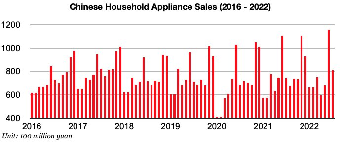
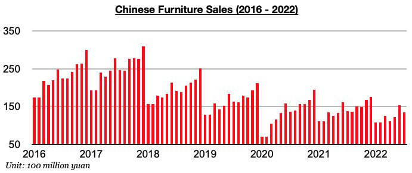
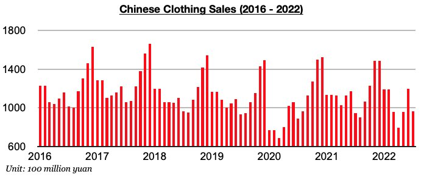

# Chinese Consumer Spending Showing Growth

**Date:** August 25, 2022  
**Publisher:** Breakwave Advisors | **Category:** Market Insights  
**Original URL:** [https://www.breakwaveadvisors.com/insights/2022/8/25/chinese-consumer-spending-showing-growth](https://www.breakwaveadvisors.com/insights/2022/8/25/chinese-consumer-spending-showing-growth)  

---

*By*[*Jeffrey Landsberg*](https://www.linkedin.com/in/jeffrey-landsberg-70ab957/)

Consumer spending in China has now experienced year-on-year growth for two straight months, most recently rising by 2.7% in July. Prior to these last two months, spending had contracted on a year-on-year basis for three consecutive months. As we have continued to stress in Commodore's Weekly China Reports, coronavirus cases and restrictions eased significantly in June and this has helped allow consumer spending to start growing again. Domestic appliance sales and domestic clothing sales in July each grew on a year-on-year basis for only the second month since February. In addition, domestic furniture sales again also contracted on a year-on-year basis by the smallest amount since February.

Domestic appliance sales (which includes consumer electronics) totaled 80.8 billion yuan last month, which has marked a year-on-year increase of 9%. Prior to these last two months, sales contracted on a year-on-year basis during March, April, and May, with the contraction during that period averaging 6%*)*.

> **Figure 1: Chart 1 (44)**  
> [Local Asset](file:///C:/Users/Dell/Github/Shipping/corpus/03-breakwave/insights/2022/assets/2022-08-25_chinese-consumer-spending-showing-growth_img_chart1284429_be01c14428ba.jpg)

Furniture sales in June totaled 13.4 billion yuan, which has marked a year-on-year contraction of 3%. Furniture sales have now contracted on a year-on-year basis for twelve consecutive months.

> **Figure 2: Chart 2 (39)**  
> [Local Asset](file:///C:/Users/Dell/Github/Shipping/corpus/03-breakwave/insights/2022/assets/2022-08-25_chinese-consumer-spending-showing-growth_img_chart2283929_089795c3862d.jpg)

Clothing sales (which includes garments, footwear, hats, and knitwear) in July totaled 96.4 billion yuan, which has marked a year-on-year increase of 2%. Prior to these last two months, sales contracted on a year-on-year basis during March, April, and May, with the contraction during that period averaging 18%.

> **Figure 3: Chart 3 (30)**  
> [Local Asset](file:///C:/Users/Dell/Github/Shipping/corpus/03-breakwave/insights/2022/assets/2022-08-25_chinese-consumer-spending-showing-growth_img_chart3283029_1d5581db276f.jpg)
