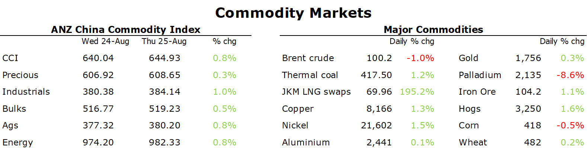

# Copper gains as China throws more stimulus measures at economy

**Date:** August 26, 2022  
**Publisher:** Breakwave Advisors | **Category:** Market Insights  
**Original URL:** [https://www.breakwaveadvisors.com/insights/2022/8/26/copper-gains-as-china-throws-more-stimulus-measures-at-economy](https://www.breakwaveadvisors.com/insights/2022/8/26/copper-gains-as-china-throws-more-stimulus-measures-at-economy)  

---

*By*[*Daniel Hynes*](https://www.linkedin.com/in/dahynes/)

A risk-off tone across markets helped push commodities higher in choppy trading. A weaker USD also boosted investor appetite.

> **Figure 1: 1661464589241**  
> **Interactive Data & Source:** [Publications Anz](https://publications.anz.com/SingletrackCMS__DownloadDocument?docRef=b8318fde-225b-4b40-b50b-6c9ea45b43fd&uid=bd219b92-f5cc-400e-9646-4178791864b7&jobRef=d35f02e3-ec6d-4ddf-9fcb-e0dc4e74f349) | [Local Asset](file:///C:/Users/Dell/Github/Shipping/corpus/03-breakwave/insights/2022/assets/2022-08-26_copper-gains-as-china-throws-more-stimulus-measures-at-economy_img_1661464589241_c1eebc6b4a31.png)

**Copper**led the base metals sector higher as China increased its support of the economy with a CNY1tn of measures to bolster growth. This includes a CNY300bn investment in infrastructure projects that should support consumption of industrial metals. Much of this could be directed into the power grid to help ease an energy crisis in the country. An effort to connect renewable energy projects in China’s far west with its big energy consuming cities in the east is boosting investment in ultra-high-voltage power lines. Power shortages in Sichuan, where a drought has hindered hydro generation, could see investment ploughed into improving the connectivity. Beijing had already earmarked an increase in grid investment, but these latest issues are likely to fast-track projects over the next year. This will see[**stronger demand for metals such as copper and aluminium**](https://publications.anz.com/SingletrackCMS__DownloadDocument?docRef=b8318fde-225b-4b40-b50b-6c9ea45b43fd&uid=bd219b92-f5cc-400e-9646-4178791864b7&jobRef=d35f02e3-ec6d-4ddf-9fcb-e0dc4e74f349)in China, despite the property sector headwinds that are weighing on their use in construction.

The stimulus measures boosted optimism for the**steel and iron ore**market. Futures of the steel making raw material gained as much as 1.8% in Singapore. However, those gains were pared as investors assessed the strength of the demand recovery in steel markets. Weak margins for steel mills could deter them from restarting operations ahead of the traditional peak construction season.

**Crude oil**snapped a three-day rally as hawkish comments from Fed officials cast a cloud over the economic backdrop. Nevertheless, signs of strong demand are emerging. The most recent Congestion Index data from TomTom shows Asia Pacific, European and North American traffic levels all posting strong weekly growth in the week to August 24. Nationwide congestion levels in China rebounded after the previous week's drop, according to Baidu data. Saudi Arabia was joined by Libya and Congo in supporting the view that supply curbs may be needed to stabilise the oil market. Even so, supply side issues continue to crop up. Kazakhstan's exports of crude may be impacted for months amid repair works required on three damage moorings at the port facility. Daily volumes had already been down 20% due to a string of other maintenance issues. Approximately 1.3mb/d was expected in August.

**European energy markets**extended recent gains as the continent faces severe shortages over winter. German and French power soared to fresh records after EDF said that more of its reactors will take longer to come back online after halts. The outages effect almost 14% of France’s total nuclear capacity. Coupled with tighter hydropower supply, this places more reliance on gas for power generation, dragging**European natural gas**higher, with Dutch front-month futures rising 10% top end the session as EUR321.41/MWh. However, aside from curtailed Russia gas flows, the market is seeing further disruptions. Gas facilities in Norway are undergoing seasonal maintenance, which will continue next month. The Freeport LNG export terminal has delayed its restart to November. This is driving competition for LNG higher.**North Asian LNG**spot prices also gained, with JKM futures rising 5.6% to USD69.96/MMBtu.

**Gold**found some support from a weaker USD early in the session. That quickly evaporated after some mixed economic data. Hawkish comments from Fed officials ahead of Powell’s Jackson Hole speech also weighed on investor demand.

Data source:[Commodities Wrap](https://www.linkedin.com/newsletters/commodities-wrap-6692196755876012032/?fbclid=IwAR3kiXJqZdxmp9ZcRwBNI7FsBySI-XSC0pfPur1qzjt7OZp7PTE59Tsl1QI)
