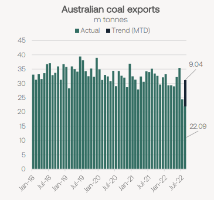
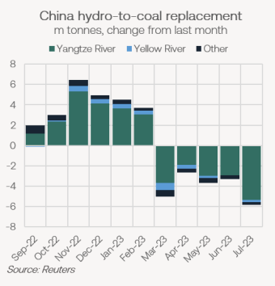
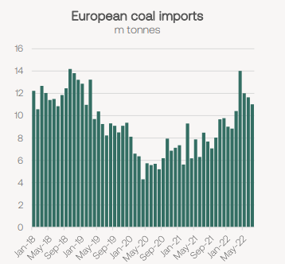

# Braemar Weekly Dry Market Report

**Date:** August 27, 2022  
**Publisher:** Breakwave Advisors | **Category:** Market Insights  
**Original URL:** [https://www.breakwaveadvisors.com/insights/2022/8/26/weekly-dry-market-report](https://www.breakwaveadvisors.com/insights/2022/8/26/weekly-dry-market-report)  

---

*By*[*Mark Nugent*](https://www.linkedin.com/in/mark-nugent-3724a3192/)

## Looking Towards the Winter

Energy prices are continuing to firm in Europe and weather is driving supply/demand changes across several regions. We look at how these recent developments shape the outlook for seaborne coal demand going forward.

## More Issues on the Way in Australia?

Following the heavily disrupted month of July for Australian coal exports, shipments in August are on track to recover back above 30m tonnes. In July, the extreme weather resulted in the country’s lowest level of monthly coal exports on record, amounting to 24.4m tonnes. The fall in exports in July added to pressures in other trades for the larger vessels in the Pacific as ships opted to avoid Australia’s east coast.

> **Figure 1: Market Chart 1**  
> [Local Asset](file:///C:/Users/Dell/Github/Shipping/corpus/03-breakwave/insights/2022/assets/2022-08-27_weekly-dry-market-report_img_image028429_8c7e91fe02a3.png)

Looking forward, fresh weather reports suggest more rainfall is on the horizon, as even moderate precipitation can now put pressure on the country’s coal supply chains. Mining pits typically have water storage facilities, many of which will be near capacity following the flooding in July, making further draining more difficult. Current weather forecasts indicate more rainfall is to come in the next couple of weeks, in which we could see another slowdown in coal shipments in the region as we did in July, but likely to a lesser extent.

## China Drought Disrupting Hydro Output

In China, several weather stations along the Yangtze have reportedly recorded their highest ever temperatures in the past week. According to Reuters estimates, hydro-to-coal replacement for the rest of the year in China has increased by 16.2m tonnes versus last month’s predictions due to the persistent dryness. At present, several cities around the Yangtze river have been asked to reduce their power needs by any means necessary to stabilise the power grid. This has included the industrial and manufacturing sectors such as automobiles, batteries and solar manufacturing.

> **Figure 2: Market Chart 2**  
> [Local Asset](file:///C:/Users/Dell/Github/Shipping/corpus/03-breakwave/insights/2022/assets/2022-08-27_weekly-dry-market-report_img_image128429_ca016ceb4a13.png)

While positive for Chinese coal demand, it is not likely the country’s seaborne interest will see any significant increase as a result. The sharp rise in domestic coal production and weak industrial demand for coal in recent months has allowed for inventories to grow at power utilities in the country and therefore the situation is still manageable without a scramble for seaborne volumes. Average daily coal imports in China currently lie at 847k tonnes in August, 17.1% below that of August last year. Practically all of the coal volumes arriving on bulk carriers to China have come from Indonesia and Russia. In July, Chinese imports of Russian coal hit their highest level on record at 7.5m tonnes. However, 87% of these volumes loaded at Russia’s far-eastern ports, such as from Shakhtersk at 1.4m tonnes. At 5.5 days (bss Shakhtersk—Qingdao), this voyage is approximately 25 days less than that from Taman in the Black Sea for example. Therefore, despite the increase in coal shipments from Russia to China, this has not provided the surge in bulk carrier demand that may have been expected if the majority of volumes originated in the Black Sea.

> **Figure 3: Market Chart 3**  
> [Local Asset](file:///C:/Users/Dell/Github/Shipping/corpus/03-breakwave/insights/2022/assets/2022-08-27_weekly-dry-market-report_img_image328529_2247b21947e9.png)

## Rhine Water Levels Back Above Minimum

Following weeks of falling water levels on the Rhine, which inherently reduced ARA ports’ capacity to discharge coal, some relief has come with wetter weather as the river have returned above the minimum level for barges. Subsequently, coal stocks have started to fall at ports in the region. Europe has continued to re-commission power plants for increased coal burn as the bloc plans for declining natural gas supplies from Russia, which bodes well for further increases in European coal purchases on the seaborne market. In July, European coal imports totalled 11m tonnes, falling for the third consecutive month. August imports have averaged 381k tonnes per day, suggesting a total of 11.8m tonnes for the month, still lower than arrivals in both April and May.

> **Figure 4: Market Chart 4**  
> [Local Asset](file:///C:/Users/Dell/Github/Shipping/corpus/03-breakwave/insights/2022/assets/2022-08-27_weekly-dry-market-report_img_image328529_2247b21947e9.png)

Germany has also agreed on legislation this week that will see priority on the country’s rail network be given to energy transport. This has come in response to the situation on the Rhine. Again, this move should improve inland logistics for coal in Europe which the river levels severely disrupted in recent months. Overall, we continue to see strength in European seaborne coal demand and the easing of inland transportation constraints should drive more buying interest from utilities, which have mildly slowed down ordering in recent weeks.
