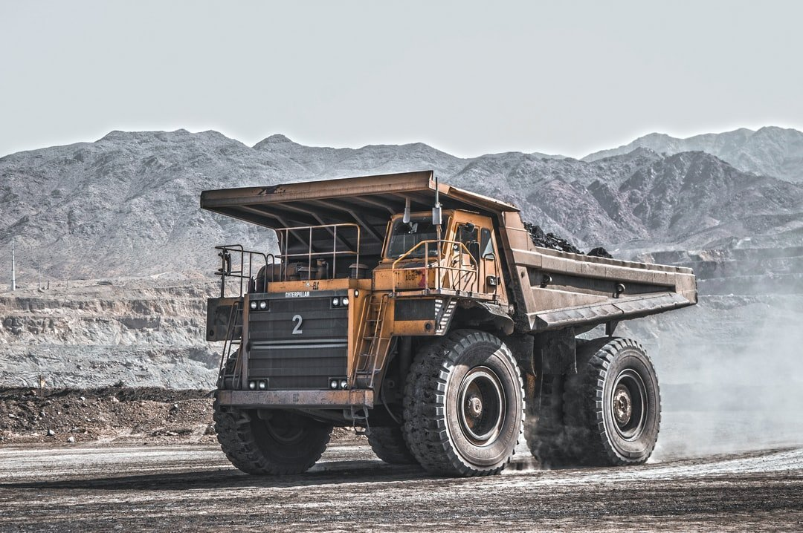
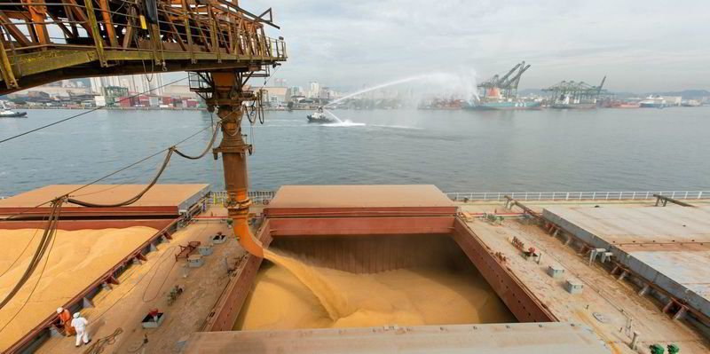

# Weekly Insights Review

**Date:** August 28, 2022  
**Publisher:** Breakwave Advisors | **Category:** Market Insights  
**Original URL:** [https://www.breakwaveadvisors.com/insights/2022/8/28/weekly-insights-review](https://www.breakwaveadvisors.com/insights/2022/8/28/weekly-insights-review)  

---

## Welcome to Our Weekly Insights Review

## Read Here Everything You Need to Know

> **Figure 1: Greek+kaiki**  
> **Interactive Data & Source:** [Breakwave Advisors Market Insights](https://www.breakwaveadvisors.com/insights/2022/8/23/shipping-decarbonization-weekly-insights) | [Local Asset](file:///C:/Users/Dell/Github/Shipping/corpus/03-breakwave/insights/2022/assets/2022-08-28_weekly-insights-review_img_greek2bkaiki_120f93109f02.jpg)

## Shipping Decarbonization Weekly Insights

## Latest Trends

Waste-based biofuels could be a key driver of the energy transition transforming today’s limited supply of low-carbon transportation fuels and creating a local, circular economy, according to a new report by research and consultancy group Wood Mackenzie.
[Read More](https://www.breakwaveadvisors.com/insights/2022/8/23/shipping-decarbonization-weekly-insights)

## Market Comment: ‘Paradigm Shift’ Deferred, But Not for Long

## The Fed Is Still ‘the Only Game in Town’ for Markets

Frank Herbert’s ‘[Dune](https://en.wikipedia.org/wiki/Dune_(novel))’, one of the most epic sci-fi novels of all time (and the subject of a less-great 1984 Kyle MacLachlan[movie](https://www.imdb.com/title/tt0087182/)), featured, amongst other things, a mystical far-future sisterhood, called the Bene Gesserit.
[Read More](https://www.breakwaveadvisors.com/insights/2022/8/22/market-comment-paradigm-shift-deferred-but-not-for-long)

> **Figure 2: 243**  
> **Interactive Data & Source:** [Breakwave Advisors Market Insights](https://www.breakwaveadvisors.com/insights/2022/8/22/chinas-coal-and-iron-ore-imports-remain-in-contraction) | [Local Asset](file:///C:/Users/Dell/Github/Shipping/corpus/03-breakwave/insights/2022/assets/2022-08-28_weekly-insights-review_img_243_26511b74f458.jpeg)

## China's Coal and Iron Ore Imports Remain in Contraction

## China's Iron Ore and Coal Imports Were Each Able to Climb on a M-O-M Basis Last Month

China's iron ore and coal imports most recently were each able to climb on a month-on-month basis last month, but..
[Read More](https://www.breakwaveadvisors.com/insights/2022/8/22/chinas-coal-and-iron-ore-imports-remain-in-contraction)

> **Figure 3: Coal6**  
> **Interactive Data & Source:** [Breakwave Advisors Market Insights](https://www.breakwaveadvisors.com/insights/2022/8/22/are-chinas-crude-imports-on-a-path-to-recovery) | [Local Asset](file:///C:/Users/Dell/Github/Shipping/corpus/03-breakwave/insights/2022/assets/2022-08-28_weekly-insights-review_img_coal6_da289607770f.jpg)

> **Figure 4: Revovery**  
> **Interactive Data & Source:** [Breakwave Advisors Market Insights](https://www.breakwaveadvisors.com/insights/2022/8/22/are-chinas-crude-imports-on-a-path-to-recovery) | [Local Asset](file:///C:/Users/Dell/Github/Shipping/corpus/03-breakwave/insights/2022/assets/2022-08-28_weekly-insights-review_img_revovery_ea760a4c4ec0.jpeg)

## Are China’s Crude Imports on a Path to Recovery?

## Is a Long-Awaited Recovery in Sight?

China’s seaborne crude imports in August (days representing 1-18) have breached the 8mbd mark, up marginally from the 7.9mbd average seen in the past two months but remains 10% below last year’s volumes.
[Read More](https://www.breakwaveadvisors.com/insights/2022/8/22/are-chinas-crude-imports-on-a-path-to-recovery)

## Shipfix Data: Ukrainian Grain Orders Are Starting to Lift Off

> **Figure 5: Grain+cargo**  
> **Interactive Data & Source:** [Breakwave Advisors Market Insights](https://www.breakwaveadvisors.com/insights/2022/7/22/ndias-coal-production-and-thermal-coal-derived-electricity-generation-both-remain-strong) | [Local Asset](file:///C:/Users/Dell/Github/Shipping/corpus/03-breakwave/insights/2022/assets/2022-08-28_weekly-insights-review_img_grain2bcargo_e4b1d3174155.jpg)

## The Majority of These Grains Are Heading to China, Turkey, Indonesia, Egypt and Spain

A total of 24 ships carrying 948,000 Mts of grain have now found their way out of war-torn Ukraine since the UN grain corridor was established on the 23rd of July.

## Crude Oil Extends Gains As OPEC Support Hangs Over Market

## Commodity Markets Pushed Higher As Ongoing Supply Shortages Offset Concerns of Weaker Demand

A weaker USD also helped boost investor appetite for the sector.
[Read More](https://www.breakwaveadvisors.com/insights/2022/8/24/crude-oil-extends-gains-as-opec-support-hangs-over-market)

## Chinese Consumer Spending Showing Growthspending Had Contracted on a Year-on-Year Basis for Three Consecutive Months

Consumer spending in China has now experienced year-on-year growth for two straight months, most recently rising by 2.7% in July.
[Read More](https://www.breakwaveadvisors.com/insights/2022/8/25/chinese-consumer-spending-showing-growth)

> **Figure 6: Unsplash Image Lvma9fjoywk**  
> **Interactive Data & Source:** [Breakwave Advisors Market Insights](https://www.breakwaveadvisors.com/insights/2022/7/22/european-gas-rises-as-russian-gas-flows-restart-slowly) | [Local Asset](file:///C:/Users/Dell/Github/Shipping/corpus/03-breakwave/insights/2022/assets/2022-08-28_weekly-insights-review_img_unsplash-image-lvma9fjoywk_93bd2d2258de.jpg)

> **Figure 7: Unsplash Image Wp2ovy14tjs**  
> **Interactive Data & Source:** [Breakwave Advisors Market Insights](https://www.breakwaveadvisors.com/insights/2022/7/22/european-gas-rises-as-russian-gas-flows-restart-slowly) | [Local Asset](file:///C:/Users/Dell/Github/Shipping/corpus/03-breakwave/insights/2022/assets/2022-08-28_weekly-insights-review_img_unsplash-image-wp2ovy14tjs_80b1ba143651.jpg)

## Crude Tankers: Russian Invasion Sets the Tone But China’s Behaviour Has the Last Say

## Chinese Purchasing Activity Is and Will Remain a Barometer for Tanker Recovery.

Six months have passed since the invasion of Russia in Ukraine, which caught most of the world and in consequence – shipping markets – by surprise.
[Read More](https://www.breakwaveadvisors.com/insights/2022/7/22/european-gas-rises-as-russian-gas-flows-restart-slowly)

> **Figure 8: Unsplash Image Uwq F5g4yoo**  
> **Interactive Data & Source:** [Breakwave Advisors Market Insights](https://www.breakwaveadvisors.com/insights/2022/8/26/copper-gains-as-china-throws-more-stimulus-measures-at-economy) | [Local Asset](file:///C:/Users/Dell/Github/Shipping/corpus/03-breakwave/insights/2022/assets/2022-08-28_weekly-insights-review_img_unsplash-image-uwq-f5g4yoo_8117ecf1dd7f.jpg)

## Copper Gains As China Throws More Stimulus Measures at Economy

## A Risk-Off Tone Across Markets Helped Push Commodities Higher in Choppy Trading

A weaker USD also boosted investor appetite.
[Read More](https://www.breakwaveadvisors.com/insights/2022/8/26/copper-gains-as-china-throws-more-stimulus-measures-at-economy)

**.**

## Braemar Weekly Dry Market Report

## The Big Picture: Coal Update

Energy prices are continuing to firm in Europe and weather is driving supply/demand changes across several regions.
[Read More](https://www.breakwaveadvisors.com/insights/2022/8/26/weekly-dry-market-report)

> **Figure 9: Unsplash Image Iuvjqubfi9g**  
> [Local Asset](file:///C:/Users/Dell/Github/Shipping/corpus/03-breakwave/insights/2022/assets/2022-08-28_weekly-insights-review_img_unsplash-image-iuvjqubfi9g_77b1cb54386f.jpg)
