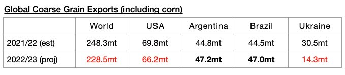
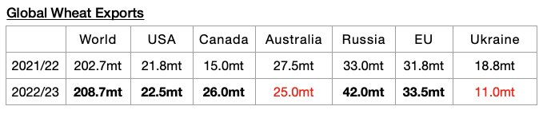
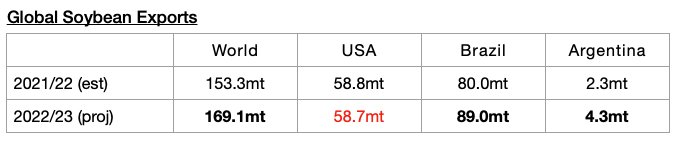
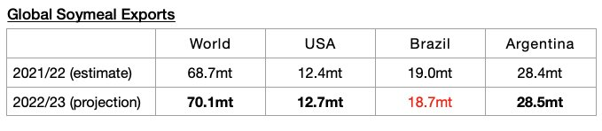

# More Grain Expected To Be Exported

**Date:** August 29, 2022  
**Publisher:** Breakwave Advisors | **Category:** Market Insights  
**Original URL:** [https://www.breakwaveadvisors.com/insights/2022/8/29/more-grain-expected-to-be-exported](https://www.breakwaveadvisors.com/insights/2022/8/29/more-grain-expected-to-be-exported)  

---

*By*[*Jeffrey Landsberg*](https://www.linkedin.com/in/jeffrey-landsberg-70ab957/)

The United States Department of Agriculture (USDA) recently released their latest global grain export forecast for the upcoming 2022/23 season and has raised it higher. The forecast is of course still very preliminary, but of note is that 491.8 million tons of exports are now expected. This is 5.1 million tons (1%) more than was forecast a month ago but would still mark a year-on-year decline of 13.8 million tons (-3%). However, global soybean exports (soybeans are not technically classified as a grain) are now expected to rise year-on-year by close to 16 million tons (discussed in more detail below).

The USDA is now forecasting that global coarse grain exports in 2022/23 will total 228.5 million tons, which is 1.8 million tons (1%) more than was forecast a month ago but would mark a year-on-year decline of 19.8 million tons (-8%).

> **Figure 1: Chart 1 (45)**  
> [Local Asset](file:///C:/Users/Dell/Github/Shipping/corpus/03-breakwave/insights/2022/assets/2022-08-29_more-grain-expected-to-be-exported_img_chart1284529_77cc7f609d19.jpg)

Global wheat exports are expected to total 208.7 million tons. This is 3.2 million tons (2%) more than was forecast a month ago and would mark a year-on-year increase of 6 million tons (3%).

> **Figure 2: Chart 2 (40)**  
> [Local Asset](file:///C:/Users/Dell/Github/Shipping/corpus/03-breakwave/insights/2022/assets/2022-08-29_more-grain-expected-to-be-exported_img_chart2284029_319d48f62b51.jpg)

Global soybean exports are expected to total 169.1 million tons. This is 200,000 tons more than was forecast a month ago and would mark a year-on-year increase of 15.8 million tons (10%).

> **Figure 3: Chart 3 (31)**  
> [Local Asset](file:///C:/Users/Dell/Github/Shipping/corpus/03-breakwave/insights/2022/assets/2022-08-29_more-grain-expected-to-be-exported_img_chart3283129_40187e7c4240.jpg)

Global soymeal exports are expected to total 70.1 million tons. This is 200,000 tons more than was forecast a month ago and would mark a year-on-year increase of 1.4 million tons (2%).

> **Figure 4: Chart 4 (16)**  
> [Local Asset](file:///C:/Users/Dell/Github/Shipping/corpus/03-breakwave/insights/2022/assets/2022-08-29_more-grain-expected-to-be-exported_img_chart4281629_b0f3ce083f90.jpg)
