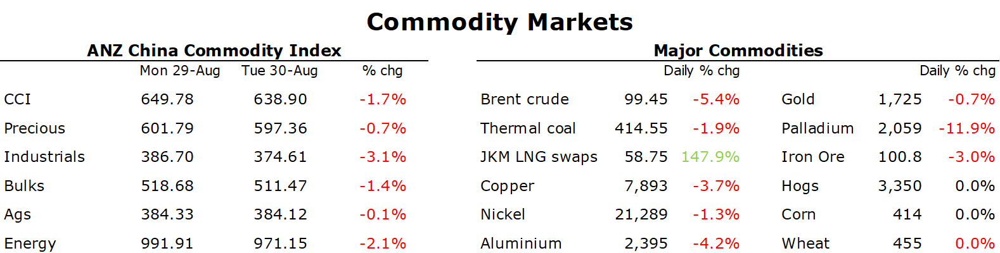

# Metals slump as fears of weak demand in China linger

**Date:** August 31, 2022  
**Publisher:** Breakwave Advisors | **Category:** Market Insights  
**Original URL:** [https://www.breakwaveadvisors.com/insights/2022/8/31/metals-slump-as-fears-of-weak-demand-in-china-linger](https://www.breakwaveadvisors.com/insights/2022/8/31/metals-slump-as-fears-of-weak-demand-in-china-linger)  

---

*By*[*Daniel Hynes*](https://www.linkedin.com/in/dahynes/)

A risk off tone across markets saw commodity markets come under pressure. This was exacerbated by worsening outbreaks of COVID-19 in China, raising fears of further lockdowns weakening demand.

> **Figure 1: 1661897750623 (1)**  
> **Interactive Data & Source:** [Linkedin](https://www.linkedin.com/newsletters/commodities-wrap-6692196755876012032/?fbclid=IwAR3kiXJqZdxmp9ZcRwBNI7FsBySI-XSC0pfPur1qzjt7OZp7PTE59Tsl1QI) | [Local Asset](file:///C:/Users/Dell/Github/Shipping/corpus/03-breakwave/insights/2022/assets/2022-08-31_metals-slump-as-fears-of-weak-demand-in-china-linger_img_166189775062328129_b02f9a882fc9.png)

**Base metal**markets reopened in London in a bearish mood amid concerns of virus lockdowns in China hurting demand. Outbreaks of COVID-19 have emerged in every province over the past week despite strict measures to control the virus. This is starting to impact confidence, with US companies increasingly delaying or cancelling investments in the country.**Aluminium**led the sector lower after supply side issues eased. Smelters in Sichuan are restarting following two weeks of stoppages due to power shortages caused by the drought. Falls in European energy prices have also alleviated concerns of further output cuts in the region. This is despite Alcoa warning it will reduce output at its Norwegian smelter by one third. This comes against a weakening economic backdrop as central banks look to tighten monetary conditions to suppress inflation.

**Iron ore**fell below USD100/t for the first time in five weeks amid a crisis in China’s steel industry. Baoshan Iron & Steel, the world’s biggest steel producer, warned it is facing severe challenges in the third quarter. Restrictions on output in Tangshan could see output fall substantially. The steel industry is also battling a property crisis that shows no signs of easing. A lack of growth in construction activity will keep steel and iron ore demand weak in the short term.

The risk off tone also weighed on**crude oil**markets, with Brent crude falling below USD100/bbl. Worsening outbreaks of COVID-19 in China are also impacting sentiment. China’s independent refiners are planning to increase maintenance in September amid the weak demand backdrop. That will likely drag on crude oil demand. Supply side issues also eased. Clashes in Iraq have yet to impact oil production. Supporters of Moqtada Al-Sadr have battled with Iraqi security forces amid a deepening political crisis in the OPEC member state. Iraq’s national oil company, SOMO, said it has the capacity to increase exports to all destinations and won’t refuse requests for more oil. This comes as negotiations over the 2015 Iran nuclear deal progress. The US and Iran are at loggerheads over key details, which may take several weeks to resolve.

**European energy**prices slumped as authorities threatened to step up efforts to curb the crisis. The European Union warned it will intervene in power markets and is currently studying various options to bring down the prices of electricity, although it could take weeks to hash out and implement. This sent German and French power prices tumbling 20%. This weighed on European gas, with Dutch front month futures extending Monday’s losses. Nevertheless, gas flows into Europe continue to fall. Russia halted supplies to French utility Engie SA because of a disagreement over payments and a full cut-off of gas will commence from 1 September after Gazprom said it had not received payment for July deliveries. This comes ahead of a three-day maintenance shutdown of the Nord Stream pipeline which will cut gas flows completely into the continent. The falls in Europe saw**North Asian LNG**spot prices also come under pressure. Nevertheless, top LNG importers are showing no signs of letting up on purchases of cargoes heading into the Northern Hemisphere winter.

**Gold**edged lower in the wake of Fed Chair Jerome Powell’s hawkish speech at Jackson Hole last week. With central bankers making it clear they will do everything to tame inflation, interest rates are likely to rise sharply in coming months.

Data source:[Commodities Wrap](https://www.linkedin.com/newsletters/commodities-wrap-6692196755876012032/?fbclid=IwAR3kiXJqZdxmp9ZcRwBNI7FsBySI-XSC0pfPur1qzjt7OZp7PTE59Tsl1QI)
