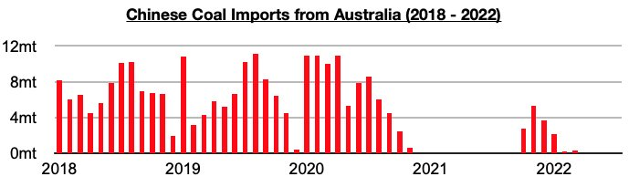
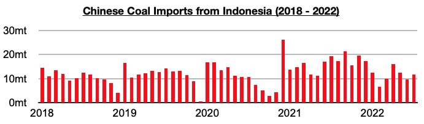
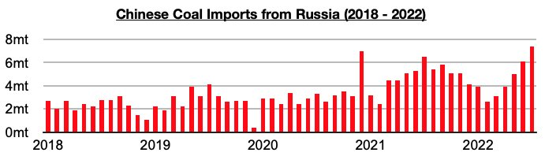

# China Buying Even More Russia Coal

**Date:** September 01, 2022  
**Publisher:** Breakwave Advisors | **Category:** Market Insights  
**Original URL:** [https://www.breakwaveadvisors.com/insights/2022/9/1/china-buying-even-more-russia-coal](https://www.breakwaveadvisors.com/insights/2022/9/1/china-buying-even-more-russia-coal)  

---

*By*[*Jeffrey Landsberg*](https://www.linkedin.com/in/jeffrey-landsberg-70ab957/)

China's coal import data for July by origin was recently released and shows that imports from Indonesia have remained the primary source of imports and Russia the second largest source. Also of note is that July again saw no imports from Australia. China had previously imported coal from Australia for six straight months before suspending imports again starting in April.

> **Figure 1: Chart 1 (46)**  
> [Local Asset](file:///C:/Users/Dell/Github/Shipping/corpus/03-breakwave/insights/2022/assets/2022-09-01_china-buying-even-more-russia-coal_img_chart1284629_07c92950cb74.jpg)

Coal imports from Indonesia totaled 11.7 million tons in July, which is up from June by 2.1 million tons (22%) but down year-on-year by 7.7 million tons (-40%).

> **Figure 2: Chart 2 (41)**  
> [Local Asset](file:///C:/Users/Dell/Github/Shipping/corpus/03-breakwave/insights/2022/assets/2022-09-01_china-buying-even-more-russia-coal_img_chart2284129_2da8f6d29dd3.jpg)

Coal imports from Russia totaled 7.4 million tons, which is up from June by 1.3 million tons (21%) and up year-on-year by 900,000 tons (14%). Imports from Russia came in at the highest level seen in over five years. We continue to stress that Russia and China have been strengthening their relationship and that China’s coal imports from Russia are poised to continue to grow.

> **Figure 3: Chart 3 (32)**  
> [Local Asset](file:///C:/Users/Dell/Github/Shipping/corpus/03-breakwave/insights/2022/assets/2022-09-01_china-buying-even-more-russia-coal_img_chart3283229_3d498ca380ae.jpg)

As we also have been examining in our Weekly China Reports, imports from Russia have risen sharply as we have anticipated during the months since April’s tariff cut. The last three months have seen imports average 6.2 million tons. This marks an impressive 2.8 million tons (82%) increase from the 3.4 million ton average that was seen this year before the tariff cut. Overall, we continue to believe that April's coal import tariff cut was done with Russian imports in mind. Thermal coal imports from Russia previously had a 6% tariff. Indonesia, China's largest source of coal imports, already had a tariff rate of zero.
