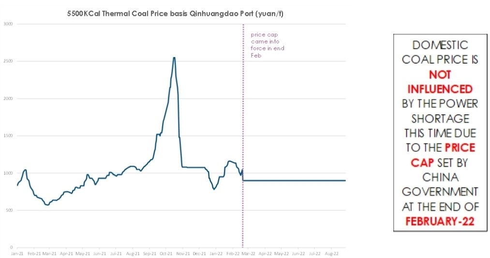
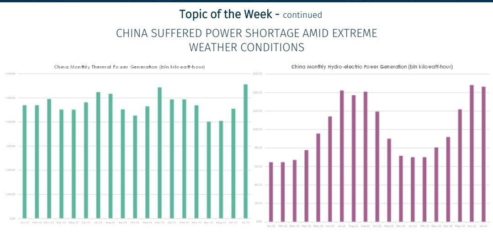
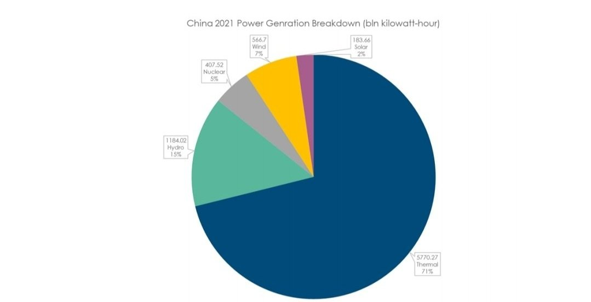
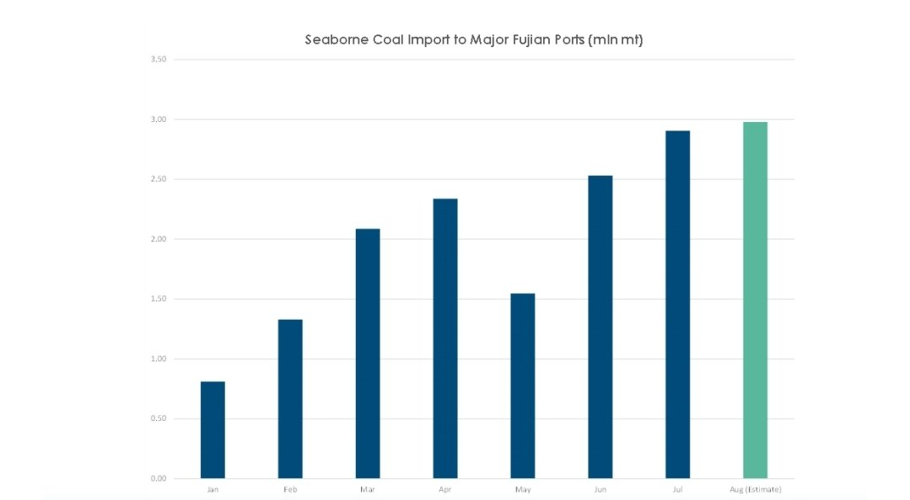

# BRS Dry Bulk Weekly Newsletter

**Date:** September 02, 2022  
**Publisher:** Breakwave Advisors | **Category:** Market Insights  
**Original URL:** [https://www.breakwaveadvisors.com/insights/2022/9/2/brs-dry-bulk-weekly-newsletter](https://www.breakwaveadvisors.com/insights/2022/9/2/brs-dry-bulk-weekly-newsletter)  

---

There had been a shortage of power supply caused by high temperatures and worsened by sparse rains in major Chinese provinces including Sichuan, Chongqing, Zhejiang, Anhui and Jiangsu. In response, the Chinese government, in a bid to ensure ample power for residential consumption, had issued a series of notices on electricity consumption, requiring industrial enterprises to consume electricity in an orderly fashion and execute off-peak electricity consumption plan. This latest manoeuvre is yet another large-scale power curtailment measure since last September-21. However, the reasons behind this attempt are different. In 2021, there was a lack of coal supplies (partially caused by a ban on Australian coal), against a recovering industrial activity following China’s emergence from the initial covid outbreak. These factors pushed the thermal coal price basis Qinhuangdao Port to an all-time peak of 2,550 yuan/t (see below). High fossil prices combined with inflexible electricity prices meant less generation by power plants to minimize losses. This led to rolling blackouts last year, especially for energy-intensive industries.

> **Figure 1: Screenshot 20220902 110742 Samsung Notes**  
> [Local Asset](file:///C:/Users/Dell/Github/Shipping/corpus/03-breakwave/insights/2022/assets/2022-09-02_brs-dry-bulk-weekly-newsletter_img_screenshot-20220902-110742-samsungno_938ed192e7da.jpg)

This year, however, the shortage of electricity was caused by “An Act of God”, extreme droughts. In Sichuan, the power shortage is a consequence of soaring electricity demand under high temperatures. Ironically, the drying out of reservoirs further aggravated the shortage of hydropower. To complicate matters, a large part of the power generation (82% via hydropower) in Sichuan is transferred to other Chinese provinces. For example, it forms 18% of electricity consumption in Shanghai. While accurate numbers are not yet available, it is estimated that entire hydropower generation in August will fall by around 20% from July to 12 billion kilowatt-hours. With the foreseeable weakening of the current heatwaves, power supply and industrial production are expected to see a rebound by late autumn. Hence, we cautiously estimate that the negative impact would be contained, affecting only industrial production in the local areas. As of writing, according to China Electricity Council officials, the power crunch in eastern and central China is forecasted to gradually subside, along with a decrease in air conditioning demand.

> **Figure 2: Screenshot 20220902 110758 Samsung+notes**  
> [Local Asset](file:///C:/Users/Dell/Github/Shipping/corpus/03-breakwave/insights/2022/assets/2022-09-02_brs-dry-bulk-weekly-newsletter_img_screenshot-20220902-110758-samsung2b_cb9d04084100.jpg)

CHINA ELECTRICITY MARKET OVERVIEW

According to National Bureau of Statistics (NBS) data, China's thermal power generation accounts for 71% of total power generation in 2021. Meantime, hydropower, nuclear, wind and solar power generation account for 15%, 5%, 7% and 2% respectively

> **Figure 3: Screenshot 20220902 110758 Samsung+notes**  
> [Local Asset](file:///C:/Users/Dell/Github/Shipping/corpus/03-breakwave/insights/2022/assets/2022-09-02_brs-dry-bulk-weekly-newsletter_img_screenshot-20220902-110758-samsung2b_a710bcdf40ec.jpg)

In recent years, on the back of the decarbonisation trend, wind power and solar power generation in China experienced rapid growth, accounting for 50% of total newly installed capacity of power generation facilities. Despite this trend, to ensure a reliable and stable electricity supply, thermal power will occupy an important role in the domestic electricity market, as evidenced by thermal power installed capacity managing to grow mildly year on year. Thermal power installation shall continue to grow in the next few years considering the successive commissioning of the on-going thermal power investment projects. Long run wise, the growth rate of thermal power installed capacity had to be significantly curbed to meet the government’s agenda on decarbonization and environmental protection.

On 19 August-22, the National Energy Administration (NEA) released the national power industry statistics from January to July. As of end July, the national installed capacity of power generation stood at 2.46 billion kilowatts, an increase of 8% year-on-year. From January to July, the national electricity consumption of the whole country was 4.93 trillion kilowatts, a year-on-year increase of 3.4%. Industry wise, the electricity consumption of the primary industry* was 63.4 billion kWh, a year-on-year increase of 11.1%, accounting for 1.3% of the electricity consumption of the whole country; the electricity consumption of the secondary industry was 3,255.2 billion kWh, a year-on-year increase of 1.1%, accounting for 66.0% of the electricity consumption of the whole country, and the contribution rate to the increment of electricity consumption of the whole country was 21.4%; electricity consumption of the tertiary industry 853.1 billion kWh, a year-on-year increase of 4.6%, accounting for 17.3% of the electricity consumption of the whole country; the domestic electricity consumption of urban and rural residents was 758.6 billion kWh, a year-on-year increase of 12.5% %, accounting for 15.4% of the electricity consumption of the whole country, and contributed 51.8% to the increment of electricity consumption of the whole country.

Representing more than 50% of the consumption increment, the data indicates that, actively or passively, more factories had given electricity priority to residential users amid tighter power supply and worsening macro-environment.

### Impact on Seaborne Market

The recent hydropower shortage caused by the heatwaves once again display the irreplaceable status of thermal power generation in the short term. NEA reiterated that China would strengthen thermal power generation to minimize the potential power supply uncertainties from hydro and other renewable energy under extreme conditions. Despite a total of new coal production capacity of 37.7 million tonnes per annum so far this year, seaborne coal import could be the best alternative to partially offset the temporary power shortage.

Theoretically speaking, as opposed to domestic coal, which would be difficult to ramp up its production in a very short time, seaborne coal could be quickly shipped to the coastal power plants in two weeks. It is rumoured that Fujian province introduced policies that allowed power plants with inventory above 14 days to sell electricity to power shortage areas with premium. Stimulated by this policy, seaborne freight level could be well supported with more Fujian coastal power plants rushing into the Indonesian coal market to increase their inventories. According to AXSMarine, seaborne coal volume to Fujian reached 1.14 mln mt in week 31, highest weekly volumes since 2019. However, given the constrained coal capacity (outside of Russia) on a global basis, Indonesian coal shipments heading to China should be limited ceiling. Moreover, seaborne coal imports into China are likely to drop with more domestic supply coming online. Therefore, there will be more short-term volatility and ensuing mismatch between supply and demand in the seaborne market.

> **Figure 4: Screenshot 20220902 110817 Samsung Notes**  
> [Local Asset](file:///C:/Users/Dell/Github/Shipping/corpus/03-breakwave/insights/2022/assets/2022-09-02_brs-dry-bulk-weekly-newsletter_img_screenshot-20220902-110817-samsungno_a63a7fcbe175.jpg)
