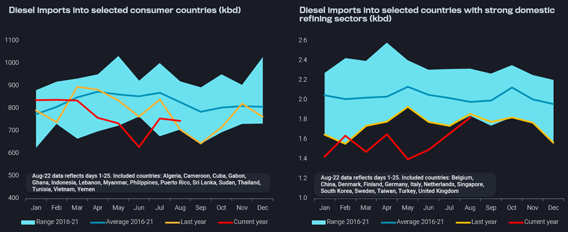
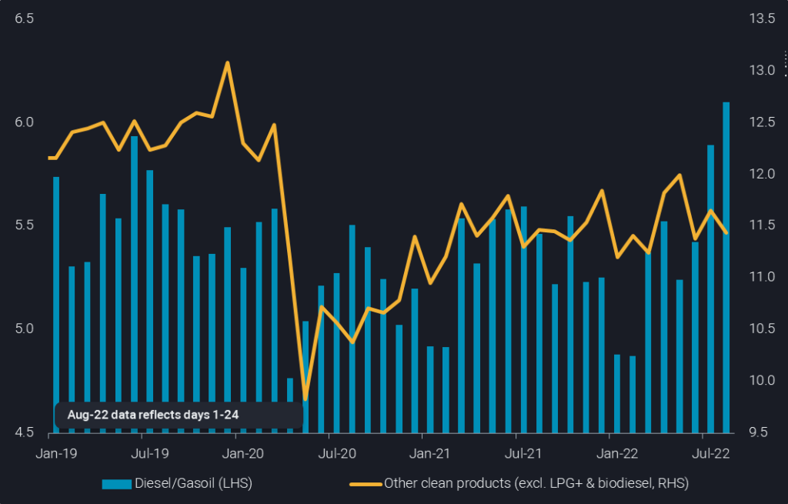
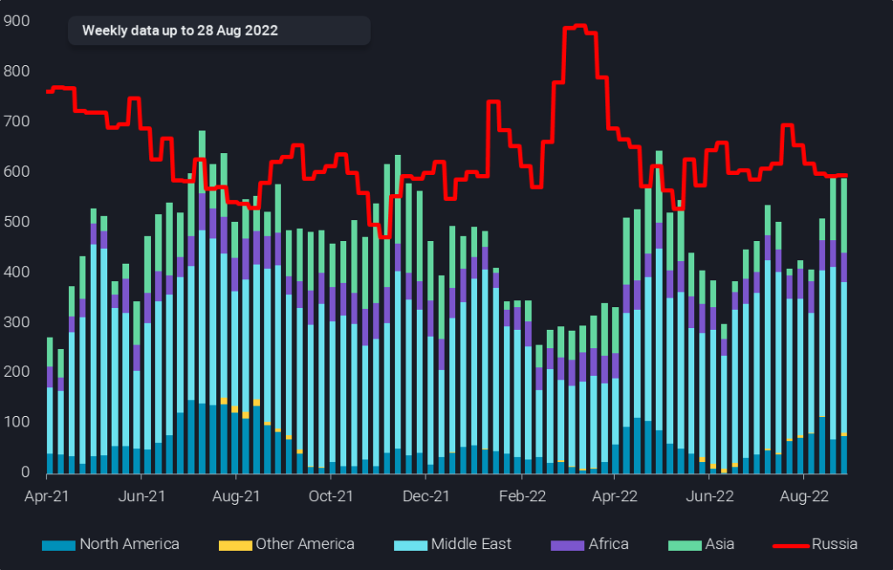

# Where are diesel cracks heading to?

**Date:** September 03, 2022  
**Publisher:** Breakwave Advisors | **Category:** Market Insights  
**Original URL:** [https://www.breakwaveadvisors.com/insights/2022/8/31/where-are-diesel-cracks-heading-to](https://www.breakwaveadvisors.com/insights/2022/8/31/where-are-diesel-cracks-heading-to)  

---

*By*[*David Wech*](https://www.linkedin.com/in/david-wech-83a163165/)

Just over the last couple of weeks, European diesel cracks have increased by $40/b – close to triple the typical trading range over recent years – to reclaim the $50+/b territory (Argus). However, this rally is nearly ridiculously tiny compared to what is going on in natural gas and power pricing. So what will the future bring: much higher diesel cracks to catch up with power and gas? Or was the correction in diesel cracks in early August to just about $10/b a valid warning signal that the boom period for the middle distillate will not go on forever, following the easing path of the crude oil complex?

## A Look at the (Potential) Bear Factors

Let’s start with the factors speaking for lower diesel cracks. The biggest downside factor is the global economy. Europe appears firmly headed into recession, while on a relative basis China may have fared even worse so far this year. But inflationary pressures far beyond energy, persistent supply chain issues, and massive geopolitical uncertainty are weighing on economic activity, with many developing countries muddling through on the verge of insolvency. Oil demand remains closely linked to GDP and is surely falling short of expectations already for some time, at least since late Q1 2022, with disappointing petchem feedstocks playing a crucial role.

But is it true that diesel demand is save from the demand downside as lofty prices may suggest? Certainly not. In the left-hand chart below diesel imports in a group of mostly smaller consuming countries are shown from a seasonal perspective. While in the first quarter imports have still been 4% above the 2016-21 average, they fell short of that benchmark by an average 15% since then. The massive downtrend in Q2 is surely reflecting the repercussions of strongly rising outright prices on import and consumption levels.

> **Figure 1: Chart 3 20220829 3**  
> **Interactive Data & Source:** [Analytics Vortexa](https://analytics.vortexa.com/?dateRange=2019-01-01T00%3A00%3A00.000Z__2022-08-25T23%3A59%3A59.999Z&filtersEnabled=%5B%22p%22%2C%22o%22%2C%22d%22%2C%22d_r%22%2C%22v%22%2C%22intra%22%2C%22sts_o%22%2C%22c_o%22%2C%22w%22%5D&geoBreakdownOriginGlobal=region&intraMovementFilter=0&metric=bpd&movementEvent=unloading_start&page=Flows&products=%5B%22deda35eb9ca56b54e74f0ff370423f9a8c61cf6a3796fcb18eaeeb32a8c290bb%22%5D&tabId=c6f9e5c5-5194-4257-8a66-ff4ad1067951&timeSeriesProperty=destination_country&to=%5B%22ab254fbd275723cb1503ad9b6df84abb9acd9bf1de86c9f598f6498d6bb63a5b%22%2C%22609f0d4c317cf8488de1fe851667c803d6fcb56e8e75b4d751cf67fe7460d322%22%2C%22fde14d5b0b8f8c943d66e55b81254af86267988a6a44bdd755b75bd89cf01b11%22%2C%22d93823ebdbde2e10f127caa62e6a23e2599252cc1582387869fac188c7560246%22%2C%22e0e72896f2d07d134de6efb2d6541bed7e297e17f010f67f30247abc56d92c6c%22%2C%2287269b28eaea324d2c35e97b0ecc837ebc9a244faf94e260c08b518580b9e164%22%2C%2280ccd59a719f2767156694923e74dcea96baa78e9220c697e1e8dddaeef7bd8f%22%2C%2203b07ca887edb311bf70d7dc51a802539c73a404a23f3a2b08cf5e7a04128336%22%2C%2275d0436e9f47508020863fb5108eb31955a95d754083075d014f3564dfb432b5%22%2C%22739b312ae914cfc44ab85100d93f3ba28c22dfe7fbbd4cee9072c19a11d87411%22%2C%2220f1a57d5d8c667c827ce96dfe1390dfb2fa4eecc6c6a87910da4a0d5bb4f874%22%2C%22612eeab9024bfb733a1bb626524d40d7ace1c637097bf76d36d9395e269f4170%22%2C%22065aab207e6fe875caf93419bd6cfedcbb0933098c75e52a6702b75bdfe71c53%22%2C%22e1638e7a3cb9bd9c9b75f8903770c6fb3abe09f3aebca59447b2750c73b77fd5%22%2C%22833d6983cdb9e4c6c12bf3022bdae163f91a51f1cf9876c955137e5f996f9763%22%2C%22a17c19d4f322a201c1d136e828f69673ed2a7428f28f217f330379c5decefd1d%22%5D&vesselClassesExcluded=%5B%22tiny_tanker%22%5D) | [Local Asset](file:///C:/Users/Dell/Github/Shipping/corpus/03-breakwave/insights/2022/assets/2022-09-03_where-are-diesel-cracks-heading-to_img_chart-3-20220829-3_612fe57859ba.png)

**Diesel imports into selected**[**consumer**](https://analytics.vortexa.com/?dateRange=2019-01-01T00%3A00%3A00.000Z__2022-08-25T23%3A59%3A59.999Z&filtersEnabled=%5B%22p%22%2C%22o%22%2C%22d%22%2C%22d_r%22%2C%22v%22%2C%22intra%22%2C%22sts_o%22%2C%22c_o%22%2C%22w%22%5D&geoBreakdownOriginGlobal=region&intraMovementFilter=0&metric=bpd&movementEvent=unloading_start&page=Flows&products=%5B%22deda35eb9ca56b54e74f0ff370423f9a8c61cf6a3796fcb18eaeeb32a8c290bb%22%5D&tabId=c6f9e5c5-5194-4257-8a66-ff4ad1067951&timeSeriesProperty=destination_country&to=%5B%22ab254fbd275723cb1503ad9b6df84abb9acd9bf1de86c9f598f6498d6bb63a5b%22%2C%22609f0d4c317cf8488de1fe851667c803d6fcb56e8e75b4d751cf67fe7460d322%22%2C%22fde14d5b0b8f8c943d66e55b81254af86267988a6a44bdd755b75bd89cf01b11%22%2C%22d93823ebdbde2e10f127caa62e6a23e2599252cc1582387869fac188c7560246%22%2C%22e0e72896f2d07d134de6efb2d6541bed7e297e17f010f67f30247abc56d92c6c%22%2C%2287269b28eaea324d2c35e97b0ecc837ebc9a244faf94e260c08b518580b9e164%22%2C%2280ccd59a719f2767156694923e74dcea96baa78e9220c697e1e8dddaeef7bd8f%22%2C%2203b07ca887edb311bf70d7dc51a802539c73a404a23f3a2b08cf5e7a04128336%22%2C%2275d0436e9f47508020863fb5108eb31955a95d754083075d014f3564dfb432b5%22%2C%22739b312ae914cfc44ab85100d93f3ba28c22dfe7fbbd4cee9072c19a11d87411%22%2C%2220f1a57d5d8c667c827ce96dfe1390dfb2fa4eecc6c6a87910da4a0d5bb4f874%22%2C%22612eeab9024bfb733a1bb626524d40d7ace1c637097bf76d36d9395e269f4170%22%2C%22065aab207e6fe875caf93419bd6cfedcbb0933098c75e52a6702b75bdfe71c53%22%2C%22e1638e7a3cb9bd9c9b75f8903770c6fb3abe09f3aebca59447b2750c73b77fd5%22%2C%22833d6983cdb9e4c6c12bf3022bdae163f91a51f1cf9876c955137e5f996f9763%22%2C%22a17c19d4f322a201c1d136e828f69673ed2a7428f28f217f330379c5decefd1d%22%5D&vesselClassesExcluded=%5B%22tiny_tanker%22%5D)**and**[**refining**](https://analytics.vortexa.com/?dateRange=2019-01-01T00%3A00%3A00.000Z__2022-08-25T23%3A59%3A59.999Z&filtersEnabled=%5B%22p%22%2C%22o%22%2C%22d%22%2C%22d_r%22%2C%22v%22%2C%22intra%22%2C%22sts_o%22%2C%22c_o%22%2C%22w%22%5D&geoBreakdownOriginGlobal=region&metric=bpd&movementEvent=unloading_start&page=Flows&products=%5B%22deda35eb9ca56b54e74f0ff370423f9a8c61cf6a3796fcb18eaeeb32a8c290bb%22%5D&tabId=c6f9e5c5-5194-4257-8a66-ff4ad1067951&timeSeriesProperty=destination_country&to=%5B%22934c47f36c16a58d68ef5e007e62a23f5f036ee3f3d1f5f85a48c572b90ad8b2%22%2C%22bcd7dddaf951959ebf6076a3a594b426a246d3bffe13339b10d04e45f222e011%22%2C%22b15970adfcd316d11d698d13de23e2291a60e1fb05070feab30957c6645e576e%22%2C%22f04ac0af071c3907111e6e2b70e7198ae4385e921090b3d51a3dc3d806ebfcd5%22%2C%22a33b9df1b504c55afca13e04a3f2ba03fe7bd830471d843c92b1acd460c4fb6c%22%2C%22284c8d9831e1ac59c0cb714468856d561af722c8a2432c13a001f909b97e6b71%22%2C%227fed43c640957555ddac588be64822538078409a0acdaf22126623203ef9954a%22%2C%2216676c1285da37e83be8ff745f25a853d73fffabdeada4f86d17b947dbadca63%22%2C%22b563622dd5a266e6a022036c867c746bef712c2b06fb6f73402af43548fe94ac%22%2C%222dfc3d43a21697c02ec3b2700b3b570a6ed1abb66d01c4fe6310ef362fcf6653%22%2C%22ee1de4914cc26e8f1326b49793b089131870d478714c07e0c99c56cb307704c5%22%2C%222aaad41b89dfad19e5668918018ae02695d7710bcbe5f2dc689234e8da492de3%22%2C%2269c53542ac9ee1fc4ba65a2af2da93739443a6b6918591ed820793a165b7fb1c%22%5D&vesselClassesExcluded=%5B%22tiny_tanker%22%5D)**countries (kbd), updated chart from**[**EMEA Market Spotlight**](https://www.vortexa.com/newsletter-subscription/)

The right-hand chart shows that diesel imports into developed countries with a strong domestic refining sector are falling even more strongly. All except one of the first eight months of the year show a new seasonal low being reached. Relative to Jan-Aug 2021, itself consistently marking seasonal lows, diesel imports so far this year are down 10% or 180kbd. Of course, increased domestic refining runs and yield shifts are blurring the view on the demand downside. But particularly low levels in May and June tell a clear enough story, with May diesel imports being down by 0.7mbd or 34% vs the 6-year average.

While a substantial structural downside to diesel demand is illustrated by the above charts, it may well be offset by the anticipated upcoming demand spike for diesel as back-up power and heating fuel. The 400kbd jump in diesel imports from May to August in the developed/refining country group with strong European representation may well be a precursor, but more on this later on.

There is a good reason why oil prices in general are not as volatile and responsive compared to natural gas and electricity. Apart from the sheer size of the market it is the close to perfect global integration, as well as the responsiveness of supply (OPEC, US SPR releases) and demand to price signals.

Also the refining sector has proven its flexibility over and over again. Evident demand disappointments, new and come-back refining capacity, as well as elevated utilisation rates (hampered by an unusual rate of outages especially in central Europe) have put the question of overall capacity limitations largely to the back burner as illustrated by weakening refining margins.

And then there is the yield flexibility that can be exploited to different extents based on the depth and persistence of price signals. Already now clear shifts are visible when looking at clean product exports from leading refining hubs, including the US Gulf Coast, NW Europe, the Med, and Southeast and Northeast Asia (see chart). Diesel exports from these markets reached 6mbd over July/August, up by 1.1mbd or 23% from a low point at the beginning of the year. But also versus the 2019 average, diesel exports are up by 440kbd or 8%. In sharp contrast, exports of all other clean products from these refining hubs are moving sideways so far this year in spite of increasing refinery runs, while being down nearly 1mbd or 7% relative to the 2019 average.

> **Figure 2: Chart 1 20220829 1024x655**  
> **Interactive Data & Source:** [Analytics Vortexa](https://analytics.vortexa.com/?dateRange=2019-01-01T00%3A00%3A00.000Z__2022-08-24T23%3A59%3A59.999Z&filtersEnabled=%5B%22p%22%2C%22o%22%2C%22d%22%2C%22d_r%22%2C%22v%22%2C%22intra%22%2C%22sts_o%22%2C%22c_o%22%2C%22w%22%5D&from=%5B%22212fb4cfc862391faeacc63aa3ceb446a1c5ba6073da2a4e514a496e4c850635%22%2C%220e62f0e257232123903546d411a3325cd27e78c9088c6ba0d54bfe26717ee1de%22%2C%227fe5c7cd39e8e95bfab135ca495b1fb577367ae89e3f6148375b9122bd8c461a%22%2C%220d42148db6075633f3a285f69f92d789fa3be741d37841367848a9a1ca8bc125%22%2C%2213092fe26ac4a02e3e3e6b9bef84e3e08400c646ba08672d53176044cbfaccda%22%2C%22e0d68b7a4ac37c97e3387471644d8b5c2a4be16a50092676ec3bec08408a2ebb%22%5D&geoBreakdownDestinationGlobal=region&geoBreakdownOriginGlobal=trading_region&intraMovementFilter=0&metric=bpd&page=Flows&products=%5B%22deda35eb9ca56b54e74f0ff370423f9a8c61cf6a3796fcb18eaeeb32a8c290bb%22%2C%223e4db72ef7027de928ce55703a213a546fd86d2debe6f2e9c85f3a5f9d53e8dd%22%2C%229256907ba7e4ed11ff03aa297a7e62e14484ce5a85c8118c7495b9120ad0e268%22%2C%22d72edbab2b5e2e249d8c216909945922a02eb017dd200f90876fee6fa180c743%22%2C%22cbb5acffa542aad31d26712a8cdfd9884301aa7658ac95c40f86ddb31bc29d9b%22%5D&sortDirection=asc&sortField=destination&tabId=c6f9e5c5-5194-4257-8a66-ff4ad1067951&timeSeriesProperty=product_group_product&vesselClassChartView=count) | [Local Asset](file:///C:/Users/Dell/Github/Shipping/corpus/03-breakwave/insights/2022/assets/2022-09-03_where-are-diesel-cracks-heading-to_img_chart-1-20220829-1024x655_d56f5d5da4bf.png)

[**Diesel vs other CPP liftings from US Gulf, NWE, Med, SE Asia and NE Asia**](https://analytics.vortexa.com/?dateRange=2019-01-01T00%3A00%3A00.000Z__2022-08-24T23%3A59%3A59.999Z&filtersEnabled=%5B%22p%22%2C%22o%22%2C%22d%22%2C%22d_r%22%2C%22v%22%2C%22intra%22%2C%22sts_o%22%2C%22c_o%22%2C%22w%22%5D&from=%5B%22212fb4cfc862391faeacc63aa3ceb446a1c5ba6073da2a4e514a496e4c850635%22%2C%220e62f0e257232123903546d411a3325cd27e78c9088c6ba0d54bfe26717ee1de%22%2C%227fe5c7cd39e8e95bfab135ca495b1fb577367ae89e3f6148375b9122bd8c461a%22%2C%220d42148db6075633f3a285f69f92d789fa3be741d37841367848a9a1ca8bc125%22%2C%2213092fe26ac4a02e3e3e6b9bef84e3e08400c646ba08672d53176044cbfaccda%22%2C%22e0d68b7a4ac37c97e3387471644d8b5c2a4be16a50092676ec3bec08408a2ebb%22%5D&geoBreakdownDestinationGlobal=region&geoBreakdownOriginGlobal=trading_region&intraMovementFilter=0&metric=bpd&page=Flows&products=%5B%22deda35eb9ca56b54e74f0ff370423f9a8c61cf6a3796fcb18eaeeb32a8c290bb%22%2C%223e4db72ef7027de928ce55703a213a546fd86d2debe6f2e9c85f3a5f9d53e8dd%22%2C%229256907ba7e4ed11ff03aa297a7e62e14484ce5a85c8118c7495b9120ad0e268%22%2C%22d72edbab2b5e2e249d8c216909945922a02eb017dd200f90876fee6fa180c743%22%2C%22cbb5acffa542aad31d26712a8cdfd9884301aa7658ac95c40f86ddb31bc29d9b%22%5D&sortDirection=asc&sortField=destination&tabId=c6f9e5c5-5194-4257-8a66-ff4ad1067951&timeSeriesProperty=product_group_product&vesselClassChartView=count)**(mbd)**

The huge shift in refining and export dynamics towards diesel over the recent months is even more impressive given that it occurred during the gasoline-dominated driving season in the northern hemisphere. Even stronger price signals now, reflected also in the forward curve, are likely to unleash more yield shifting potential over the coming months. The US refining sector may play a particularly important role, albeit growing political interference may hold back the US refining fleet from fully optimising on export opportunities.

While diesel demand destruction and the refining supply boost are happening, with the uncertainty related only to the affected volumes going forward, there are a number of big political wildcards out there. While everybody appears to assume that the Russia/Ukraine war will go on for at least the upcoming winter, one should not completely disregard the admittedly tiny chance of appeasement, e.g. if Russia’s President Putin were toppled following military disappointments. Somewhat more likely, albeit still with only outsider chances, is the implementation of a price cap on Russian oil that would in all likelihood bring with it an adjustment to European plans to fully forego Russian diesel. The latter option may also materialise without a price cap, if the EU’s cohesion disintegrates. China also has the power to change the fate of the global diesel market, if it were to ease off the brakes on rationalising its domestic refining industry. The sector has run so far 7% lower this year than in Jan-Jul 2021 (Argus) and has ample spare capacity, that is set to grow further with the current startup of the 320kbd Lianyungang grassroots refinery.

## The Diesel Bull Case Is Easier to Explain, But Is It Also More Powerful?

On the surface, $50/b diesel cracks appear easily justifiable given that Europe is potentially heading into its most difficult winter in the memory of the majority of living generations. But the problem is not limited to Europe, with Northeast Asian LNG prices averaging $400 per barrel of oil equivalent for the next 12 months (Argus). The assumption is that a lot of diesel will be used for power generation everywhere from the utility level to industry- and small-scale back-up generators, as well as for heat generation in industry, commercial, residential and other sectors.

Preparations in Europe appear to be very widespread, but actual consumption is only happening in a few instances, as power prices are only feeding through to final consumers with quite some delay. So the big jump in diesel consumption is yet to come, while refiners – in spite of all the efforts and incentives – failed to build diesel stocks over summer as usual, and are now due for autumn maintenance on top of regular outages.

Furthermore, Europe has yet to wean itself from Russian diesel imports, which still run at 600kbd and make up more than 50% of diesel imports from non-European sources (see chart). And this will be way more difficult than the ongoing efforts to forego Russian crude, fuel oil and light distillates, which are increasingly hitting Asian and Middle Eastern markets, however, largely concentrated in a very few countries, namely India, China and the UAE. It will require much more countries to take Russian diesel to allow for the necessary flow reshuffling without loosing Russian supplies beyond the initial adjustment period.

> **Figure 3: Chart 2 20220829 1024x655**  
> **Interactive Data & Source:** [Analytics Vortexa](https://analytics.vortexa.com/?dateRange=2020-01-01T00%3A00%3A00.000Z__2022-08-28T23%3A59%3A59.999Z&filtersEnabled=%5B%22p%22%2C%22o%22%2C%22d%22%2C%22d_r%22%2C%22v%22%2C%22intra%22%2C%22sts_o%22%2C%22c_o%22%2C%22w%22%5D&frequency=week&metric=bpd&movementEvent=unloading_start&page=Flows&products=%5B%22deda35eb9ca56b54e74f0ff370423f9a8c61cf6a3796fcb18eaeeb32a8c290bb%22%5D&tabId=c6f9e5c5-5194-4257-8a66-ff4ad1067951&timeSeriesProperty=origin_region&to=%5B%22f39d455f5d38907394d6da3a91da4e391f9a34bd6a17e826d6042761067e88f4%22%5D&toExcluded=%5B%2269c53542ac9ee1fc4ba65a2af2da93739443a6b6918591ed820793a165b7fb1c%22%2C%2202c0b7bcc4d2aa75332fb32dadfd4eba09d1d351ca7215a94d20a12c40f4ebc9%22%2C%2280ccd59a719f2767156694923e74dcea96baa78e9220c697e1e8dddaeef7bd8f%22%2C%229b8bc70a7157cb4ae8712a23476fd320e98bc25ed523de6443ab3e9611d7f583%22%2C%22d64020634ef61665444e23e74946dd02b6ab9961efc7aaf52d5c161f3f55a953%22%5D&vesselClassesExcluded=%5B%22tiny_tanker%22%5D) | [Local Asset](file:///C:/Users/Dell/Github/Shipping/corpus/03-breakwave/insights/2022/assets/2022-09-03_where-are-diesel-cracks-heading-to_img_chart-2-20220829-1024x655_a4f2f01d1f96.png)

[**European (excl. Turkey) diesel imports by source**](https://analytics.vortexa.com/?dateRange=2020-01-01T00%3A00%3A00.000Z__2022-08-28T23%3A59%3A59.999Z&filtersEnabled=%5B%22p%22%2C%22o%22%2C%22d%22%2C%22d_r%22%2C%22v%22%2C%22intra%22%2C%22sts_o%22%2C%22c_o%22%2C%22w%22%5D&frequency=week&metric=bpd&movementEvent=unloading_start&page=Flows&products=%5B%22deda35eb9ca56b54e74f0ff370423f9a8c61cf6a3796fcb18eaeeb32a8c290bb%22%5D&tabId=c6f9e5c5-5194-4257-8a66-ff4ad1067951&timeSeriesProperty=origin_region&to=%5B%22f39d455f5d38907394d6da3a91da4e391f9a34bd6a17e826d6042761067e88f4%22%5D&toExcluded=%5B%2269c53542ac9ee1fc4ba65a2af2da93739443a6b6918591ed820793a165b7fb1c%22%2C%2202c0b7bcc4d2aa75332fb32dadfd4eba09d1d351ca7215a94d20a12c40f4ebc9%22%2C%2280ccd59a719f2767156694923e74dcea96baa78e9220c697e1e8dddaeef7bd8f%22%2C%229b8bc70a7157cb4ae8712a23476fd320e98bc25ed523de6443ab3e9611d7f583%22%2C%22d64020634ef61665444e23e74946dd02b6ab9961efc7aaf52d5c161f3f55a953%22%5D&vesselClassesExcluded=%5B%22tiny_tanker%22%5D)**(kbd, 4-week average)**

All these are very powerful bull factors for the diesel market, but the persistence or even further upside for diesel cracks will depend on how things play out in reality, especially related to the bear factors listed above. Key questions and comparisons will include:

- How strong is the diesel demand upside from power/heat generation compared to the loss of demand due to recessionary patterns, including the shutdown of industrial operations?
- How much of the power/heat upside will actually materialise in diesel as opposed to much cheaper LPG, naphtha, fuel oil and crude oil?
- How much more will refiners be able to increase diesel production without increasing overall throughput?
- To what extent winter preparations are already happening and driving prices higher? E.g. Germany may reach its 85% gas storage target already in early September rather than October.
- How difficult will the reshuffling of Russian diesel flows really be? If well prepared the net effect would be limited, except for freight markets. Big trading companies may come back to the table for this task, which may still be alleviated by political decisions.
- How much energy can and will be consistently saved over the coming six months?

The answers to these questions leave room for a wide spread of diesel cracks over the coming months, with the elephant in the room not yet raised – winter weather. An exceptionally warm, windy and rainy winter would easily crash power, gas and diesel pricing, while a long, dry and calm winter would very much play to the cards of Russian President Putin, leaving many Europeans in the cold – physically, economically and politically.

Data Source:[Vortexa](https://www.vortexa.com//oil-gas-data-traders-analysts-data-scientists?gclid=Cj0KCQjw8_qRBhCXARIsAE2AtRZKOvMnbilZ_6_91d7huSFFy71pWLrnPwGwOHVzXsmsG-1a1mZnQw8aAt89EALw_wcB&hsa_acc=1782073842&hsa_ad=548425387665&hsa_cam=14746637662&hsa_grp=125038601902&hsa_kw=&hsa_mt=&hsa_net=adwords&hsa_src=g&hsa_tgt=dsa-1431852288425&hsa_ver=3&utm_campaign=%5BCD%5D%20-%20DSA%20-%20EMEA&utm_medium=cpc&utm_medium=ppc&utm_source=google&utm_source=adwords&utm_term=)
